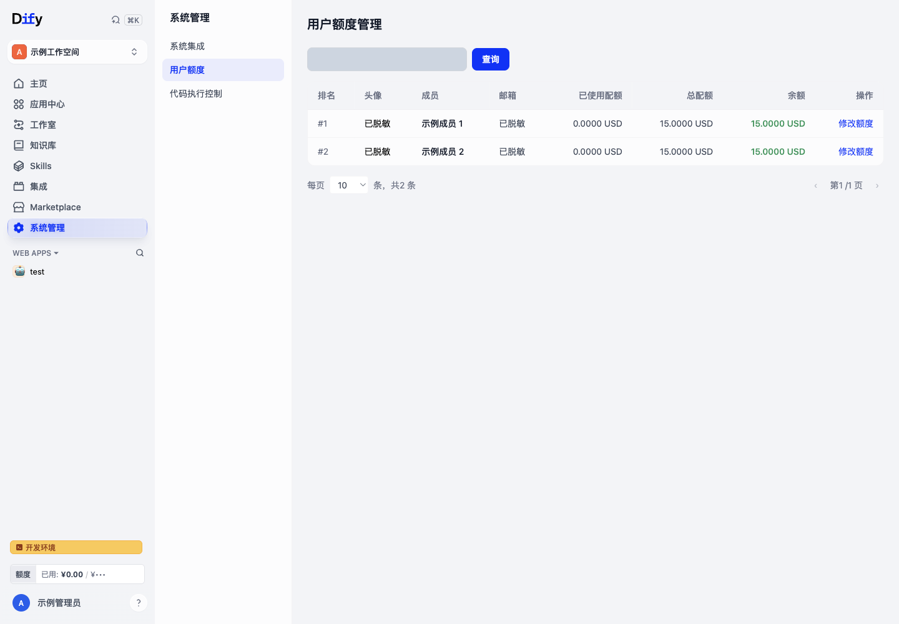
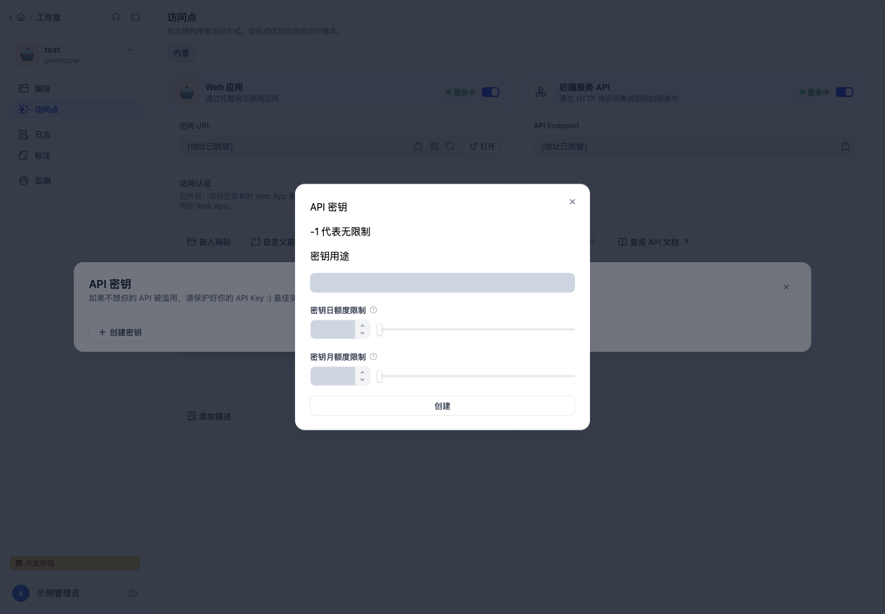
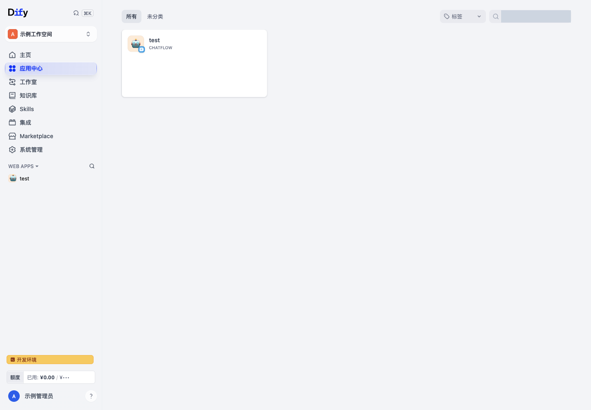
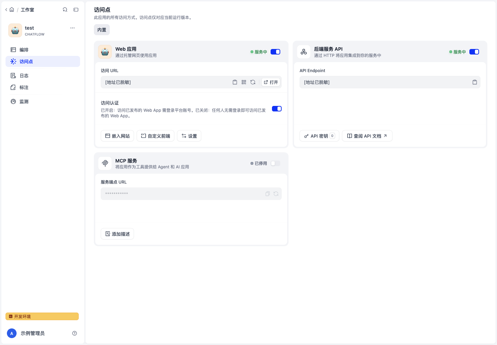
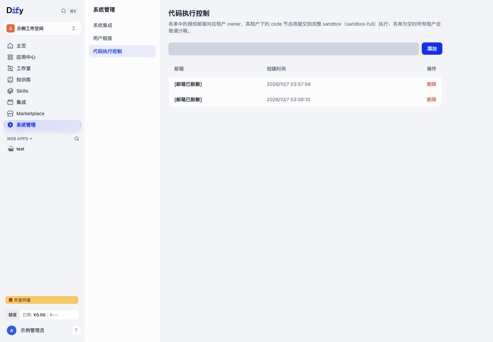

# Dify-Plus

Dify-Plus 是基于 Dify 的企业 AI 应用平台，提供可视化工作流、Agent、知识库与 RAG、模型与插件管理、应用发布及服务 API，并在同一套 Console 中提供企业身份接入、空间权限、个人额度、API 密钥限额和应用使用管理。

本仓库保留 Dify 的应用开发能力，去除了 gin-vue-admin（GVA）独立后台，使用 Dify 原生前端、后端和权限体系承载系统管理，无需另行部署管理后台。

[正式发布 1.17.1-plus.1](https://github.com/YFGaia/dify-plus/releases/tag/1.17.1-plus.1) · [功能与配置文档](docs/dify-plus/README.md) · [部署与运维](docs/dify-plus/二开部署配置与运维说明.md) · [架构](docs/dify-plus/整体架构图.md) · [开发指引](AGENTS.md) · [上游 Dify 文档](https://docs.dify.ai)

## 核心二开功能

### 企业身份与 Casdoor 单点登录

在「系统管理 → 系统集成」中集中配置 Casdoor，登录页根据已启用配置显示企业登录入口。

- **原生配置管理**：配置 Casdoor 地址、组织、应用、Client ID/Secret、回调地址和登录空间；支持保存草稿、静态校验、真实登录诊断、启用和停用。
- **自动登录验证**：通过 Discovery/JWKS 自动发现签名公钥并处理缓存与刷新，管理员无需手工维护验签证书。
- **空间角色映射**：按 Casdoor 精确角色名映射到多个 Dify 空间的 `admin`、`editor`、`normal`，同一空间多角色命中时按此顺序取最高角色；不映射 `owner`，保留已有未托管权限。
Casdoor 当前支持 Community 本地模式（`RBAC_ENABLED=false`）。配置保存不等于启用，启用需要通过对应版本的校验与登录诊断。登录成功后使用 Dify 本地会话和空间权限。本项目的 Casdoor 功能范围是 **SSO 集成**。

配置步骤见[Casdoor SSO 指南](docs/dify-plus/Casdoor-SSO配置指南.md)。


### 统一系统管理与空间权限

系统管理包含 **Casdoor、钉钉、OAuth2 集成、用户额度和代码执行控制**。菜单、页面与后端管理 API 使用同一授权边界：当前空间必须是实例初始化空间，当前账号在该空间的真实角色必须为 `owner` 或 `admin`。

初始化空间由数据库关联自动核验，不依赖空间名称或固定 UUID。普通成员和其他空间的管理员不能管理全局配置；切换空间后重新判定权限。Casdoor 登录目标空间与角色映射不改变这条规则。

### 钉钉与通用 OAuth2 集成配置

系统集成页提供钉钉和通用 OAuth2 的配置、启停和测试工具。钉钉支持企业应用参数、回调验证与企业邮箱查询接口配置；OAuth2 支持授权地址、Token 地址和用户信息接口等参数。

当前普通登录表单直接展示 Casdoor 及原生社交/SSO 入口；钉钉、通用 OAuth2 的配置页与后端回调能力不代表普通登录页已经展示对应按钮。企业接入方式及邮箱映射要求见[钉钉配置指南](docs/dify-plus/钉钉企业邮箱查询配置指南.md)。

### 个人额度与消费归因

Dify-Plus 为每个账号维护独立的总额度、已用额度和余额，与上游 Cloud 套餐额度分开管理。

- 管理员可以搜索用户、查看消费与余额、设置个人总额度。
- 导航栏显示当前账号的额度使用情况，并按配置汇率显示人民币金额；管理列表和后端额度以 USD 为单位。
- 对已登录用户的聊天、应用及工作流调用进行账号归因，记录模型调用费用与相关消费凭证。
- 周期任务维护消费统计与额度快照；需要运行 worker/beat 并启用相应任务配置。



### 应用 API 密钥日/月限额

应用 API 密钥可分别设置每日、每月消费上限，查看对应周期已用额度与累计消费。服务 API 在调用前校验密钥额度，调用费用写入相应统计，周期任务重置日/月使用量。

`accumulated_quota` 表示累计已用金额，**不是密钥的生命周期总上限**。密钥限额与个人账号余额是两套约束；不要将应用密钥额度理解为所有知识库密钥的通用额度。



### 应用中心与发布分发

「应用中心」集中呈现符合可见条件的已发布应用，支持分类、标签和名称搜索，并提供应用安装与访问。安装后的应用进入侧栏，可置顶、排序和卸载；应用运行次数用于相关列表的排序统计。应用作者可将符合条件的应用同步到模板中心，方便空间内分发复用。



### WebApp 登录控制与本人使用记录

每个应用可在「访问点 → Web 应用 → 访问认证」设置是否要求平台登录。默认要求登录；关闭后允许匿名访问已发布的 WebApp。已登录调用仍按账号归因，匿名调用不形成个人账号扣费归因。

WebApp 登录控制独立于服务 API 密钥鉴权。已安装工作流应用提供本人使用记录，记录查询受当前账号和应用归属约束。



### 对话记忆与上下文分段

聊天应用支持配置记忆窗口，限制带入模型的历史轮数；保存消息上下文分割点，支持查看和清理上下文记录。该配置用于适用的聊天路径，不替代 Chatflow 中的工作流节点记忆设置。

### 代码执行控制

管理员维护授权邮箱名单。系统按空间 owner 的邮箱选择代码节点执行沙箱：匹配名单的空间使用 `sandbox-full`，其余空间使用普通沙箱。名单为空时全部使用普通沙箱。完整沙箱需要单独部署和配置，并有更宽的执行能力，应仅授权受信任空间。



### 工作流记录归档与恢复

运维可通过后端命令批量归档工作流运行记录与节点执行数据，将数据 bundle 和索引保存到归档对象存储，并执行恢复、验证与校验后删除。归档存储和导出存储可独立配置，适合降低数据库长期留存压力。

自托管使用命令行归档与恢复入口；Console 月度下载接口受 Cloud 套餐条件限制。命令和对象存储要求见[部署与运维](docs/dify-plus/二开部署配置与运维说明.md)。

> 本页截图来自实际本地 Console。配置输入值、地址、邮箱、账号名称和头像等敏感信息已在保存前遮挡或替换为示例标识。截图用于说明界面，不代表所有外部身份系统与生产环境已完成验收。

## Dify 应用开发能力

| 能力 | 用途 |
| --- | --- |
| 可视化工作流与 Chatflow | 编排模型、工具、条件、代码、检索及多步骤处理 |
| Agent 与工具 | 组合模型推理、插件和外部工具完成任务 |
| 知识库与 RAG | 文档入库、处理、检索和知识增强生成 |
| 模型与插件管理 | 接入模型供应商、工具插件与兼容 API |
| 应用发布 | 发布 WebApp、嵌入网页、提供服务 API 与适用的 MCP 入口 |
| 运行观测 | 查看日志、工作流执行、标注和监测数据 |

具体原生能力与使用方法见[上游文档](https://docs.dify.ai)。Dify Cloud 和上游商业版的服务、定价与授权不构成本 fork 的服务承诺。

## 部署

使用本仓库维护的 [`docker/docker-compose.dify-plus.yaml`](docker/docker-compose.dify-plus.yaml)。部署前准备 Docker Compose v2、数据库与持久存储，并为 API、worker、migration、密钥初始化服务与 Web 准备一致的 Dify-Plus 镜像。直接使用上游镜像不能获得本页二开能力。

```bash
cd docker
cp .env.example .env
```

在 `.env` 中设置 `DIFY_AGENT_SERVER_SECRET_KEY`，按环境配置数据库、域名、存储和服务密钥，并按[部署说明](docs/dify-plus/二开部署配置与运维说明.md)准备 fork 镜像覆盖文件。可选参数参考 `docker/envs/*.env.example`；fork Compose 中实际生效的参数须写入 `.env` 或显式覆盖文件，不能假定所有示例文件会自动加载。

部署使用单一迁移执行者，依次执行 `flask db upgrade` 和 `flask extend_db upgrade`。应用服务自动迁移关闭；数据库双链升级成功后再启动业务服务。完整的新装、升级、备份与恢复步骤见[部署与运维](docs/dify-plus/二开部署配置与运维说明.md)。

初次安装访问部署域名的 `/install` 创建管理员和初始化空间。首次管理员应保留可用的本地登录方式，随后在初始化空间配置系统集成。

## 文档与开发

- [当前文档索引](docs/dify-plus/README.md)：功能、界面、权限、部署、数据模型与历史资料入口。
- [前端功能与交互](docs/dify-plus/二开功能详解-Web与管理后台.md)：实际页面、入口及访问边界。
- [后端与数据层](docs/dify-plus/二开功能详解-后端与数据层.md)：接口、计费、认证和任务实现。
- [数据库与双迁移链](docs/dify-plus/二开数据库与迁移说明.md)：数据模型与迁移约束。
- [开发约定](AGENTS.md)：目录边界、工作方式和验证要求。
- [贡献指南](CONTRIBUTING.md)与[许可证](LICENSE)。

历史合并、变更提案和发布验收记录集中在文档索引的历史资料区，不作为现行功能使用说明。

## 许可证与上游

本项目基于 [Dify](https://github.com/langgenius/dify)，遵循仓库内的 [Dify Open Source License](LICENSE)（基于 Apache 2.0，并附加条件）。部署、分发和商业使用前请阅读许可证。上游项目的品牌、社区和安全联系渠道归原项目所有。
