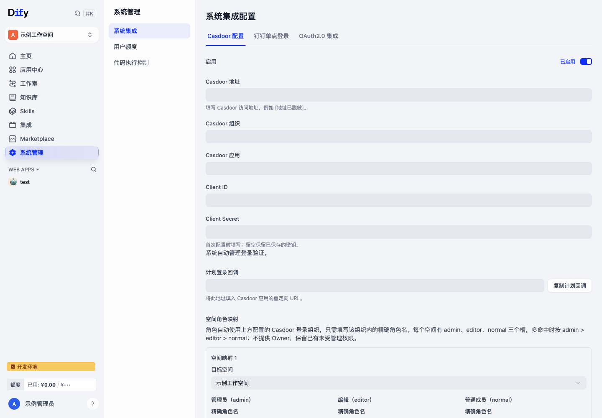

# Casdoor SSO 配置指南

Dify-Plus 的 Casdoor 能力范围是单点登录：平台将用户引导到 Casdoor 完成认证，后端处理授权回调、校验身份并建立 Dify 本地登录会话。配置由 Dify 原生 Console 管理，不需要 GVA 后台。

## 前置条件

- 当前部署为 Community，`RBAC_ENABLED=false`；当前实现不支持 Enterprise / RBAC 开启模式下激活 Casdoor 配置。
- 当前账号位于实例初始化空间，数据库真实角色为 `owner` 或 `admin`。
- Casdoor 已有组织、应用及可登录用户，应用允许 Dify 使用的授权回调地址。
- 用户浏览器可访问 Casdoor 前端与 Dify，Dify 后端可访问 Casdoor API、Discovery/JWKS 和相关登录验证接口。
- Dify 的对外入口、反向代理和 Cookie 配置正确，跨域或 HTTPS 配置与实际部署一致。

## 配置步骤

1. 打开「系统管理 → 系统集成 → Casdoor 配置」。
2. 填写 Casdoor 地址、组织、应用和 Client ID；首次配置填写 Client Secret。已保存的 Secret 不回填，留空表示保留。
3. 核对配置区提供的登录回调地址，在 Casdoor 应用的重定向 URL 中登记完全相同的地址。地址必须使用浏览器实际访问的域名与协议。
4. 按需配置登录目标空间及角色映射。映射使用组织内精确角色名，支持 `admin`、`editor`、`normal`，不授予 `owner`；多角色命中同一空间时按 admin > editor > normal 判定。SSO 空间权限不改变全局系统管理授权。
5. 存在前后端地址分离、内部网络或 issuer 差异时，按实际部署填写高级参数。系统自动管理验签公钥，无需手工复制证书。
6. 保存配置草稿，完成静态校验和真实测试登录。测试结果必须对应当前配置版本；修改配置后重新测试。测试草稿不会直接替换普通用户使用的生效版本。
7. 检查诊断结果并启用当前版本。普通登录页依据生效配置显示 Casdoor 登录按钮，用户点击后完成企业 SSO。

图中配置输入值均已遮挡，不能直接复制为部署参数。

## 登录与权限

登录页不读取 Client Secret。后端通过 Discovery/JWKS 自动获取、缓存和刷新签名公钥，验证授权结果和身份声明后签发 Dify 本地会话。前端登录结果页提供成功或失败提示，不展示授权码或访问令牌。

此前在 Dify 移除的 Casdoor 托管成员，重新登录时若同一身份绑定命中当前生效配置中的显式角色映射，平台会恢复对应空间成员，并按最新映射赋予角色，包括默认登录空间。默认普通成员兜底不会恢复被移除的成员；现存成员的人工角色覆盖、owner 和已释放的托管关系仍受保护。恢复在本地权限事务内完成，并保留原始托管基线与审计记录；存在未确认的权限任务时继续拒绝登录。

系统管理仍限定为初始化空间真实 owner/admin。Casdoor 的登录空间、角色映射或外部认证成功都不会单独授予实例管理权限。首次配置前保留可用的本地管理员登录方式。

## 常见问题

| 现象 | 核对项 |
| --- | --- |
| 不显示登录按钮 | 是否启用配置、生效版本是否存在、公开展示接口是否返回可用 |
| 保存后登录仍使用原配置 | 保存的是草稿，需完成校验与测试后启用 |
| 回调失败 | 实际入口域名/协议、Casdoor 重定向 URL、组织与应用、客户端凭据 |
| 验签或 issuer 失败 | 后端网络、Discovery/JWKS、issuer 与配置一致性、公钥获取结果 |
| 不能启用 | 部署模式、当前配置版本对应的校验和诊断、是否发生并发修改 |
| 没有系统管理权限 | 当前是否为初始化空间、数据库成员角色是否为 owner/admin |
| 移除成员后重新登录失败 | 是否仍为同一身份绑定、是否命中已启用的显式角色映射；仅默认普通成员兜底不会恢复。用结果页关联 ID 核对后端日志及权限任务状态 |

排查记录只保留必要状态与脱敏错误信息，不保存 Token、Secret、密码、私有地址或原始认证响应。后端实现见[后端说明](./二开功能详解-后端与数据层.md)，部署见[运维说明](./二开部署配置与运维说明.md)。
