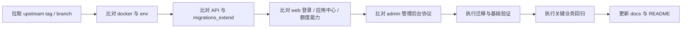

# 上游升级与回归检查清单

本文用于指导 Dify-Plus 从当前基线继续合并 `langgenius/dify` 上游版本时的检查顺序与回归范围。

当前建议对照基线：`upstream-1.12.1`

## 1. 升级前准备

1. 确认当前分支已保存本地改动，避免直接在脏工作区合并上游。
2. 确认存在 `upstream` 远程并可访问：
   - `git remote -v`
   - `git fetch upstream --tags`
3. 先阅读：
   - [与上游差异总表](./与上游差异总表.md)
   - [二开部署配置与运维说明](./二开部署配置与运维说明.md)
   - [二开数据库与迁移说明](./二开数据库与迁移说明.md)

## 2. 必查目录

按风险高低，优先检查以下目录：

1. `docker/`
2. `api/migrations_extend/`
3. `api/controllers/`、`api/services/`、`api/libs/`
4. `web/service/`、`web/app/components/`、`web/app/signin/`
5. `admin/`
6. `scripts/`

## 3. 升级顺序

## 4. 后端检查清单

### 4.1 迁移与数据层

- `api/migrations_extend/env.py` 是否仍能正确读取当前应用的数据库引擎。
- `api/migrations_extend/versions/*.py` 的 `down_revision` 是否连续。
- `alembic_version_extend` 与主迁移版本表没有串表。
- 新增上游迁移是否修改了与 fork 同名或同语义的表字段。
- `account_money_extend`、`api_token_money_extend`、`system_integration_extend` 的索引和唯一约束是否被上游模型改动影响。

### 4.2 核心控制器与服务

- `api/controllers/console/feature.py`
  - `login_config_bootstrap`
  - `login_config`
- `api/controllers/console/app/ding_talk_extend.py`
- `api/controllers/console/app/passport_extend.py`
- `api/controllers/console/money_extend.py`
- `api/services/billing_extend.py`
- `api/services/recommended_app_service_extend.py`
- `api/services/model_provider_service_extend.py`
- `api/services/model_service_extend.py`
- `api/libs/token.py`
- `api/libs/login_extend.py`

### 4.3 事件与定时任务

- `api/events/event_handlers/update_account_money_when_messaeg_created_extend.py`
- `api/events/event_handlers/update_provider_when_message_created.py`
- `api/schedule/update_account_used_quota_extend.py`
- `api/schedule/update_api_token_daily_used_quota_task_extend.py`
- `api/schedule/update_api_token_monthly_used_quota_task_extend.py`

重点确认：

- 扣费是否仍然只执行一次。
- provider quota 与余额更新是否仍在同一事务语义内。
- 月快照/日快照任务的清零逻辑没有被上游任务覆盖。

## 5. 前端检查清单

### 5.1 登录与系统特性

- `web/context/global-public-context.tsx`
- `web/service/common.ts`
- `web/service/client.ts`
- `web/app/signin/**`
- `web/app/(shareLayout)/webapp-signin/**`

重点确认：

- `login_config_bootstrap` -> `login_config` 双阶段链路仍然可用。
- 跨域或反向代理下 cookie/header 认证没有失效。
- 钉钉/OAuth2/WebApp 外部成员登录仍能正确跳转。

### 5.2 应用中心与默认落点

- `web/app/components/header/index.tsx`
- `web/app/components/explore/sidebar/index.tsx`
- `web/app/(commonLayout)/explore/apps-center-extend/page.tsx`
- `web/app/components/explore/app-list-center-extend/index.tsx`
- `web/service/use-explore.ts`

重点确认：

- 默认首页仍是应用中心。
- 已安装应用列表和按使用次数排序仍然正确。
- 模板同步/取消同步入口没有被上游 UI 改动覆盖。

### 5.3 配置与额度

- `web/app/components/header/account-money-extend/index.tsx`
- `web/app/components/develop/secret-key/secret-key-quota-set-modal-extend.tsx`
- `web/app/components/app/configuration/retention-number-extend/index.tsx`
- `web/app/components/base/chat/chat/index.tsx`

重点确认：

- 额度显示与 API Key 日/月限额仍能提交。
- 记忆上下文和消息上下文操作按钮仍然渲染。

## 6. 管理后台检查清单

### 6.1 管理端后端

- `admin/server/router/gaia/**`
- `admin/server/api/v1/gaia/**`
- `admin/server/service/gaia/**`

重点确认：

- `quota`、`dashboard`、`system`、`model_provider`、`workflow`、`app_version` 的路由和返回结构没有漂移。
- 与 `api/` 交互时使用的 JWT / Cookie 机制仍然兼容。

### 6.2 管理端前端

- `admin/web/src/view/gaia/dashboard/index.vue`
- `admin/web/src/view/quota/index.vue`
- `admin/web/src/view/systemIntegrated/dingTalk/index.vue`
- `admin/web/src/view/systemIntegrated/oauth2/index.vue`
- `admin/web/src/view/systemIntegrated/modelManagement/index.vue`
- `admin/web/src/view/gaia/appVersion/index.vue`

重点确认：

- 图表和表格字段是否与后端响应仍然一致。
- 钉钉、OAuth2、模型管理页的表单字段没有因上游字段变化失效。

## 7. 部署与配置检查清单

- `docker/docker-compose.dify-plus.yaml`
- `docker/docker-compose.middleware.yaml`
- `docker/.env.example`
- `api/.env.example`
- `web/.env.example`
- `docker/admin-server/config.docker.yaml`
- `.gitlab-ci.yml`
- `.github/workflows/api-tests.yml`
- `.github/workflows/db-migration-test.yml`

重点确认：

- 新增上游环境变量是否需要透传到 fork compose。
- `FILES_URL`、`INTERNAL_FILES_URL`、`COOKIE_DOMAIN`、各类登录相关配置是否仍满足 fork 认证逻辑。
- 管理后台镜像和主链路镜像版本没有错位。

## 8. 运维脚本回归

检查：

- `scripts/fail_pending_documents.py`
- `scripts/fix_stuck_documents.py`
- `scripts/rerun_document_indexing.py`
- `scripts/run_and_stop_dataset_tasks.py`

重点确认：

- `Document`、`DocumentSegment`、Redis key、Celery task 名称没有被上游改掉。
- 脚本中的数据库状态常量仍与主应用一致。

## 9. 最终回归建议

至少完成以下业务回归：

1. Console 登录，确认默认进入应用中心。
2. 钉钉登录或 OAuth2 登录。
3. 查看顶部账户额度。
4. 创建或编辑 API Key，并设置日/月限额。
5. 应用同步到模板中心，再取消同步。
6. 发送一轮消息，确认额度被正确扣减。
7. 管理后台查看额度排行榜。
8. 管理后台修改一个用户额度。
9. 管理后台测试系统集成配置。
10. ~~批量工作流上传文件并查看进度~~（功能已按 D2 决策删除，改为回归：text-generation 运行页单次运行与上游原生 batch 运行正常、无批量任务列表入口）。

## 10. 升级后文档同步

完成升级后，至少同步更新以下文件：

- [README.md](../README.md)
- [AGENTS.md](../AGENTS.md)
- [与上游差异总表](./与上游差异总表.md)
- [二开数据库与迁移说明](./二开数据库与迁移说明.md)
- [二开页面与交互清单](./二开页面与交互清单.md)
