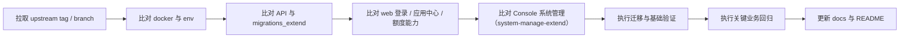

# 上游升级与回归检查清单

本文用于指导 Dify-Plus 从当前基线继续合并 `langgenius/dify` 上游版本时的检查顺序与回归范围。

当前建议对照基线：`upstream 1.16.0`（合并记录见
[合并规划-upstream-1.16.0](./合并规划-upstream-1.16.0.md) 及其关联的合并/复核/验证记录）

> - 从 1.15.0 升级到 1.16.0：见 [升级到 1.16.0 说明](./升级到1.16.0说明.md)（两段迁移命令即可）。
> - 从 1.12.1（或更早、仍含 GVA 管理后台的版本）升级，请先读版本专项文档
>   [升级到 1.15.0 说明](./升级到1.15.0说明.md)（含 GVA 后台下线步骤与迁移序列），再按 1.16.0 说明继续。

## 0. 1.15.0 生产升级 runbook（DD7 固化，停机窗口内按序执行）

> 本节是 1.14.2（或更早）→ 1.15.0 生产升级的**强制序列**，保留作历史参照。
> **1.15.0 → 1.16.0 的 runbook 简单得多（两段迁移命令，无新增一次性命令），
> 见[升级到 1.16.0 说明](./升级到1.16.0说明.md)。**
> 其中标注【强制】的项属于"不做不报错、上线才爆"的静默炸弹，禁止跳过。

1. **备份**【强制】：`pg_dump` 整库快照 + 生产 `.env` 备份。跨 24 个上游迁移的
   `flask db downgrade` 不可靠，快照是唯一可靠的 DB 回滚手段。
2. **停止服务**：api / worker / worker_beat / web。
3. **三段命令链**【强制，顺序不可调换】：
   1. `flask db upgrade` —— 上游链（1.14.2→1.15.0 新增 24 个迁移）到 head；
   2. `flask extend_db upgrade` —— fork 链到 head。其中 `017_migrate_recommended_cats`
      把 fork 分类表数据迁入 `recommended_apps.categories`（幂等，可重复执行）；
      链尾 `018_drop_recommended_cats` 会**删除两张 fork 分类表**——如需在探索页
      回归通过前保留退路，先执行
      `flask extend_db upgrade --revision 017_migrate_recommended_cats`，
      回归通过后再升到 head；
   3. `flask backfill-plugin-auto-upgrade`【强制】—— 回填租户插件自动升级策略，
      跳过则租户插件自动升级设置静默失效。执行后抽验
      `SELECT count(*) FROM tenant_plugin_auto_upgrade_strategies;` 非零。
4. **迁移抽验**：分类数据一致性（迁移前 join 对数 = 迁移后 categories 展开匹配对数）：

   ```sql
   -- drop（018）执行前有效
   SELECT
     (SELECT count(DISTINCT (j.recommended_id, c."table"))
        FROM recommended_apps_category_join_extend j
        JOIN recommended_category_extend c ON c.id = j.category_id) AS join_pairs,
     (SELECT count(*)
        FROM (SELECT r.id, json_array_elements_text(r.categories) AS cat
                FROM recommended_apps r) x
        JOIN recommended_apps_category_join_extend j2 ON x.id::uuid = j2.recommended_id
        JOIN recommended_category_extend c2
          ON c2.id = j2.category_id AND x.cat = c2."table") AS migrated_pairs;
   ```

5. **env 对齐**【强制】：以 `docker/.env.example`（1.15.0 版）为准比对生产 `.env`。
   新增项按需配置；重点是下一条 SSRF 白名单。
6. **SSRF 私有网络白名单**【强制，最易漏】：1.15.0 起 SSRF 代理（squid）**默认拒绝**
   访问私有网段/内网域名。企业内网的 HTTP 请求节点目标、自建工具、内部 API 必须写入：
   - `SSRF_PROXY_ALLOW_PRIVATE_IPS`（逗号分隔，支持 CIDR，如 `10.1.2.0/24,192.168.1.10`）
   - `SSRF_PROXY_ALLOW_PRIVATE_DOMAINS`（逗号分隔，支持通配，如 `.internal.example.com`）
   清单需业务方提供内网访问目标全集；漏配的表现为工作流 HTTP 节点/工具调用内网批量 403。
7. **起动与回归**：`docker compose -f docker/docker-compose.dify-plus.yaml up -d`；
   按第 7 节执行回归（计费 6 链路见[计费回归基线清单](./计费回归基线清单.md)、
   SSO 三方登录、应用中心分类展示与过滤、系统管理页、main-nav 双角色、
   SSRF 白名单实测：加白目标可访问 + 未加白私有目标仍 403）。
8. **回滚路径**：代码回退到上一 tag；DB 用第 1 步快照整库恢复；
   若尚未执行 018 drop，fork 分类表数据天然保留，代码回退即可回到旧分类路径。

## 1. 升级前准备

1. 确认当前分支已保存本地改动，避免直接在脏工作区合并上游。
2. 确认存在 `upstream` 远程并可访问：
   - `git remote -v`
   - `git fetch upstream --tags`
3. **refname 歧义防护**（1.16.0 轮固化）：fork 使用版本号作为分支名（如 `1.15.0`），与上游
   tag 同名。所有引用上游版本的 git 命令**必须写全 `refs/tags/<版本号>`**（如
   `git merge --no-ff refs/tags/1.16.0`、`git diff refs/tags/1.15.0 refs/tags/1.16.0`），
   禁止裸写版本号——裸写时 git 优先解析为本地分支，diff/merge 对象会整个错位。
4. 先阅读：
   - [与上游差异总表](./与上游差异总表.md)（重点第 7 节挂点坐标——合并冲突处理的输入清单）
   - [二开部署配置与运维说明](./二开部署配置与运维说明.md)
   - [二开数据库与迁移说明](./二开数据库与迁移说明.md)
   - 上一轮的合并规划/记录文档（如[合并规划-upstream-1.16.0](./合并规划-upstream-1.16.0.md)），
     沿用其阶段划分（变更分析 → 合并 → 挂点复核 → 后端/前端验证 → 容器验证 → 文档收尾）

## 2. 必查目录

按风险高低，优先检查以下目录：

1. `docker/`
2. `api/migrations_extend/`
3. `api/controllers/`、`api/services/`、`api/libs/`
4. `web/service/`、`web/app/components/`、`web/app/signin/`、`web/app/(commonLayout)/system-manage-extend/`
5. `scripts/`

## 3. 升级顺序



## 4. 后端检查清单

### 4.1 迁移与数据层

- `api/migrations_extend/env.py` 是否仍能正确读取当前应用的数据库引擎。
- `api/migrations_extend/versions/*.py` 的 `down_revision` 是否连续。
- `alembic_version_extend` 与主迁移版本表没有串表。
- 新增上游迁移是否修改了与 fork 同名或同语义的表字段。
- `account_money_extend`、`api_token_money_extend`、`system_integration_extend` 的索引和唯一约束是否被上游模型改动影响。

### 4.2 核心控制器与服务

- `api/controllers/console/feature.py`
  - `login_config_bootstrap`
  - `login_config`
- `api/controllers/console/app/ding_talk_extend.py`
- `api/controllers/web/passport.py`（并确认已退役的 `/console/api/passport-extend` 未重新注册）
- `api/controllers/console/money_extend.py`
- `api/services/billing_extend.py`
- `api/services/recommended_app_service_extend.py`
- `api/services/model_provider_service_extend.py`、`api/services/model_service_extend.py`
  （已确认为孤儿死代码，仅保 import 可解析即可，见[差异总表 §4.7](./与上游差异总表.md)；删除留维护者决策）
- `api/libs/token.py`
- `api/libs/login_extend.py`

另（1.16.0 轮固化）：上游 controller 层已 `with_session` 化并带 ast_grep 守卫
（禁止 controller 新写 `db.session`），fork 在 controller 层新增/重挂的写入必须改用注入 session；
合并后需全量核对 `validate_app_token` 装饰的方法均带 `api_token: ApiToken | None = None`
末位参数（wraps 始终注入 kwargs，缺参运行时 TypeError）。

### 4.3 事件与定时任务

- `api/events/event_handlers/update_account_money_when_messaeg_created_extend.py`
- `api/events/event_handlers/update_provider_when_message_created.py`
- `api/schedule/update_account_used_quota_extend.py`
- `api/schedule/update_api_token_daily_used_quota_task_extend.py`
- `api/schedule/update_api_token_monthly_used_quota_task_extend.py`

重点确认：

- 扣费是否仍然只执行一次。
- provider quota 与余额更新是否仍在同一事务语义内。
- 月快照/日快照任务的清零逻辑没有被上游任务覆盖。

## 5. 前端检查清单

### 5.1 登录与系统特性

- `web/features/system-features/client.ts`、`server.ts`（login_config 双阶段与 SSR 形状守卫；
  原 `global-public-context.tsx` 已随上游 1.16.0 重构删除）
- `web/contract/base.ts`、`web/contract/router-extend.ts`、`web/service/console-router-loader.ts`
  （fork 契约段注册，1.16.0 起）
- `web/service/common.ts`
- `web/service/client.ts`（`X-Login-Config-Token` 注入在 `createConsoleOpenAPILink`）
- `web/app/signin/**`
- `web/app/(shareLayout)/webapp-signin/**`
- `web/utils/login-redirect.ts::getClientLoginFallback`（登录后默认落点集中点，fork 值
  `/explore/apps-center-extend`，1.16.0 起）

重点确认：

- `login_config_bootstrap` -> `login_config` 双阶段链路仍然可用。
- 跨域或反向代理下 cookie/header 认证没有失效。
- 钉钉/OAuth2/WebApp 外部成员登录仍能正确跳转。
- 上游若调整登录 API（如 1.16.0 的 password Base64 + Cookie/CSRF 会话），同步排查 fork
  直调登录接口的脚本/巡检/e2e。

### 5.2 应用中心与默认落点

- `web/app/components/main-nav/index.tsx`（原 `header/index.tsx`，1.15.0 起改名 main-nav）
- `web/app/components/explore/sidebar/index.tsx`
- `web/app/(commonLayout)/explore/apps-center-extend/page.tsx`
- `web/app/components/explore/app-list-center-extend/index.tsx`
- `web/service/use-explore.ts`
- `web/context/app-context-extend.ts`（fork 权限原子 `useExtendPermissions`，1.16.0 起）

重点确认：

- 默认首页仍是应用中心。
- 已安装应用列表和按使用次数排序仍然正确。
- 模板同步/取消同步入口没有被上游 UI 改动覆盖。

### 5.3 配置与额度

- `web/app/components/main-nav/components/account-money-extend.tsx`（原 header 下，1.15.0 起迁至 main-nav）
- `web/app/components/develop/secret-key/secret-key-quota-set-modal-extend.tsx`
- `web/app/components/app/configuration/retention-number-extend/index.tsx`
- `web/app/components/base/chat/chat/index.tsx`

重点确认：

- 额度显示与 API Key 日/月限额仍能提交。
- 记忆上下文和消息上下文操作按钮仍然渲染。

### 5.4 i18n（1.16.0 轮固化）

- extend 命名空间：23 语种 `web/i18n/*/extend.json` 一个都不能缺——上游新装载体系对当前
  locale 全命名空间 eager import，**缺文件直接 SSR 报错**（旧体系有静默回退，新体系没有）。
- typed-selector：optimize 模式下旧式 `t('key', { ns })` **运行时失效但构建全绿**，
  必须把 i18n 调用迁移当一等公民验证（静态解析脚本抽验 + 页面实测），不能只看 build 通过。

## 6. Console 系统管理检查清单

> 原 GVA 管理后台（`admin/`）已于 2026-07-05 随 `p5-admin-decommission` 删除，
> 管理能力由 Console `/system-manage-extend/*` 承接，见[admin迁移状态总表](./admin迁移状态总表.md)。

### 6.1 后端

- `api/controllers/console/system_manage_extend.py`
- `api/services/system_manage_extend.py`

重点确认：

- `integration/dingtalk`、`integration/oauth2`、`integration/email-api`、`forward-tokens`、
  `quota-management`、`code-execution-control` 的路由和返回结构没有漂移。
- `@system_admin_required_extend` 权限装饰器仍然生效（admin/owner 可访问后端 API）。

### 6.2 前端

- `web/app/(commonLayout)/system-manage-extend/**`
- 顶部导航「系统管理」入口（仅 workspace owner 渲染）

重点确认：

- 三条路由（系统集成 / 用户额度管理 / 代码执行控制）页面可用、表单可提交。
- 钉钉、OAuth2 表单字段没有因上游字段变化失效。
- 普通成员与 admin 角色不渲染导航入口（main-nav 双角色回归）。

## 7. 部署与配置检查清单

- `docker/docker-compose.dify-plus.yaml`
- `docker/docker-compose.middleware.yaml`
- `docker/.env.example`
- `api/.env.example`
- `web/.env.example`
- `.github/workflows/publish-dify-plus.yml`（GHCR 四组件双架构发布）
- `.gitlab-ci.yml`（历史 CCR 发布参考）
- `.github/workflows/api-tests.yml`
- `.github/workflows/db-migration-test.yml`

重点确认：

- 新增上游环境变量是否需要透传到 fork compose。
- 四组件镜像的源码提交、两架构 manifest、OCI revision 和 digest 完整，全部 API 消费者使用同一镜像；见[容器镜像发布与多架构部署](./容器镜像发布与多架构部署.md)。
- `full-sandbox` 是可选 profile；供应镜像无本仓源码，必须独立核验架构及执行能力。旧 Weaviate 不能直接跳到新默认镜像读取原卷。
- `FILES_URL`、`INTERNAL_FILES_URL`、`COOKIE_DOMAIN`、各类登录相关配置是否仍满足 fork 认证逻辑。
- `api_websocket`（collaboration profile）与 nginx `/socket.io/` 路由变量（`NEXT_PUBLIC_SOCKET_URL`、`NGINX_SOCKET_IO_UPSTREAM`）没有丢失。
- 上游新增服务的默认密钥不要照抄（1.16.0 轮先例：`DIFY_AGENT_SERVER_SECRET_KEY` 上游样例是
  公开弱密钥，fork 改为空占位 + 注释，启动前必配，即使 Agent v2 功能关闭）。
- **`docker/docker-compose.middleware.yaml` 引用的 `./middleware.env` 在仓库中不存在**
  （也无 example），直接 `docker compose -f` 会报错；本地验证时先建该文件，或用
  postgres+redis 的等价最小 compose 并配独立命名卷/端口做隔离（1.16.0 轮做法，见
  [1.16.0 容器验证记录](./1.16.0升级本地容器验证记录.md) §1）。补 `middleware.env.example`
  的修复留维护者。

## 8. 运维脚本回归

检查：

- `scripts/fail_pending_documents.py`
- `scripts/fix_stuck_documents.py`
- `scripts/rerun_document_indexing.py`
- `scripts/run_and_stop_dataset_tasks.py`

重点确认：

- `Document`、`DocumentSegment`、Redis key、Celery task 名称没有被上游改掉。
- 脚本中的数据库状态常量仍与主应用一致。

## 9. 最终回归建议

> 每轮合并后应基于本节框架产出**版本专项人工回归清单**（含具体验证步骤与预期结果），
> 例如 [人工回归清单-1.16.0](./人工回归清单-1.16.0.md)；计费链路细化步骤见
> [计费回归基线清单](./计费回归基线清单.md)。

至少完成以下业务回归：

1. Console 登录，确认默认进入应用中心。
2. 钉钉登录或 OAuth2 登录。
3. 查看顶部账户额度。
4. 创建或编辑 API Key，并设置日/月限额。
5. 应用同步到模板中心，再取消同步。
6. 发送一轮消息，确认额度被正确扣减。
7. Console「系统管理 → 用户额度管理」查看列表并修改一个用户额度。
8. Console「系统管理 → 系统集成」测试钉钉/OAuth2 配置保存与连接测试。
9. Console「系统管理 → 代码执行控制」增删一条授权名单并确认 redis 缓存生效。
10. ~~批量工作流上传文件并查看进度~~（功能已按 D2 决策删除，改为回归：text-generation 运行页单次运行与上游原生 batch 运行正常、无批量任务列表入口）。

## 10. 升级后文档同步

完成升级后，至少同步更新以下文件：

- [README.md](../../README.md)（`README_DIFY.md` 一并换成上游新版 README）
- [AGENTS.md](../../AGENTS.md)（对照基线与 `fork-merged-*` tag）
- [文档索引](./README.md)
- [与上游差异总表](./与上游差异总表.md)（全表基线口径 + 第 7 节挂点坐标 + 差异变动登记）
- [二开数据库与迁移说明](./二开数据库与迁移说明.md)
- [二开页面与交互清单](./二开页面与交互清单.md)
- 本清单（补入该轮新踩的坑与口径变化）
- 版本专项：《升级到 X.Y.Z 说明》+《人工回归清单-X.Y.Z》

## 11. 合并执行工程经验（1.16.0 轮固化）

自动化验证阶段容易反复踩、且与具体版本无关的坑，固化在此：

1. **git refname 歧义**：见第 1 节第 3 条——上游版本引用必须写全 `refs/tags/<版本号>`。
2. **ast_grep 守卫口径伪影**（`scripts/check_no_new_getattr.py`、
   `scripts/check_no_new_controller_sqlalchemy.py`）：两守卫以「base-rev → HEAD 的 diff 中
   净新增违规」为口径。若以 fork 合并前基线为 base-rev 跨版本运行，**上游自身新增代码会被
   计为"新增违规"**（上游自己的 CI 以 PR base 为参照，不会报）。正确姿势：逐条核对报出条目
   是否与 `refs/tags/<新版本>` 逐字相同——相同即上游代码伪影，可豁免；fork CI 若启用同款守卫，
   base-rev 必须取 PR base 而非跨版本基线。
3. **testcontainers 在 macOS Docker Desktop**：ryuk reaper 容器端口映射可能
   `ConnectionError` 阻断整个套件，用 `TESTCONTAINERS_RYUK_DISABLED=true` 绕过
   （代价：异常中断时测试容器需手工清理，跑完后核查残留）；沙箱镜像默认 tag 需从 docker.io
   拉取，代理环境下会挂起，用 `DIFY_SANDBOX_TEST_IMAGE` 指向本机已缓存镜像。
4. **docker.io 拉取挂起**（本机代理环境）：pull 长时间无进度时不要干等，改用镜像仓库缓存
   （如 `ccr.ccs.tencentyun.com/yfgaia/*` 同款 tag）。
5. **上游删除顶层 import 的静默炸弹**：上游重构常删除宿主文件顶层 import（如 1.16.0 删
   `base_app_runner.py`/`conversation_service.py` 的顶层 `db`），fork 挂点块若引用该名字，
   **import 冒烟、构建、lint 全不报错，首次运行才 NameError**。合并后必须对每个挂点宿主文件
   做「fork 块引用的名字仍在作用域内」核对（类型检查也能兜住一部分——这是跑 pyrefly/mypy
   的额外价值）。
6. **单测全量跑的负载抖动**：`--timeout 20` 的套件与类型检查等重活并行会出现批量超时假失败；
   对失败文件在空载下串行复跑再定性，不要直接当回归处理。
7. **前端快照测试非确定性失败**：上游 lockfile 若含多个 `@types/node` 变体会装出多个 vitest
   实例，SnapshotClient 状态不共享（vitest#7668/#8622），全量并行跑时唯一使用文件快照的
   spec 可能偶发失败；单跑该 spec 全绿即可定性为基建问题，不要为此动 lockfile。
