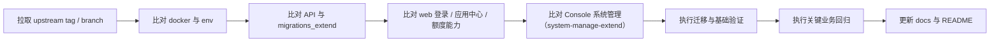

# 上游升级与回归检查清单

本文用于指导 Dify-Plus 从当前基线继续合并 `langgenius/dify` 上游版本时的检查顺序与回归范围。

当前建议对照基线：`upstream 1.15.0`（合并记录见 openspec `p3-merge-upstream-1-15-0`）

> 从 1.12.1（或更早、仍含 GVA 管理后台的版本）升级，请先读版本专项文档
> [升级到 1.15.0 说明](./升级到1.15.0说明.md)（含 GVA 后台下线步骤与迁移序列）。

## 0. 1.15.0 生产升级 runbook（DD7 固化，停机窗口内按序执行）

> 本节是 1.14.2（或更早）→ 1.15.0 生产升级的**强制序列**。其中标注【强制】的项
> 属于"不做不报错、上线才爆"的静默炸弹，禁止跳过。

1. **备份**【强制】：`pg_dump` 整库快照 + 生产 `.env` 备份。跨 24 个上游迁移的
   `flask db downgrade` 不可靠，快照是唯一可靠的 DB 回滚手段。
2. **停止服务**：api / worker / worker_beat / web。
3. **三段命令链**【强制，顺序不可调换】：
   1. `flask db upgrade` —— 上游链（1.14.2→1.15.0 新增 24 个迁移）到 head；
   2. `flask extend_db upgrade` —— fork 链到 head。其中 `017_migrate_recommended_cats`
      把 fork 分类表数据迁入 `recommended_apps.categories`（幂等，可重复执行）；
      链尾 `018_drop_recommended_cats` 会**删除两张 fork 分类表**——如需在探索页
      回归通过前保留退路，先执行
      `flask extend_db upgrade --revision 017_migrate_recommended_cats`，
      回归通过后再升到 head；
   3. `flask backfill-plugin-auto-upgrade`【强制】—— 回填租户插件自动升级策略，
      跳过则租户插件自动升级设置静默失效。执行后抽验
      `SELECT count(*) FROM tenant_plugin_auto_upgrade_strategies;` 非零。
4. **迁移抽验**：分类数据一致性（迁移前 join 对数 = 迁移后 categories 展开匹配对数）：

   ```sql
   -- drop（018）执行前有效
   SELECT
     (SELECT count(DISTINCT (j.recommended_id, c."table"))
        FROM recommended_apps_category_join_extend j
        JOIN recommended_category_extend c ON c.id = j.category_id) AS join_pairs,
     (SELECT count(*)
        FROM (SELECT r.id, json_array_elements_text(r.categories) AS cat
                FROM recommended_apps r) x
        JOIN recommended_apps_category_join_extend j2 ON x.id::uuid = j2.recommended_id
        JOIN recommended_category_extend c2
          ON c2.id = j2.category_id AND x.cat = c2."table") AS migrated_pairs;
   ```

5. **env 对齐**【强制】：以 `docker/.env.example`（1.15.0 版）为准比对生产 `.env`。
   新增项按需配置；重点是下一条 SSRF 白名单。
6. **SSRF 私有网络白名单**【强制，最易漏】：1.15.0 起 SSRF 代理（squid）**默认拒绝**
   访问私有网段/内网域名。企业内网的 HTTP 请求节点目标、自建工具、内部 API 必须写入：
   - `SSRF_PROXY_ALLOW_PRIVATE_IPS`（逗号分隔，支持 CIDR，如 `10.1.2.0/24,192.168.1.10`）
   - `SSRF_PROXY_ALLOW_PRIVATE_DOMAINS`（逗号分隔，支持通配，如 `.internal.example.com`）
   清单需业务方提供内网访问目标全集；漏配的表现为工作流 HTTP 节点/工具调用内网批量 403。
7. **起动与回归**：`docker compose -f docker/docker-compose.dify-plus.yaml up -d`；
   按第 7 节执行回归（计费 6 链路见[计费回归基线清单](./计费回归基线清单.md)、
   SSO 三方登录、应用中心分类展示与过滤、系统管理页、main-nav 双角色、
   SSRF 白名单实测：加白目标可访问 + 未加白私有目标仍 403）。
8. **回滚路径**：代码回退到上一 tag；DB 用第 1 步快照整库恢复；
   若尚未执行 018 drop，fork 分类表数据天然保留，代码回退即可回到旧分类路径。

## 1. 升级前准备

1. 确认当前分支已保存本地改动，避免直接在脏工作区合并上游。
2. 确认存在 `upstream` 远程并可访问：
   - `git remote -v`
   - `git fetch upstream --tags`
3. 先阅读：
   - [与上游差异总表](./与上游差异总表.md)
   - [二开部署配置与运维说明](./二开部署配置与运维说明.md)
   - [二开数据库与迁移说明](./二开数据库与迁移说明.md)

## 2. 必查目录

按风险高低，优先检查以下目录：

1. `docker/`
2. `api/migrations_extend/`
3. `api/controllers/`、`api/services/`、`api/libs/`
4. `web/service/`、`web/app/components/`、`web/app/signin/`、`web/app/(commonLayout)/system-manage-extend/`
5. `scripts/`

## 3. 升级顺序



## 4. 后端检查清单

### 4.1 迁移与数据层

- `api/migrations_extend/env.py` 是否仍能正确读取当前应用的数据库引擎。
- `api/migrations_extend/versions/*.py` 的 `down_revision` 是否连续。
- `alembic_version_extend` 与主迁移版本表没有串表。
- 新增上游迁移是否修改了与 fork 同名或同语义的表字段。
- `account_money_extend`、`api_token_money_extend`、`system_integration_extend` 的索引和唯一约束是否被上游模型改动影响。

### 4.2 核心控制器与服务

- `api/controllers/console/feature.py`
  - `login_config_bootstrap`
  - `login_config`
- `api/controllers/console/app/ding_talk_extend.py`
- `api/controllers/console/app/passport_extend.py`
- `api/controllers/console/money_extend.py`
- `api/services/billing_extend.py`
- `api/services/recommended_app_service_extend.py`
- `api/services/model_provider_service_extend.py`
- `api/services/model_service_extend.py`
- `api/libs/token.py`
- `api/libs/login_extend.py`

### 4.3 事件与定时任务

- `api/events/event_handlers/update_account_money_when_messaeg_created_extend.py`
- `api/events/event_handlers/update_provider_when_message_created.py`
- `api/schedule/update_account_used_quota_extend.py`
- `api/schedule/update_api_token_daily_used_quota_task_extend.py`
- `api/schedule/update_api_token_monthly_used_quota_task_extend.py`

重点确认：

- 扣费是否仍然只执行一次。
- provider quota 与余额更新是否仍在同一事务语义内。
- 月快照/日快照任务的清零逻辑没有被上游任务覆盖。

## 5. 前端检查清单

### 5.1 登录与系统特性

- `web/context/global-public-context.tsx`
- `web/service/common.ts`
- `web/service/client.ts`
- `web/app/signin/**`
- `web/app/(shareLayout)/webapp-signin/**`

重点确认：

- `login_config_bootstrap` -> `login_config` 双阶段链路仍然可用。
- 跨域或反向代理下 cookie/header 认证没有失效。
- 钉钉/OAuth2/WebApp 外部成员登录仍能正确跳转。

### 5.2 应用中心与默认落点

- `web/app/components/header/index.tsx`
- `web/app/components/explore/sidebar/index.tsx`
- `web/app/(commonLayout)/explore/apps-center-extend/page.tsx`
- `web/app/components/explore/app-list-center-extend/index.tsx`
- `web/service/use-explore.ts`

重点确认：

- 默认首页仍是应用中心。
- 已安装应用列表和按使用次数排序仍然正确。
- 模板同步/取消同步入口没有被上游 UI 改动覆盖。

### 5.3 配置与额度

- `web/app/components/header/account-money-extend/index.tsx`
- `web/app/components/develop/secret-key/secret-key-quota-set-modal-extend.tsx`
- `web/app/components/app/configuration/retention-number-extend/index.tsx`
- `web/app/components/base/chat/chat/index.tsx`

重点确认：

- 额度显示与 API Key 日/月限额仍能提交。
- 记忆上下文和消息上下文操作按钮仍然渲染。

## 6. Console 系统管理检查清单

> 原 GVA 管理后台（`admin/`）已于 2026-07-05 随 `p5-admin-decommission` 删除，
> 管理能力由 Console `/system-manage-extend/*` 承接，见[admin迁移状态总表](./admin迁移状态总表.md)。

### 6.1 后端

- `api/controllers/console/system_manage_extend.py`
- `api/services/system_manage_extend.py`

重点确认：

- `integration/dingtalk`、`integration/oauth2`、`integration/email-api`、`forward-tokens`、
  `quota-management`、`code-execution-control` 的路由和返回结构没有漂移。
- `@system_admin_required_extend` 权限装饰器仍然生效（admin/owner 可访问后端 API）。

### 6.2 前端

- `web/app/(commonLayout)/system-manage-extend/**`
- 顶部导航「系统管理」入口（仅 workspace owner 渲染）

重点确认：

- 三条路由（系统集成 / 用户额度管理 / 代码执行控制）页面可用、表单可提交。
- 钉钉、OAuth2 表单字段没有因上游字段变化失效。
- 普通成员与 admin 角色不渲染导航入口（main-nav 双角色回归）。

## 7. 部署与配置检查清单

- `docker/docker-compose.dify-plus.yaml`
- `docker/docker-compose.middleware.yaml`
- `docker/.env.example`
- `api/.env.example`
- `web/.env.example`
- `.gitlab-ci.yml`
- `.github/workflows/api-tests.yml`
- `.github/workflows/db-migration-test.yml`

重点确认：

- 新增上游环境变量是否需要透传到 fork compose。
- `FILES_URL`、`INTERNAL_FILES_URL`、`COOKIE_DOMAIN`、各类登录相关配置是否仍满足 fork 认证逻辑。
- `api_websocket`（collaboration profile）与 nginx `/socket.io/` 路由变量（`NEXT_PUBLIC_SOCKET_URL`、`NGINX_SOCKET_IO_UPSTREAM`）没有丢失。

## 8. 运维脚本回归

检查：

- `scripts/fail_pending_documents.py`
- `scripts/fix_stuck_documents.py`
- `scripts/rerun_document_indexing.py`
- `scripts/run_and_stop_dataset_tasks.py`

重点确认：

- `Document`、`DocumentSegment`、Redis key、Celery task 名称没有被上游改掉。
- 脚本中的数据库状态常量仍与主应用一致。

## 9. 最终回归建议

至少完成以下业务回归：

1. Console 登录，确认默认进入应用中心。
2. 钉钉登录或 OAuth2 登录。
3. 查看顶部账户额度。
4. 创建或编辑 API Key，并设置日/月限额。
5. 应用同步到模板中心，再取消同步。
6. 发送一轮消息，确认额度被正确扣减。
7. Console「系统管理 → 用户额度管理」查看列表并修改一个用户额度。
8. Console「系统管理 → 系统集成」测试钉钉/OAuth2 配置保存与连接测试。
9. Console「系统管理 → 代码执行控制」增删一条授权名单并确认 redis 缓存生效。
10. ~~批量工作流上传文件并查看进度~~（功能已按 D2 决策删除，改为回归：text-generation 运行页单次运行与上游原生 batch 运行正常、无批量任务列表入口）。

## 10. 升级后文档同步

完成升级后，至少同步更新以下文件：

- [README.md](../README.md)
- [AGENTS.md](../AGENTS.md)
- [与上游差异总表](./与上游差异总表.md)
- [二开数据库与迁移说明](./二开数据库与迁移说明.md)
- [二开页面与交互清单](./二开页面与交互清单.md)
