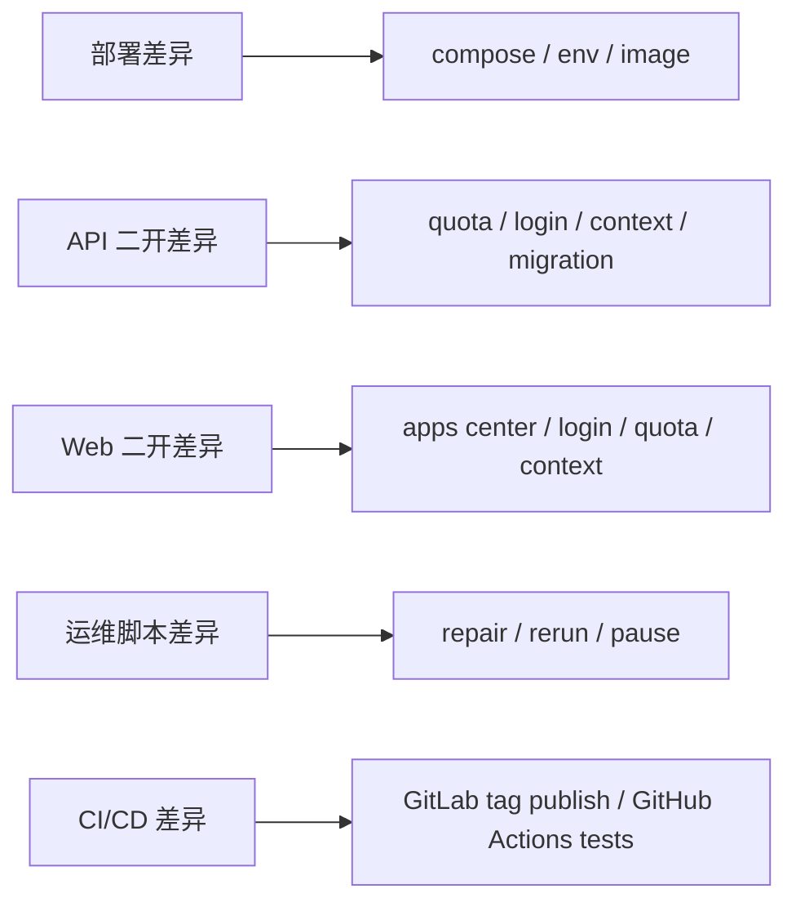

# Dify-Plus 与上游差异总表

本文按 `upstream-1.12.1` 作为对照基线，汇总当前 fork 相对官方仓库的主要差异，方便做升级、回归和责任拆分。

## 1. 差异分层

当前 fork 的差异可以分成四层（原「管理端差异」`admin/` 已于 2026-07-05 随 `p5-admin-decommission` 废弃删除，管理能力全部由 Console `/system-manage-extend/*` 承接）：

1. 交付层差异：镜像、编排、CI/CD、上游接入。
2. Dify 二开差异：`api/` 与 `web/` 中的业务改造（含系统管理 Console 化）。
3. 运维工具差异：`scripts/` 的数据修复与索引重跑。
4. 文档与工程化差异：README、AGENTS、配置样例、工作流。

## 2. 总体结构图

## 3. 差异总表

| 层级 | 差异结论 | 业务影响 | 主要文件 |
| --- | --- | --- | --- |
| 交付层 | 新增 fork 级 Docker 组合、GitLab CI、多架构镜像发布和上游 remote | 决定 fork 的发布与合并方式 | `docker/docker-compose.dify-plus.yaml`、`docker/.env.example`、`.gitlab-ci.yml` |
| 系统管理（Console） | 原 GVA 管理后台已废弃删除（2026-07-05，`p5-admin-decommission`，tag `pre-admin-removal` 留档）；系统集成、用户额度、代码执行控制均由 Console 原生承接（详见 [admin迁移状态总表](./admin迁移状态总表.md)） | 管理能力统一入 Console，消除双写与共享密钥攻击面 | `api/controllers/console/system_manage_extend.py`、`api/services/system_manage_extend.py`、`web/app/(commonLayout)/system-manage-extend/**` |
| API 二开 | 后端增加额度、模板同步、上下文、OAuth、DingTalk、权限等扩展 | 改变核心业务行为与鉴权逻辑 | `api/` 中所有 `extend` 文件、`api/migrations_extend/` |
| Web 二开 | 前端增加应用中心、额度展示、秘钥限额、上下文记忆、登录页扩展等 | 改变用户入口和操作路径 | `web/app/components/**`、`web/service/**`、`web/i18n/**` |
| 运维脚本 | 新增文档索引修复和批量暂停/重跑脚本 | 支撑生产故障处理与数据修复 | `scripts/*.py` |
| CI/CD | 新增 GitLab tag 发布链路，并补充 GitHub Actions 迁移/测试/部署任务 | 形成双轨交付和验证机制 | `.gitlab-ci.yml`、`.github/workflows/*.yml` |
| 文档工程化 | 增加 fork 说明、配置样例、部署说明与差异文档 | 降低 fork 交接成本 | `README.md`、`README_DIFY.md`、`docs/` |

## 4. 按模块拆分的差异明细

### 4.1 交付与部署

| 模块 | 相对 upstream 的差异 | 说明 |
| --- | --- | --- |
| `docker/docker-compose.dify-plus.yaml` | fork 专用编排文件，包含主链路、向量库、插件、sandbox、反代等完整服务 | upstream 的默认 compose 侧重 Dify 本身，fork 额外组织了生产交付细节 |
| `docker/docker-compose.middleware.yaml` | 提供可复用的中间件组合与迁移验证环境 | 用于测试、迁移和本地中间件启动 |
| `docker/.env.example` | 增加 fork 级别的域名、文件服务、cookie、插件与存储相关变量 | 决定部署可用性 |
| `.gitlab-ci.yml` | 新增面向腾讯云镜像仓库的构建与 manifest 发布 | upstream 不包含该 fork 交付链 |
| `.github/workflows/api-tests.yml` | 细化后端测试与 middleware 启动 | 保障 fork 后端可回归 |
| `.github/workflows/db-migration-test.yml` | 增加 PostgreSQL / MySQL 双栈迁移检查 | 保证扩展迁移可执行 |

### 4.2 管理后台（已废弃删除）

`admin/`（gin-vue-admin 管理后台）及其全部部署资产（`admin/deploy/*`、`docker/admin-server/config.docker.yaml`、compose 中 `admin-web`/`admin-server` 服务）已于 2026-07-05 随 `p5-admin-decommission` 删除，git 历史与 tag `pre-admin-removal` 留档；GVA 框架表由 `migrations_extend` 的 `016_drop_gva_admin_tables` 迁移清理。迁移与切流过程见 [admin迁移状态总表](./admin迁移状态总表.md)。

### 4.3 API 侧二开

| 功能域 | 差异摘要 | 代表文件 |
| --- | --- | --- |
| 额度与计费 | 新增账号额度、密钥额度、使用统计、余额更新逻辑 | `api/controllers/console/money_extend.py`、`api/controllers/service_api/wraps.py`、`api/events/event_handlers/update_account_money_when_messaeg_created_extend.py`、`api/tasks/extend/update_account_money_when_workflow_node_execution_created_extend.py`、`api/models/account_money_extend.py`、`api/models/api_token_money_extend.py` |
| 应用同步与模板中心 | 新增应用同步至模板、模板中心相关能力 | `api/controllers/console/app/app_extend.py`、`api/controllers/console/app/passport_extend.py`、`api/services/app_generate_service_extend.py`、`api/services/recommended_app_service_extend.py`、`api/models/tenant_model_sync_extend.py` |
| 登录与鉴权 | 增加钉钉登录、oauth2、cookie 鉴权与登录配置变体（原 admin 专用注册端点 `register_extend.py` 已随 P5 删除） | `api/libs/login_extend.py`、`api/controllers/console/app/ding_talk_extend.py`、`api/controllers/web/login.py`、`api/services/ding_talk_extend.py`、`api/tasks/mail_email_code_login.py` |
| 知识库与上下文 | 增加文档任务修复、消息上下文扩展、检索行为调整 | `api/models/model_extend.py`、`api/models/account_money_monthly_stat_extend.py`、`api/services/account_service_extend.py`、`api/services/model_provider_service_extend.py`、`api/services/model_service_extend.py`、`api/controllers/web/workflow.py` |
| 配置与迁移 | 新增扩展配置、扩展迁移目录、独立升级命令 | `api/configs/extend/__init__.py`、`api/migrations_extend/`、`api/configs/app_config.py` |

### 4.4 Web 侧二开

| 功能域 | 差异摘要 | 代表文件 |
| --- | --- | --- |
| 应用中心 | 新增应用中心与推荐列表页面，默认跳转路径被调整 | `web/app/(commonLayout)/explore/apps-center-extend/page.tsx`、`web/app/components/explore/app-list-center-extend/index.tsx` |
| 额度显示 | 新增用户额度、秘钥额度、日/月限额交互 | `web/app/components/header/account-money-extend/index.tsx`、`web/app/components/develop/secret-key/secret-key-quota-set-modal-extend.tsx` |
| 登录页 | 新增钉钉、oauth2、登录跳转与 cookie 兼容 | `web/app/signin/*`、`web/app/(shareLayout)/webapp-signin/*` |
| 上下文与会话 | 新增消息上下文控制和记忆配置 | `web/app/components/base/chat/chat/index.tsx`、`web/app/components/app/configuration/retention-number-extend/index.tsx` |
| 模板与复制 | 新增模板同步、卡片状态与引导 | `web/app/components/apps/app-card.tsx`、`web/service/use-explore.ts` |

### 4.5 运维脚本

| 脚本 | 差异摘要 | 代表文件 |
| --- | --- | --- |
| 文档索引修复 | 新增停用、修复、重跑与批量运行/停止脚本 | `scripts/fail_pending_documents.py`、`scripts/fix_stuck_documents.py`、`scripts/rerun_document_indexing.py`、`scripts/run_and_stop_dataset_tasks.py` |

### 4.6 工程化与文档

| 模块 | 差异摘要 | 代表文件 |
| --- | --- | --- |
| fork 说明 | 新增 fork 级 README 和 Dify 原版说明镜像 | `README.md`、`README_DIFY.md` |
| 工程设置 | 新增 Claude / MCP / Git ignore 调整 | `.claude/settings.json.example`、`.mcp.json`、`.gitignore` |
| 语言与国际化 | 增加或改造多语言资源与生成流程 | `web/i18n/**`、`web/i18n-config/**` |

## 5. 重点差异矩阵

### 5.1 谁负责什么

- `docker/`：部署、镜像、依赖服务、运行时环境。
- `api/`：核心业务扩展、数据库迁移、事件处理。
- `web/`：用户侧交互、页面入口、鉴权体验。
- `scripts/`：生产数据修复和任务控制。
- `.github/workflows/`、`.gitlab-ci.yml`：验证与发布。

## 6. 上游合并时的风险点

以下部分在合并 `upstream` 时最容易产生回归：

1. `docker/docker-compose.dify-plus.yaml` 和 `docker/.env.example` 的环境变量语义漂移。
2. `api/migrations_extend/` 的 revision 顺序、幂等性和离线 migration 支持。
3. `web/service/**` 中围绕 cookie、登录态、默认跳转和应用中心的 fork 逻辑。
4. `scripts/` 对 `Document`、`DocumentSegment`、Redis 标志位的直接写操作。

## 7. 建议的文档维护方式

- 每次合并上游前，先更新本文件中的“差异总表”。
- 每次新增 `extend` 相关功能，必须补一个条目到“按模块拆分的差异明细”。
- 如果某个差异已经被 upstream 吸收，应从本表中标注“已回收”或直接移除，避免长期漂移。
