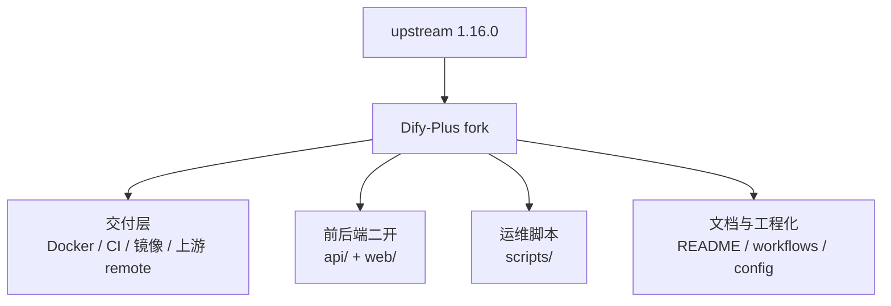
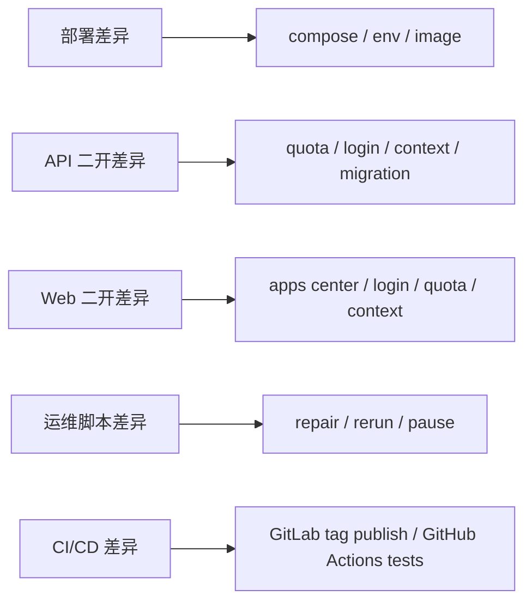

# Dify-Plus 与上游差异总表

本文按 `upstream 1.16.0` 作为对照基线（早期章节形成于 1.12.1/1.15.0 基线，结论仍然有效；1.16.0 合并期的差异变动见 §4.7），汇总当前 fork 相对官方仓库的主要差异，方便做升级、回归和责任拆分。

## 1. 差异分层

当前 fork 的差异可以分成四层（原「管理端差异」`admin/` 已于 2026-07-05 随 `p5-admin-decommission` 废弃删除，管理能力全部由 Console `/system-manage-extend/*` 承接）：

1. 交付层差异：镜像、编排、CI/CD、上游接入。
2. Dify 二开差异：`api/` 与 `web/` 中的业务改造（含系统管理 Console 化）。
3. 运维工具差异：`scripts/` 的数据修复与索引重跑。
4. 文档与工程化差异：README、AGENTS、配置样例、工作流。

## 2. 总体结构图

## 3. 差异总表

| 层级 | 差异结论 | 业务影响 | 主要文件 |
| --- | --- | --- | --- |
| 交付层 | 新增 fork 级 Docker 组合、GitLab CI、多架构镜像发布和上游 remote | 决定 fork 的发布与合并方式 | `docker/docker-compose.dify-plus.yaml`、`docker/.env.example`、`.gitlab-ci.yml` |
| 系统管理（Console） | 原 GVA 管理后台已废弃删除（2026-07-05，`p5-admin-decommission`，tag `pre-admin-removal` 留档）；系统集成、用户额度、代码执行控制均由 Console 原生承接（详见 [admin迁移状态总表](./admin迁移状态总表.md)） | 管理能力统一入 Console，消除双写与共享密钥攻击面 | `api/controllers/console/system_manage_extend.py`、`api/services/system_manage_extend.py`、`web/app/(commonLayout)/system-manage-extend/**` |
| API 二开 | 后端增加额度、模板同步、上下文、OAuth、DingTalk、权限等扩展 | 改变核心业务行为与鉴权逻辑 | `api/` 中所有 `extend` 文件、`api/migrations_extend/` |
| Web 二开 | 前端增加应用中心、额度展示、秘钥限额、上下文记忆、登录页扩展等 | 改变用户入口和操作路径 | `web/app/components/**`、`web/service/**`、`web/i18n/**` |
| 运维脚本 | 新增文档索引修复和批量暂停/重跑脚本 | 支撑生产故障处理与数据修复 | `scripts/*.py` |
| CI/CD | 新增 GitLab tag 发布链路，并补充 GitHub Actions 迁移/测试/部署任务 | 形成双轨交付和验证机制 | `.gitlab-ci.yml`、`.github/workflows/*.yml` |
| 文档工程化 | 增加 fork 说明、配置样例、部署说明与差异文档 | 降低 fork 交接成本 | `README.md`、`README_DIFY.md`、`docs/` |

## 4. 按模块拆分的差异明细

### 4.1 交付与部署

| 模块 | 相对 upstream 的差异 | 说明 |
| --- | --- | --- |
| `docker/docker-compose.dify-plus.yaml` | fork 专用编排文件，包含主链路、向量库、插件、sandbox、反代等完整服务 | upstream 的默认 compose 侧重 Dify 本身，fork 额外组织了生产交付细节 |
| `docker/docker-compose.middleware.yaml` | 提供可复用的中间件组合与迁移验证环境 | 用于测试、迁移和本地中间件启动 |
| `docker/.env.example` | 增加 fork 级别的域名、文件服务、cookie、插件与存储相关变量 | 决定部署可用性 |
| `.gitlab-ci.yml` | 新增面向腾讯云镜像仓库的构建与 manifest 发布 | upstream 不包含该 fork 交付链 |
| `.github/workflows/api-tests.yml` | 细化后端测试与 middleware 启动 | 保障 fork 后端可回归 |
| `.github/workflows/db-migration-test.yml` | 增加 PostgreSQL / MySQL 双栈迁移检查 | 保证扩展迁移可执行 |

### 4.2 管理后台（已废弃删除）

`admin/`（gin-vue-admin 管理后台）及其全部部署资产（`admin/deploy/*`、`docker/admin-server/config.docker.yaml`、compose 中 `admin-web`/`admin-server` 服务）已于 2026-07-05 随 `p5-admin-decommission` 删除，git 历史与 tag `pre-admin-removal` 留档；GVA 框架表由 `migrations_extend` 的 `016_drop_gva_admin_tables` 迁移清理。迁移与切流过程见 [admin迁移状态总表](./admin迁移状态总表.md)。

### 4.3 API 侧二开

| 功能域 | 差异摘要 | 代表文件 |
| --- | --- | --- |
| 额度与计费 | 新增账号额度、密钥额度、使用统计、余额更新逻辑 | `api/controllers/console/money_extend.py`、`api/controllers/service_api/wraps.py`、`api/events/event_handlers/update_account_money_when_messaeg_created_extend.py`、`api/tasks/extend/update_account_money_when_workflow_node_execution_created_extend.py`、`api/models/account_money_extend.py`、`api/models/api_token_money_extend.py` |
| 应用同步与模板中心 | 新增应用同步至模板、模板中心相关能力 | `api/controllers/console/app/app_extend.py`、`api/controllers/console/app/passport_extend.py`、`api/services/app_generate_service_extend.py`、`api/services/recommended_app_service_extend.py`、`api/models/tenant_model_sync_extend.py` |
| 登录与鉴权 | 增加钉钉登录、oauth2、cookie 鉴权与登录配置变体（原 admin 专用注册端点 `register_extend.py` 已随 P5 删除） | `api/libs/login_extend.py`、`api/controllers/console/app/ding_talk_extend.py`、`api/controllers/web/login.py`、`api/services/ding_talk_extend.py`、`api/tasks/mail_email_code_login.py` |
| 知识库与上下文 | 增加文档任务修复、消息上下文扩展、检索行为调整 | `api/models/model_extend.py`、`api/models/account_money_monthly_stat_extend.py`、`api/services/account_service_extend.py`、`api/controllers/web/workflow.py`（`model_provider_service_extend.py`/`model_service_extend.py` 已确认为孤儿死代码，见 §4.7） |
| 配置与迁移 | 新增扩展配置、扩展迁移目录、独立升级命令 | `api/configs/extend/__init__.py`、`api/migrations_extend/`、`api/configs/app_config.py` |

### 4.4 Web 侧二开

| 功能域 | 差异摘要 | 代表文件 |
| --- | --- | --- |
| 应用中心 | 新增应用中心与推荐列表页面，默认跳转路径被调整 | `web/app/(commonLayout)/explore/apps-center-extend/page.tsx`、`web/app/components/explore/app-list-center-extend/index.tsx` |
| 额度显示 | 新增用户额度、秘钥额度、日/月限额交互 | `web/app/components/main-nav/components/account-money-extend.tsx`（1.15.0 起自 header 迁至 main-nav）、`web/app/components/develop/secret-key/secret-key-quota-set-modal-extend.tsx` |
| 登录页 | 新增钉钉、oauth2、登录跳转与 cookie 兼容 | `web/app/signin/*`、`web/app/(shareLayout)/webapp-signin/*` |
| 上下文与会话 | 新增消息上下文控制和记忆配置 | `web/app/components/base/chat/chat/index.tsx`、`web/app/components/app/configuration/retention-number-extend/index.tsx` |
| 模板与复制 | 新增模板同步、卡片状态与引导 | `web/app/components/apps/app-card.tsx`、`web/service/use-explore.ts` |

### 4.5 运维脚本

| 脚本 | 差异摘要 | 代表文件 |
| --- | --- | --- |
| 文档索引修复 | 新增停用、修复、重跑与批量运行/停止脚本 | `scripts/fail_pending_documents.py`、`scripts/fix_stuck_documents.py`、`scripts/rerun_document_indexing.py`、`scripts/run_and_stop_dataset_tasks.py` |

### 4.6 工程化与文档

| 模块 | 差异摘要 | 代表文件 |
| --- | --- | --- |
| fork 说明 | 新增 fork 级 README 和 Dify 原版说明镜像 | `README.md`、`README_DIFY.md` |
| 工程设置 | 新增 Claude / MCP / Git ignore 调整 | `.claude/settings.json.example`、`.mcp.json`、`.gitignore` |
| 语言与国际化 | 新增 `extend` 命名空间词条（23 语种 `web/i18n/*/extend.json`，接入上游 typed-selector 装载体系 `web/i18n-config/resources.ts`）；fork 自有生成/校验脚本已随上游退役（见 §4.7） | `web/i18n/**`、`web/i18n-config/resources.ts` |

### 4.7 1.16.0 合并期差异变动登记（2026-07-20）

> 本节登记 1.15.0 → 1.16.0 合并期间 fork 差异面的**结构性增减**，避免旧章节口径漂移。
> 完整决策依据见[合并记录](./合并记录-upstream-1.16.0.md)、[复核记录-前端与部署](./复核记录-1.16.0-前端与部署.md)、[验证记录-前端](./验证记录-1.16.0-前端.md)。

**新增 fork-only 文件（差异面扩大）**

| 文件 | 说明 |
| --- | --- |
| `web/context/app-context-extend.ts` | 上游删除 `app-context.ts(x)`（拆为 jotai 原子）后，fork 权限位 `admin_extend`/`tenant_extend` 的新宿主：`adminExtendAtom`/`tenantExtendAtom`/`useExtendPermissions`；数据链为 workspace 响应 → `app-context-normalizers.ts::normalizeCurrentWorkspace`（fork 补 extend 块）→ atom。**测试桩约定**：使用 marker-atom jotai mock 的 spec 必须直接桩 `@/context/app-context-extend`（真实 jotai 派生原子与 mock 不兼容），参照 `apps/__tests__/app-card.spec.tsx` |
| `web/contract/base.ts`、`web/contract/router-extend.ts` | 上游契约层改生成物 `router.gen.ts` + per-segment 懒加载后，fork 契约（login_config 双阶段、systemManage 代码执行控制）的新宿主；经 `console-router-loader.ts` fork 段注册接入，类型经 `ConsoleRouterContractWithExtend` 并入 `consoleClient`；`X-Login-Config-Token` header 注入迁至 `client.ts::createConsoleOpenAPILink` |
| `web/utils/login-redirect.ts::getClientLoginFallback` | 登录后默认落点语义（`/` → `/explore/apps-center-extend`）自 signin 四处散落调用点集中到该函数（fork 修改上游新增文件，非独立文件）；9 个调用点覆盖 Console 与 webapp 全部登录 fallback |

**fork 文件删除/被上游吸收（差异面收窄）**

| 文件 | 原因 |
| --- | --- |
| `web/app/components/base/react-multi-email-extend/` | 上游 invite-modal 的 `EmailRecipientsField` 原生提供多邮箱 chip 输入，fork 定制被吸收后删除。**功能损失登记**：「输入裸用户名自动补 `@NEXT_PUBLIC_DEFAULT_DOMAIN`」能力随之退役，compose 的 `NEXT_PUBLIC_DEFAULT_DOMAIN` 透传现为死配置 |
| `web/i18n-config/i18next-config.ts` | 旧 i18n 装载体系，上游 1.16.0 已删；extend 命名空间注册由 `resources.ts` 承接 |
| `web/i18n-config/auto-gen-i18n.js`、`web/i18n-config/check-i18n.js` | 上游删除旧 i18n 脚本（check-i18n 迁至 `web/scripts/check-i18n.js`，`pnpm i18n:check` 指向后者）；fork 副本零引用且已不可运行。次要语种 extend 词条扩翻改走上游 `translate-i18n-claude` workflow 或人工 |
| `api/fields/app_fields.py` | 上游 marshal 字典退役；fork `retention_number` 迁入 `controllers/console/app/app.py::AppDetailWithSite`（由 `AppApi.get` 回填，顺带修复 1.15.0 时 web 端读不到该字段的问题） |
| `web/app/components/base/form/utils/index.ts`、`web/app/fonts/`（3 文件）+ layout 字体块 | fork 残留/合并误留，随上游清理（零引用） |

**工程化差异变动**

| 项 | 说明 |
| --- | --- |
| 5 个 fork 依赖入 pnpm catalog | `@serwist/next`、`@serwist/turbopack`、`serwist`、`dingtalk-jsapi`、`esbuild-wasm` 改走 `catalog:`（`pnpm-workspace.yaml` 同步登记，版本不变） |
| oxlint 基线新增 5 个 fork 文件条目 | `oxlint-suppressions.json` +26 行：signin/normal-form、webapp-signin/page、authenticated-layout（localStorage 直用 ×8）与 common-extend、system-manage-extend、explore.ts fork 段（`@/service/base` 依赖 ×3）；属登录链路/service 层结构性债务，待后续重构消化 |
| fork 死代码登记（待维护者决策） | `api/services/model_provider_service_extend.py`、`api/services/model_service_extend.py`：原 GVA「模型同步」服务层，全仓无调用方，依赖的 `ProviderConfiguration.*_without_validate_extend` 方法从未定义；1.16.0 轮仅修复 import 使可导入。删除时需同步清理 `api/models/tenant_model_sync_extend.py` 关联文档条目 |

**上游行为变化（非 fork 差异，但影响 fork 运维/脚本，需知悉）**

| 变化 | 影响 |
| --- | --- |
| console 登录 `password` 必须 Base64 编码（1.16.0 新增 `@decrypt_password_field`，明文直传 401 "Invalid encrypted data"） | 所有直调 `/console/api/login` 的 fork 脚本/巡检/e2e 需适配 |
| console 会话改 Cookie + CSRF（HttpOnly `access_token`/`refresh_token` + 非 HttpOnly `csrf_token`，`login_required` 内嵌 CSRF 校验） | console API 调用须带 Cookie + `X-CSRF-Token` 头（值取 csrf_token cookie），仅带 Cookie 会 401 |
| controller 层 `with_session` 化 + ast_grep 守卫（禁止 controller 新写 `db.session`） | fork 在 controller 层的新增写入必须走注入 session；守卫脚本 base-rev 取 PR base（见[检查清单](./上游升级与回归检查清单.md)） |

## 5. 重点差异矩阵

### 5.1 谁负责什么

- `docker/`：部署、镜像、依赖服务、运行时环境。
- `api/`：核心业务扩展、数据库迁移、事件处理。
- `web/`：用户侧交互、页面入口、鉴权体验。
- `scripts/`：生产数据修复和任务控制。
- `.github/workflows/`、`.gitlab-ci.yml`：验证与发布。

## 6. 上游合并时的风险点

以下部分在合并 `upstream` 时最容易产生回归：

1. `docker/docker-compose.dify-plus.yaml` 和 `docker/.env.example` 的环境变量语义漂移。
2. `api/migrations_extend/` 的 revision 顺序、幂等性和离线 migration 支持。
3. `web/service/**` 中围绕 cookie、登录态、默认跳转和应用中心的 fork 逻辑。
4. `scripts/` 对 `Document`、`DocumentSegment`、Redis 标志位的直接写操作。

## 7. 计费/额度挂点坐标登记（upstream 1.16.0）

> 登记时间：2026-07-20，对应合并提交 `3ba52e850a`（分支 `merge/upstream-1.16.0`）；上一版（1.15.0）见提交 `72f5def0`。
> 本表是下次合并上游时冲突解决的输入清单；每次合并上游后必须逐项复核并更新坐标。
>
> **1.16.0 复核结论**：10 项挂点全部存活，逐项复核通过（过程与修复清单见
> [复核记录-1.16.0-后端](./复核记录-1.16.0-后端.md)）。本轮结构性变化：
> - 上游 controller 层 `with_session` 化（`controllers/common/session.py`，注入 `session` 首参 + ast_grep
>   守卫禁止新写 `db.session`），generator 层改为「调用方传 `session`」——挂点 4/6 的 fork 写入全部改用注入 session；
> - `base_app_runner.py` 顶层 `from extensions.ext_database import db` 被上游移除，挂点 9 的
>   `add_messages_context` 改为函数内延迟导入 db（本轮复核发现并修复，否则运行时 NameError）；
> - graphon 升级 `0.6.0`：`graphon.model_runtime.utils.encoders`、`graphon.enums.BuiltinNodeTypes` 路径不变，实测可导入；
> - 挂点 5 约定覆盖面扩大：**所有** `validate_app_token` 方法（含非冲突文件
>   `file_preview.py`、`human_input_form.py`、`workflow_events.py`、`end_user/end_user.py`）统一带
>   `api_token: ApiToken \| None = None` 末位参数（本轮补齐 5 处历史缺口，AST 全量扫描清零）。

| # | 挂点 | 1.16.0 坐标 | 1.15.0→1.16.0 变化点 |
|---|------|------------|---------|
| 1 | workflow 节点计费 Celery 派发 | `api/core/app/workflow/layers/persistence.py` `_handle_node_succeeded`（约 282 行，末段派发 `update_account_money_when_workflow_node_execution_created_extend.delay`）；构造参数 `user_from` 由 3 个 runner 调用点传入（`advanced_chat/app_runner.py`、`workflow/app_runner.py`、`pipeline/pipeline_runner.py`） | 上游新增节点重试历史（`_append_retry_history`/`RETRY_HISTORY_PROCESS_DATA_KEY`），fork 派发块原位存活；上游新增的 2 个 retry-history 单测已补 fork monkeypatch（屏蔽 Celery 派发）。与上游 `layers/llm_quota.py` 互不调用 |
| 2 | `extras["app_token_id"]` 写入 | `workflow/app_generator.py` 约 204-213 行（`_bind_file_access_scope` with 块内、`extras = {...}` 之后）；`advanced_chat/app_generator.py` 约 172-181 行（`generate()` 顶部 `extras = {...}` 之后，**已不在 with 块内**——上游把 with 块后移至 203 行） | 上游 `generate()` 新增必填 `session:` 形参、repository 工厂加 `tenant_id`；挂点区域本身未被重构，`extras["account_id"]`（WebApp 登录用户归因）同位保留 |
| 3 | `ApiTokenMessageJoinsExtend` 写入（chatflow/workflow） | `advanced_chat/generate_task_pipeline.py` 约 445-451 行、`workflow/generate_task_pipeline.py` 约 338-346 行：`_handle_workflow_started_event` 内 `run_id` 赋值之后，仍走 `add_app_token_record_id()`（模型自带独立会话写入） | workflow 版 `event.reason == WorkflowStartReason.INITIAL` 防重条件保留；advanced_chat 版 `_database_session` 换 `session_factory`、`HumanInputRequired` 移至 `core.workflow.nodes.human_input.pause_reason`，均不触及挂点行 |
| 4 | `ApiTokenMessageJoinsExtend` 写入（chat/agent_chat/completion） | 三个 `app_generator.py` 的 `_init_generate_records(..., session=session)` 与 `MessageBasedAppQueueManager(...)` 之间（chat 约 210 行、agent_chat 约 214 行、completion 约 193 行） | **写法变更**：改为 `session.add(...) + session.commit()` 复用调用方注入 session（与 `_init_generate_records` 同会话），不再调用内部走 `db.session` 的 `add_app_token_record_id()`；单条 insert、扣费归因仍只执行一次 |
| 5 | Service API 额度前置校验 + end_user 归因 | `api/controllers/service_api/wraps.py`：`validate_token_quota_extend(api_token)` 于 decorated_view 内调用（约 134 行）、`kwargs["api_token"]` 注入（约 136 行）、`create_or_update_end_user_account_join_extend` 在 `user_logged_in.send` 之后（约 163-169 行）；模块级定义在约 412/455 行 | wraps 本体仅上游微调（`set_current_tenant_with_session`），自动合并存活；波及 controller 的 `api_token` 末位参数已全量覆盖（含本轮补齐的 5 处）；上游另注入 `kwargs["app_model"]`，方法签名需同时带两者 |
| 6 | API 密钥额度字段联查 | `api/controllers/console/apikey.py`：`ApiKeyItem` 6 个额度字段 + `DEFAULT_QUOTA_EXTEND` 兜底；`_get_api_key_list` LEFT JOIN `ApiTokenMoneyExtend`（`session.execute`）；`_create_api_key` 建密钥+建额度记录（同一注入 session，两段 commit）；`put()` 额度编辑（`@with_session`）；`_delete_api_key` 删密钥+额度软删（同事务单次 commit）。`datasets.py` 的 dataset 密钥创建仍返回 `ApiKeyItem` | **本轮最重重写**：全面迁移到 `@with_session` 装饰器注入 session，`db.session` 清零；`ApiToken.generate_api_key` 新增 `session=` 形参；`_merge_token_with_quota_extend` 增加 expired-object 防护（commit 后先触发属性加载再读 `__dict__`） |
| 7 | `message_was_created` 扣费 handler | `api/events/event_handlers/update_account_money_when_messaeg_created_extend.py`，注册于 `event_handlers/__init__.py`；信号发送点 `easy_ui_based_generate_task_pipeline.py` 约 442 行 | 上游仅新增 `queue_default_plugin_install_when_tenant_created` handler；信号发送点随 session_factory 化位移但语义未变；fork `events/__init__.py` Events shim 原样保留 |
| 8 | 3 个 extend beat 任务 | `api/extensions/ext_celery.py` 约 266-290 行（enterprise telemetry import 之后、`celery_app.conf.update` 之前），开关 `ENABLE_EXTEND_QUOTA_RESET_TASKS` | 上游仅在 imports 列表加 4 个任务 + warm shutdown handler，fork 块零改动自动合并 |
| 9 | 消息上下文处理 | `api/core/memory/token_buffer_memory.py`：`messages_context_handling`（约 45 行）+ `get_history_prompt_messages(control_registers=True)`（约 162 行）+ assistant 消息 `name=message.id` 标记（约 254 行）；`control_registers` 经 `core/prompt/prompt_transform.py`、`simple_prompt_transform.py`、`core/app/apps/base_app_runner.py::organize_prompt_messages` 全链传递；登记入口 `AppRunner.add_messages_context`（约 91 行，chat runner 约 255 行 / agent_chat runner 约 91 行调用） | 上游把 message files 查询改为循环前批量预取（2N+1→2 次查询），挂点行不受影响；**本轮修复**：`add_messages_context` 所依赖的顶层 `db` import 被上游移除，改为函数内延迟导入；全链其余环节自动合并后逐行核对无丢失（1.13.3 丢失前科未重演） |
| 10 | OaOAuth / 钉钉 OAuth | `api/libs/oauth.py` `OaOAuth`（约 318 行；`get_authorization_url(invite_token, timezone, language, redirect_url)` + `encode_oauth_state`）；`api/controllers/console/auth/oauth.py` callback（casdoor `access_token` fallback + dict token 解析 + `id_token` 追加至 `_get_redirect_target(redirect_url)` 回跳 URL，约 181-297 行）；钉钉独立于 `api/services/ding_talk_extend.py` | 上游 `OAuthState` 新增 `redirect_url` 字段（登录后同源回跳），`get_authorization_url` 全部 provider 签名 +`redirect_url`——fork `OaOAuth` 已同步签名并透传 `encode_oauth_state`；callback 的 `SeatsLimitExceededError`、`create_owner_tenant` 等上游新逻辑与 fork fallback 并存 |

## 8. 建议的文档维护方式

- 每次合并上游前，先更新本文件中的“差异总表”。
- 每次新增 `extend` 相关功能，必须补一个条目到“按模块拆分的差异明细”。
- 如果某个差异已经被 upstream 吸收，应从本表中标注“已回收”或直接移除，避免长期漂移。
