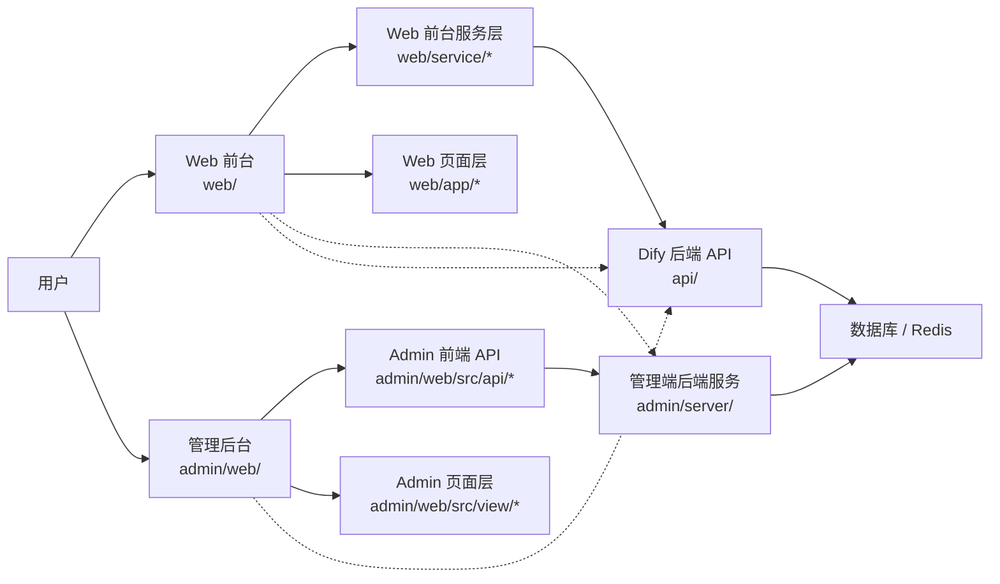
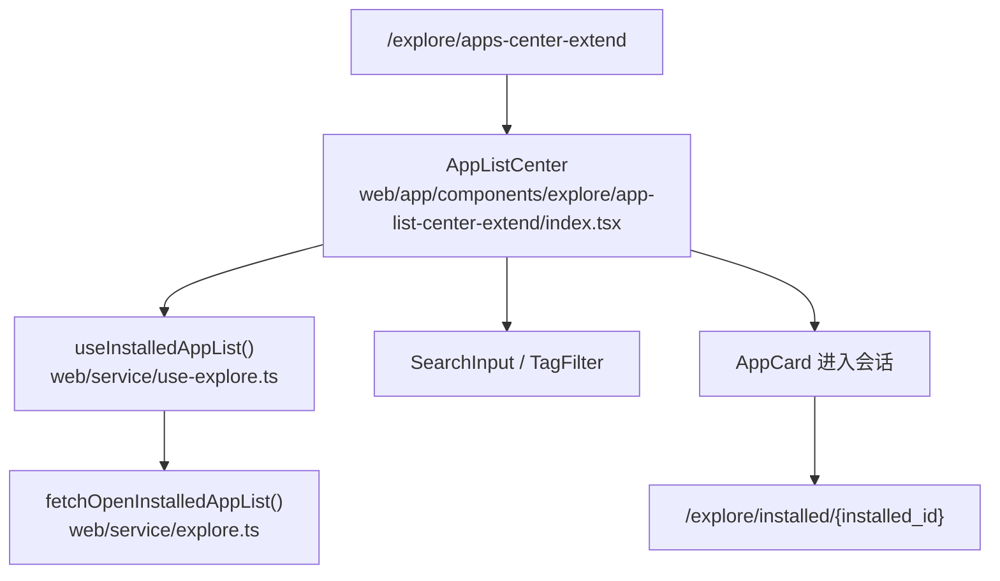
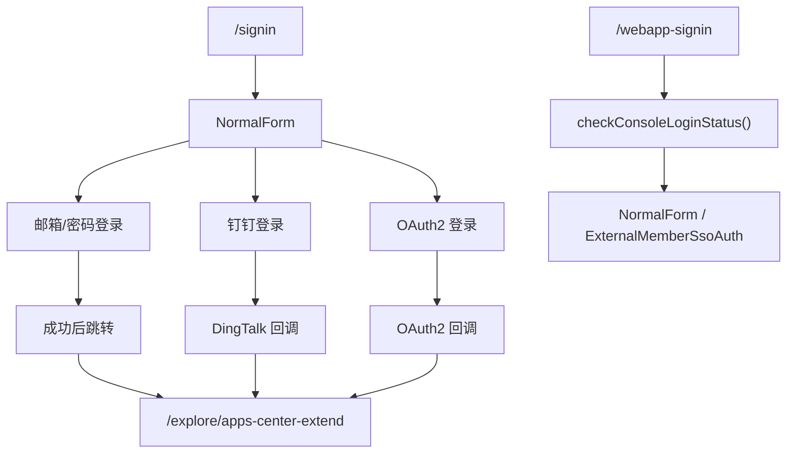
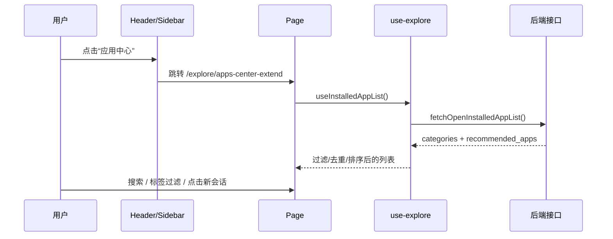
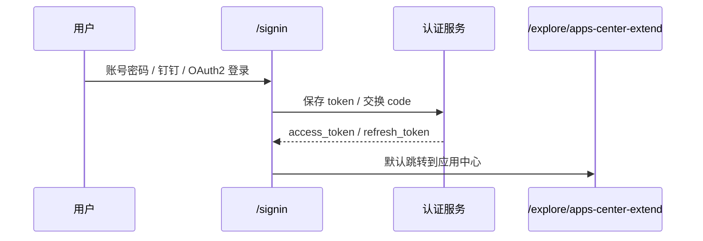
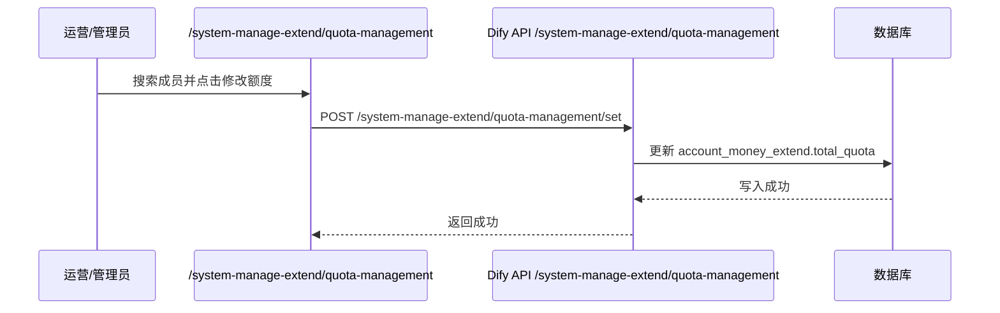

# Dify-Plus Web 与管理后台二开功能详解

本文基于当前分支 `HEAD` 相对 `upstream-1.12.1` 的差异整理，重点覆盖 Web 端、管理后台、认证链路、额度体系、应用中心、模型管理和批量工作流能力。

## 1. 基线与范围

- 基线仓库：`upstream-1.12.1`
- 当前分支：`codex/switch-1.12.1-docs`
- 核心改动集中在：
  - `web/`
  - `admin/`
  - `docker/`
  - `api/` 中与前端交互有关的二开接口

本说明只聚焦 Web 与管理后台，不展开 Docker 部署细节和后端数据库迁移实现的完整清单。

## 2. 总体架构

### 2.1 Web 端职责

- 对外承接应用浏览、登录、会话和应用配置。
- 把应用中心设为默认落点，降低首次进入成本。
- 对二开能力提供可视化入口：额度、应用模板同步、记忆上下文、登录鉴权、API Key 限额。

### 2.2 管理端职责

- 管理二开功能的“运营控制台”。
- 提供额度排行、用户额度编辑、钉钉/OAuth2 集成、模型提供商管理、版本发布管理和批量工作流处理。

## 3. Web 端二开功能

### 3.1 应用中心改造

相关文件：

- `web/app/components/header/index.tsx`
- `web/app/components/header/explore-nav/index.tsx`
- `web/app/components/explore/sidebar/index.tsx`
- `web/app/(commonLayout)/explore/apps-center-extend/page.tsx`
- `web/app/components/explore/app-list-center-extend/index.tsx`
- `web/app/components/explore/app-card-extend/index.tsx`
- `web/service/use-explore.ts`

核心变化：

- 顶部 Logo 和 `Explore` 导航默认跳到 `/explore/apps-center-extend`。
- 应用中心的列表数据来自 `useInstalledAppList()`，不再只显示原始探索页的推荐应用，而是展示已安装应用并按使用情况排序。
- 支持分类、标签和关键字筛选。
- 支持从应用中心直接进入已安装应用对话页。

用户体验上，应用中心已经从“静态展示页”变成“可筛选、可进入、可排序”的主入口。

### 3.2 应用模板同步

相关文件：

- `web/app/components/explore/app-card.tsx`
- `web/service/apps.ts`
- `web/app/components/apps/list.tsx`

核心变化：

- 在应用卡片的操作区增加“同步到应用模板”和“取消同步”。
- 对应接口：
  - `PUT /apps/{appId}/sync`
  - `DELETE /apps/{appId}/sync`
- 同步动作完成后会刷新列表和计划信息，保持前台、模板中心和管理侧状态一致。

这是典型的 fork 特性：把原本单一应用的编辑能力扩展成“应用 -> 模板中心”的双向流转。

### 3.3 登录与鉴权链路

相关文件：

- `web/app/signin/page.tsx`
- `web/app/signin/normal-form.tsx`
- `web/app/signin/components/dingtalk-auth.tsx`
- `web/app/signin/components/oauth2.tsx`
- `web/app/signin/components/sso-auth.tsx`
- `web/app/(shareLayout)/webapp-signin/page.tsx`
- `web/app/(shareLayout)/webapp-signin/normalForm.tsx`
- `web/app/(shareLayout)/webapp-signin/components/external-member-sso-auth.tsx`
- `web/service/webapp-auth.ts`
- `web/service/share.ts`
- `web/context/global-public-context.tsx`

核心变化：

- 登录页新增钉钉和 OAuth2 快捷入口。
- 普通邮箱密码登录成功后，默认跳转到 `/explore/apps-center-extend`。
- 如果本地存在 `redirect_url`，优先回跳到原目标页面。
- WebApp 公开页 `/webapp-signin` 会先检查 Console 登录态，再根据访问模式决定走邮箱登录、外部成员 SSO，还是直接提示不可用。
- 全局系统特性从 `/login_config_bootstrap` + `/login_config` 两段式获取，避免跨域时 cookie/JWT 丢失。
- WebApp 强制登录支持 per-app 开关（默认开启）：`authenticated-layout.tsx` 经 `checkWebAppConsoleAuthStatus(shareCode)`（`GET /login/status?app_code=`）读取 `webapp_auth_enabled_extend`，为 `false` 时不再强制跳 `/signin`，任何人可匿名访问；开关位于 Console 应用概览页的 Web App 卡片（`web/app/components/app/overview/app-card.tsx`「访问认证」Switch，附悬停帮助 Tooltip），切换后只提交 `webapp_auth_enabled_extend` 单字段到 `POST /apps/{id}/site` 并刷新应用详情，Web App 未运行或无编辑权限时开关置灰。

### 3.4 应用配置页的二开能力

相关文件：

- `web/app/components/app/configuration/index.tsx`
- `web/app/components/app/configuration/config/index.tsx`
- `web/app/components/app/configuration/retention-number-extend/index.tsx`
- `web/app/components/header/account-money-extend/index.tsx`
- `web/app/components/header/account-setting/model-provider-page/model-parameter-modal/parameter-item-extend.tsx`
- `web/app/components/develop/secret-key/secret-key-quota-set-modal-extend.tsx`

核心变化：

- 增加“记忆上下文”配置，默认值通过环境变量控制：
  - `NEXT_CONTEXT_RETENTION_DEFAULT_COUNT`
  - `NEXT_CONTEXT_RETENTION_MAX_COUNT`
  - `NEXT_CONTEXT_RETENTION_MIN_COUNT`
- 顶部栏展示当前账户额度，随账户数据变化刷新。
- 模型参数编辑器扩展了更多参数类型展示能力，能直接承接二开后的模型参数规则。
- API Key 创建/编辑弹窗增加日限额、月限额与用途描述。

这些能力把原本“应用配置”进一步延伸成“面向企业的运行参数控制台”。

### 3.5 公共认证与系统特性拉取

相关文件：

- `web/context/global-public-context.tsx`
- `web/service/webapp-auth.ts`
- `web/service/common.ts`
- `web/service/client.ts`

核心变化：

- 系统特性不再只依赖单一接口返回，而是先拿 bootstrap token，再拉取完整特性。
- 认证态在不同页面间共享，避免 `localhost` / `127.0.0.1` 同源和 cookie 丢失问题。
- 公开页登录态检查支持 Console / WebApp 双层状态。

## 4. 管理后台二开功能

> **迁移进度概览**：系统集成（钉钉 SSO、OAuth2、邮箱 API、转发 Token）和用户额度管理已迁移到 Dify 原生技术栈，可通过 Console 顶部菜单"系统管理"直接访问（仅 workspace owner 可见）。批量工作流已按决策点 D2（2026-07-05，方案 A）删除前端能力，Dify 前端不再有任何 GVA 运行时依赖；Go 侧实现与数据表处置见[批量工作流数据表冷备归档说明](./批量工作流数据表冷备归档说明.md)。完整迁移状态见 [admin迁移状态总表](./admin迁移状态总表.md)。

### 4.1 运营总览和额度看板

相关文件：

- `admin/web/src/view/dashboard/index.vue`
- `admin/web/src/view/gaia/dashboard/index.vue`
- `admin/web/src/view/gaia/dashboard/components/*.vue`
- `admin/web/src/api/gaia/dashboard.js`
- `admin/server/router/gaia/dashboard.go`
- `admin/server/service/gaia/dashboard.go`

功能点：

- 成员使用分析。
- 应用使用分析。
- 密钥使用分析。
- 每日密钥额度花费图表。

接口维度：

- `GET /gaia/dashboard/getAccountQuotaRankingData`
- `GET /gaia/dashboard/getAppQuotaRankingData`
- `GET /gaia/dashboard/getAppTokenQuotaRankingData`
- `GET /gaia/dashboard/getAppTokenDailyQuotaData`
- `GET /gaia/dashboard/getAiImageQuotaRankingData`

这里的核心价值不是“看板展示”，而是把多个二开表和 Dify 原生数据统一汇总成运营视角。

### 4.2 用户额度管理

> **迁移状态**：✅ 已迁移到 Dify 原生技术栈，详见 [admin迁移状态总表](./admin迁移状态总表.md)。

原 GVA 文件：

- `admin/web/src/view/quota/index.vue`
- `admin/web/src/api/user.js`
- `admin/server/router/gaia/quota.go`
- `admin/server/service/gaia/quota.go`
- `admin/server/model/gaia/response/quota.go`

**Dify 原生实现**：

- 后端：`api/controllers/console/system_manage_extend.py` (`QuotaManageResource` / `QuotaSetResource`)
- 服务层：`api/services/system_manage_extend.py` (`QuotaManageService`)
- 前端页面：`web/app/(commonLayout)/system-manage-extend/quota-management/page.tsx`
- 入口菜单：`web/app/components/header/system-manage-nav-extend/index.tsx`

Dify 原生接口：

- `GET /console/api/system-manage-extend/quota-management`
- `POST /console/api/system-manage-extend/quota-management/set`

### 4.3 钉钉集成

相关文件：

- `admin/web/src/view/systemIntegrated/dingTalk/index.vue`
- `admin/web/src/api/gaia/system.js`
- `admin/server/router/gaia/system.go`
- `admin/server/api/v1/gaia/system.go`
- `admin/server/service/gaia/system.go`

功能点：

- 配置回调域名并支持一键复制。
- 配置 `CorpID`、`AppID`、`AgentID`、`AppKey`、`AppSecret`。
- 配置第三方邮箱 API，用于登录后补充用户邮箱信息。
- 支持测试连接与启用状态切换。

> **迁移说明**：钉钉集成（含邮箱 API 配置、转发 Token 管理）已迁移到 Dify 原生 Flask API。后端见 `api/controllers/console/system_manage_extend.py`，前端入口在 `/system-manage-extend/system-integration`。详见 [admin迁移状态总表](./admin迁移状态总表.md)。

### 4.4 OAuth2 集成

> **迁移说明**：OAuth2 集成已迁移到 Dify 原生 Flask API（`OAuth2IntegrationResource`），前端与钉钉集成共用同一页面。详见 [admin迁移状态总表](./admin迁移状态总表.md)。

原 GVA 文件：

- `admin/web/src/view/systemIntegrated/oauth2/index.vue`
- `admin/web/src/api/gaia/system.js`
- `admin/server/api/v1/gaia/system_oauth2.go`
- `admin/server/service/gaia/system.go`

功能点：

- 配置 OAuth2 服务器地址、授权地址、Token 地址、用户信息地址、退出地址、OIDC discovery 地址。
- 配置 `Client ID` / `Client Secret`。
- 配置用户名、邮箱、用户唯一标识映射字段。
- 支持测试连接与启用状态切换。

### 4.5 模型管理

相关文件：

- `admin/web/src/view/systemIntegrated/modelManagement/index.vue`
- `admin/web/src/api/modelProvider.js`
- `admin/server/router/gaia/system.go`
- `admin/server/api/v1/gaia/model_provider.go`
- `admin/server/service/gaia/model_provider.go`
- `admin/server/model/gaia/response/model_provider.go`

功能点：

- 按提供商展示模型配置。
- 支持启用 / 关闭提供商。
- 支持选择可用模型，允许手工补充自定义模型 ID。
- 支持测试凭证。
- 支持拉取可用模型列表和代理日志。

页面上只展示逻辑提供商，不直接暴露底层实现细节，便于把 Dify 的 provider 能力抽象成管理侧的运营对象。

### 4.6 版本发布与下载管理

相关文件：

- `admin/web/src/view/gaia/appVersion/index.vue`
- `admin/web/src/api/gaia/appVersion.js`
- `admin/server/router/gaia/app_version.go`
- `admin/server/service/gaia/app_version.go`
- `admin/server/model/gaia/response/app_version.go`

功能点：

- 版本列表管理。
- 全局链接 Token 配置。
- 版本说明编辑。
- 安装包拖拽上传与平台/架构自动识别。
- 指定平台/架构包删除。

这块更像一个独立的“第三方软件发布中心”，但与当前 fork 的二开管理平台放在一起，说明该仓库已经不只是 Dify 运行时外壳。

### 4.7 登录与回调

相关文件：

- `admin/web/src/view/login/index.vue`
- `admin/web/src/view/login/callback.vue`
- `admin/web/src/api/user_extend.js`
- `admin/web/src/permission.js`

功能点：

- 管理后台支持钉钉登录和 OAuth2 登录。
- `login/callback.vue` 负责接收第三方 code / access_token / state，并换取后台 token。
- 登录成功后会优先回跳第三方应用，否则进入管理后台默认首页。

## 5. 关键调用链

### 5.1 应用中心

### 5.2 登录与重定向

### 5.3 管理端额度调整

## 6. 相对 upstream 的主要差异

以下是从前端/管理端视角最重要的 fork 差异：

- 默认落点从原始探索页调整为 `/explore/apps-center-extend`。
- 新增应用中心搜索、标签过滤、按使用情况排序和一键新会话。
- 新增钉钉与 OAuth2 登录入口，并把第三方回调纳入标准登录流。
- 新增 WebApp 公开页登录鉴权、redirect_url 回跳和外部成员 SSO。
- 新增记忆上下文开关与上下文窗口大小控制。
- 新增 API Key 的日/月限额编辑能力。
- 新增顶部账户额度展示。
- 新增管理后台的额度总览、用户额度编辑、模型管理、系统集成和版本发布管理。
- ~~新增批量工作流处理入口，支持上传文件、进度轮询、暂停、恢复、重试~~（已按决策点 D2 于 2026-07-05 删除，前端恢复上游原生 run-batch；见[批量工作流数据表冷备归档说明](./批量工作流数据表冷备归档说明.md)）。

## 7. 维护要点

- 应用中心相关改动分散在 header、sidebar、页面容器、服务层和国际化中，改 UI 时必须同步检查跳转路径和排序逻辑。
- 登录链路涉及 `web/context/global-public-context.tsx`、`web/service/client.ts`、`web/service/webapp-auth.ts` 和两套登录页面，改 token 逻辑时不能只改一个入口。
- 管理后台的钉钉/OAuth2 配置和前端登录按钮是强耦合的，配置页面、登录页和 callback 页必须一起看。
- 模型管理页面目前按逻辑提供商展示，新增 provider 时要同步服务端 `SupportedProviders`、前端显示名和可用模型拉取逻辑。
- 额度相关功能同时读写多个扩展表，新增报表字段时要先确认数据库表、服务层聚合和前端列定义是否一致。

