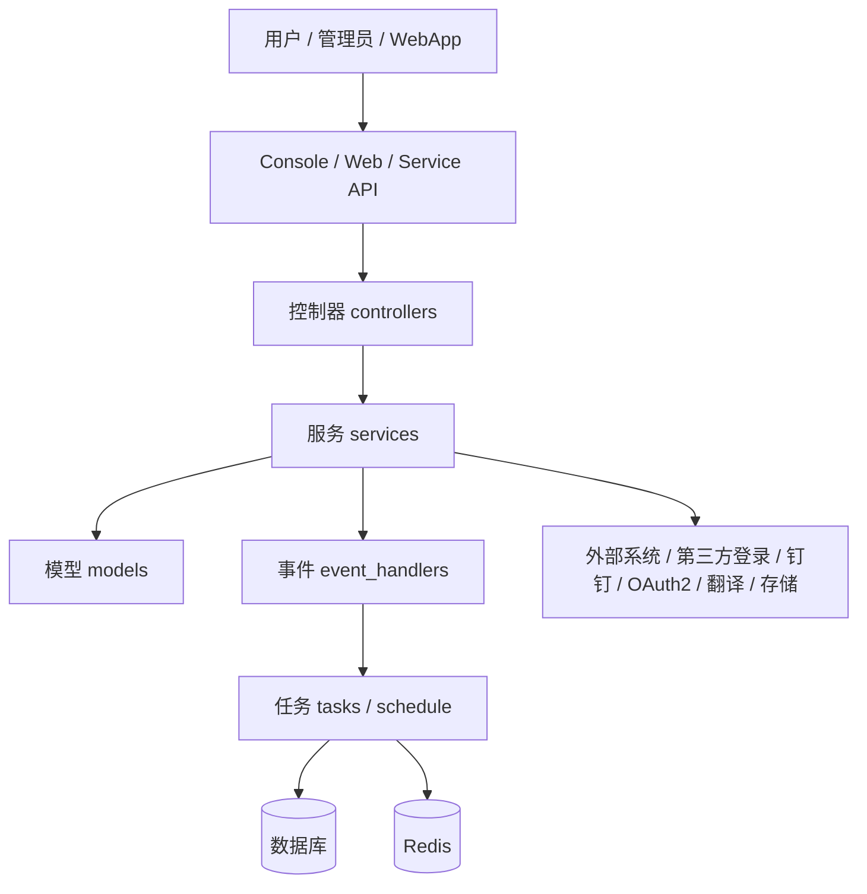
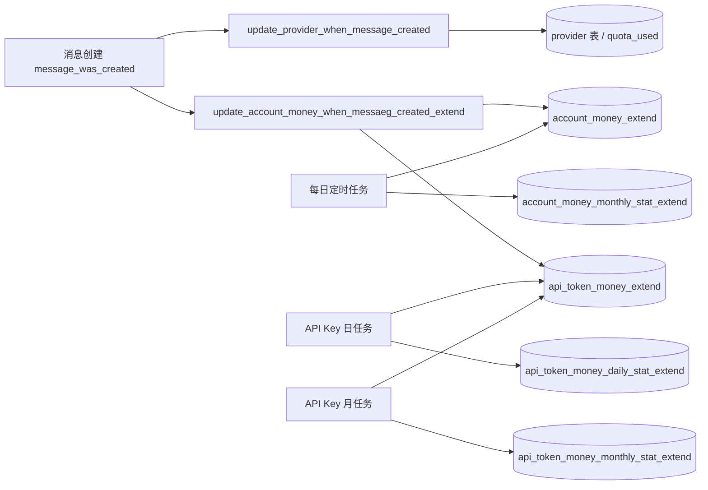

# Dify-Plus 二开功能详解 - 后端与数据层

> 范围说明：本文梳理本仓库的后端/API/数据层二开能力；上游合并后代码路径可能迁移，维护时以当前源码与[合并执行图](../../openspec/changes/merge-upstream-1-17-1/execution-graph.md)为准。

## 1. 阅读范围

本文只覆盖后端与数据层，核心关注以下目录与文件：

- `api/controllers/**`
- `api/services/**`
- `api/models/**`
- `api/tasks/**`
- `api/schedule/**`
- `api/migrations_extend/**`
- `api/configs/**`
- `api/events/event_handlers/**`
- `api/libs/**`

其中大部分二开逻辑带有 `extend` 命名或注释，便于快速定位。

## 2. 总体架构

从实现上看，fork 的增量主要分成六类：

1. 额度与计费：用户额度、密钥额度、账单转发、额度快照。
2. 应用中心：推荐应用排序、安装、同步到模板中心。
3. 模型同步：工作区模型/供应商同步与授权凭证复用。
4. 登录与认证：钉钉登录、OAuth2、WebApp Passport、登录配置 bootstrap。
5. 记忆与上下文：聊天上下文记忆数、消息上下文分割。
6. 系统集成：钉钉/微信/飞书/OAuth2 的统一配置落库。

## 3. 功能分类

### 3.1 额度与计费

这一组是 fork 最核心的二开能力，围绕“用户余额”和“API Key 额度”建立了一套独立的数据模型、事件监听和定时快照机制。

关键入口：

- `api/controllers/console/money_extend.py`
- `api/services/billing_extend.py`
- `api/events/event_handlers/update_account_money_when_messaeg_created_extend.py`
- `api/events/event_handlers/update_provider_when_message_created.py`
- `api/schedule/update_account_used_quota_extend.py`
- `api/schedule/update_api_token_daily_used_quota_task_extend.py`
- `api/schedule/update_api_token_monthly_used_quota_task_extend.py`
- `api/models/account_money_extend.py`
- `api/models/api_token_money_extend.py`
- `api/models/account_money_monthly_stat_extend.py`
- `api/models/api_token_money_extend.py`

数据流可以拆成三段：

核心行为：

- `AccountMoneyExtend.total_quota` / `used_quota` 表示 Dify-Plus 独立维护的个人账号额度，与上游 Cloud quota 分开管理。App API Key 的 `day_limit_quota` / `month_limit_quota` 是周期限额；`accumulated_quota` 是累计已用额度，不是 Key 的生命周期总额度上限。
- `api/events/event_handlers/update_account_money_when_messaeg_created_extend.py` 负责在消息创建时扣减账号余额，并把 API 调用的费用同步到 `api_token_money_extend`。
- `api/events/event_handlers/update_provider_when_message_created.py` 将原来分散的 provider last_used 更新和 quota 扣减合并成一个事务化执行流程，减少一致性问题。
- `api/controllers/console/money_extend.py` 只负责读取当前账号额度，不做复杂业务逻辑。
- `api/services/billing_extend.py` 处理转发计费、余额校验和费用落库，同时生成 `account_layover_record_extend` 作为费用凭证。
- `api/schedule/update_account_used_quota_extend.py`、`api/schedule/update_api_token_daily_used_quota_task_extend.py`、`api/schedule/update_api_token_monthly_used_quota_task_extend.py` 负责生成快照并归零周期额度。

### 3.2 应用中心与推荐应用

这一部分把“应用安装”和“推荐应用中心”变成了 fork 的显式功能。

关键入口：

- `api/controllers/console/explore/recommended_app.py`
- `api/controllers/console/explore/installed_app.py`
- `api/controllers/console/explore/workflow.py`
- `api/controllers/console/app/app_extend.py`
- `api/services/recommended_app_service_extend.py`
- `api/services/recommended_app_service.py`
- `api/services/app_service.py`
- `api/services/app_generate_service_extend.py`
- `api/models/model.py` 中的 `AppStatisticsExtend`、`RecommendedApp`、`InstalledApp`

实现特点：

- `api/services/app_service.py` 在创建和查询 App 时注入 `AppStatisticsExtend`，用于按使用次数排序。
- `api/services/app_generate_service_extend.py` 在工作流 App 被运行时递增使用次数，支撑推荐列表排序。
- `api/services/recommended_app_service_extend.py` 负责“同步到应用模板中心”和“已安装应用列表”的维护。
- `api/controllers/console/explore/installed_app.py` 提供安装、卸载、置顶、排序等能力。

### 3.3 模型同步与工作区复制

这一组是 fork 在多工作区场景里的重要能力，目标是把一个工作区中的模型或供应商配置同步到其他工作区。

关键入口：

- `api/services/model_provider_service_extend.py`
- `api/services/model_service_extend.py`
- `api/services/account_service_extend.py`
- `api/models/tenant_model_sync_extend.py`
- `api/controllers/console/workspace/model_providers.py`

关键逻辑：

- `TenantExtendService.get_sync_all_model()` 和 `get_sync_all_provider()` 从 `model_sync_config_extend` 读取“是否允许全量同步”的配置。
- `ModelExtendService.sync_set_all_model_to_tenant()` 将源工作区的模型/供应商凭证复制到目标工作区。
- `ModelProviderExtendService.create_tenant_model_sync_if_not_exist()` 将同步关系写入 `tenant_model_sync_extend`，避免重复同步。
- `api/controllers/console/workspace/model_providers.py` 提供模型凭证创建、更新、删除、切换和校验入口，是上层交互面。

### 3.4 登录与认证

fork 对认证链路的改造主要集中在钉钉登录、OAuth2 兼容和登录配置保护；WebApp Passport 使用上游标准链路。

关键入口：

- `api/controllers/console/app/ding_talk_extend.py`
- `api/services/ding_talk_extend.py`
- `api/libs/login_extend.py`
- `api/controllers/console/auth/oauth.py`
- `api/services/oauth_server.py`
- `api/controllers/web/passport.py`
- `api/controllers/console/feature.py`
- `api/libs/token.py`

要点：

- `api/controllers/console/app/ding_talk_extend.py` 用 `DingTalkService` 完成钉钉登录回调，并统一设置 access / refresh / csrf cookie。
- `api/services/ding_talk_extend.py` 负责钉钉 OAuth2、第三方邮箱查询、用户信息映射与 workspace 自动初始化。
- `api/controllers/console/auth/oauth.py` 在原生 GitHub/Google OAuth 基础上增加了 `oauth2` 分支，并兼容部分 Casdoor 变体的回调行为。
- 旧的 `/console/api/passport-extend` 二开端点因零消费者、运行时必然报错且缺少完整租户/App 资源约束，已在 1.16.0 Beta 发布收尾中安全退役；WebApp Passport 继续使用 `api/controllers/web/passport.py` 标准链路。
- `api/controllers/console/feature.py` 添加了 `login_config_bootstrap` / `login_config` 的 token 保护，避免未授权探测直接获取系统配置。
- `api/libs/login_extend.py` 提供 `repost_login_required`，用于代理透传场景的登录校验。
- `api/libs/token.py` 增加跨域 cookie 域名与 `__Host-` 前缀处理，兼容更严格的浏览器安全策略。
- WebApp 强制登录（`controllers/web/completion.py::is_end_login` 在 completion / chat / workflow run 三个生成端点校验 Console access_token cookie）支持 per-app 开关：`AppExtend.webapp_auth_enabled`（NULL/True=需登录，False=允许匿名，迁移 019），读写统一走 `api/services/webapp_auth_service_extend.py`（redis 投影缓存 `webapp_auth_enabled_extend:{app_id}`，写后失效）；写入口为 `POST /console/api/apps/{id}/site` 的 `webapp_auth_enabled_extend` 字段，匿名读出口为 `GET /api/login/status?app_code=` 响应同名字段。开关关闭时匿名请求不做计费归因（无 `account_id`），已登录用户仍照常归因。

### 3.5 记忆上下文与消息上下文

fork 把“上下文记忆”从纯前端配置扩展为后端落库和查询能力。

关键入口：

- `api/models/model_extend.py`
- `api/services/app_service.py`
- `api/services/recommended_app_service_extend.py`
- `api/controllers/console/app/app_extend.py`
- `api/web/*` 中对应的配置展示会消费这些数据，但这里重点是后端存取

实现方式：

- `AppExtend.retention_number` 保存单个 App 的上下文保留轮数。
- `MessageContextExtend` 保存消息上下文的分割点，按 `conversation_id` 和 `created_at` 索引。
- `api/controllers/console/app/app_extend.py` 提供消息上下文查询与删除接口，供前端调试和管理。
- `api/services/recommended_app_service_extend.py` 提供 `message_context()` 和 `delete_message_context()`，用于读取和清理上下文列表。

### 3.6 系统集成

这一块把钉钉、微信、飞书、OAuth2 的统一配置收敛到一张表里，供登录和企业集成使用。

关键入口：

- `api/models/system_extend.py`
- `api/migrations_extend/versions/2025_03_31_2136-588f1696997b_add_system_integration_extend.py`
- `api/migrations_extend/versions/2025_04_01_0001-add_system_integration_extend_fields.py`
- `api/services/ding_talk_extend.py`

实现特点：

- `SystemIntegrationExtend` 统一存储 `classify`、`status`、`corp_id`、`agent_id`、`app_id`、`app_key`、`app_secret`、`config`。
- `decodeSecret()` 使用 `SECRET_KEY` 作为 Blowfish 密钥解密 `app_secret`，因此该字段不能当作普通文本处理。
- `api/services/ding_talk_extend.py` 会从 `config` 里读取第三方邮箱接口等扩展配置。

## 4. 数据流与调用链

### 4.1 消息计费链路

1. 消息创建触发 `message_was_created`。
2. `api/events/event_handlers/update_account_money_when_messaeg_created_extend.py` 查找付款方，更新 `account_money_extend`。
3. 如果消息来自 API Key，再通过 `api_token_message_joins_extend` 找到对应密钥并更新 `api_token_money_extend`。
4. `api/events/event_handlers/update_provider_when_message_created.py` 处理 provider 的 `last_used` 和 quota 扣减。

### 4.2 应用中心链路

1. App 创建时，`api/services/app_service.py` 会初始化 `AppStatisticsExtend`。
2. App 在工作流运行时，`api/services/app_generate_service_extend.py` 自增次数。
3. `api/services/recommended_app_service_extend.py` / `api/controllers/console/explore/recommended_app.py` 读取次数排序的应用列表。
4. `api/controllers/console/explore/installed_app.py` 负责安装后的列表、置顶和卸载。

### 4.3 模型同步链路

1. 工作区模型/供应商凭证由 `api/controllers/console/workspace/model_providers.py` 维护。
2. `api/services/model_service_extend.py` 和 `api/services/model_provider_service_extend.py` 读取源工作区的凭证。
3. 复制到目标工作区后写入 `tenant_model_sync_extend`，建立同步关系。
4. `api/models/tenant_model_sync_extend.py` 记录同步来源和是否全量同步。

### 4.4 登录链路

1. 钉钉或 OAuth2 回调到 `api/controllers/console/app/ding_talk_extend.py` / `api/controllers/console/auth/oauth.py`。
2. 服务层完成用户映射、workspace 初始化和 token 签发。
3. `api/libs/token.py` 将 token 写入 cookie。
4. `api/controllers/console/feature.py` 的 `login_config_bootstrap` / `login_config` 负责系统配置初始化前的安全门。

## 5. 与 upstream 的关系

这一 fork 的二开并不是“单独的插件层”，而是直接嵌入 Dify 主流程的实现：

- 新增控制器一般以 `*_extend.py` 形式挂在 `controllers.console` 下。
- 新增服务通常复用原始服务，再在调用前后插入二开逻辑。
- 已改造的核心路径包括 `api/services/app_service.py`、`api/controllers/console/auth/oauth.py`、`api/controllers/console/feature.py`、`api/libs/token.py`、`api/services/recommended_app_service.py`。
- 数据层通过 `api/models/*_extend.py` 和 `api/migrations_extend/*` 独立扩展，尽量不污染原始表结构。

这种方式的优点是接入快、侵入性小，但代价是：

- 需要严格控制二开代码和原生代码之间的耦合边界。
- 上游升级时要特别检查被“就地插入”的文件是否发生冲突。
- 业务一致性依赖事件、任务和迁移脚本的组合，而不是单一表结构。

## 6. 风险与维护要点

1. `api/events/event_handlers/update_account_money_when_messaeg_created_extend.py` 和 `api/services/billing_extend.py` 都涉及扣费，必须保持事务边界和幂等性，否则容易出现重复扣费或余额不同步。
2. `api/events/event_handlers/update_provider_when_message_created.py` 的 quota 扣减依赖 Redis 缓存和数据库更新，升级时要检查 `provider:last_used` 的 TTL 和写回逻辑。
3. `api/controllers/console/feature.py` 的 `login_config` 是系统启动前置门，任何改动都必须验证未登录场景和跨域场景。
4. `api/services/ding_talk_extend.py` 同时处理第三方邮箱查询、钉钉 token、注册/绑定流程，属于高耦合模块，建议继续拆分。
5. `api/services/recommended_app_service_extend.py` 和 `api/services/app_service.py` 通过 `AppStatisticsExtend` 影响推荐排序，数据初始化和补数逻辑要避免大表全扫。
6. `api/libs/token.py` 的 cookie 域名和 `__Host-` 处理是跨域认证的关键，修改前必须确认部署域名结构。
7. `api/migrations_extend/*` 大量使用 `Inspector.from_engine` 和存在性检查，虽然便于重复执行，但迁移代码风格不统一，后续新增迁移应尽量统一模板。

## 7. 快速索引

- 额度与计费：`api/controllers/console/money_extend.py`、`api/services/billing_extend.py`、`api/events/event_handlers/update_account_money_when_messaeg_created_extend.py`
- 应用中心：`api/controllers/console/explore/recommended_app.py`、`api/controllers/console/explore/installed_app.py`、`api/services/recommended_app_service_extend.py`
- 模型同步：`api/services/model_provider_service_extend.py`、`api/services/model_service_extend.py`、`api/models/tenant_model_sync_extend.py`
- 登录认证：`api/controllers/console/app/ding_talk_extend.py`、`api/controllers/console/auth/oauth.py`、`api/controllers/web/passport.py`
- 系统集成：`api/models/system_extend.py`、`api/services/ding_talk_extend.py`
- 上下文记忆：`api/models/model_extend.py`、`api/controllers/console/app/app_extend.py`
