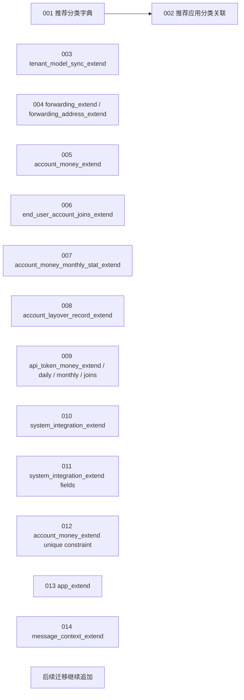

# Dify-Plus 二开数据库与迁移说明

> 本文聚焦 `api/migrations_extend` 与 `api/models/*_extend.py` 所代表的数据层扩展。
> 目标是把“有哪些表”“为什么存在”“如何迁移”“如何维护”说明白。

## 1. 迁移框架

二开迁移不复用原生 `api/migrations`，而是独立放在：

- `api/migrations_extend/env.py`
- `api/migrations_extend/versions/*.py`
- `api/migrations_extend/README.md`

执行时使用单独的版本表：

- `alembic_version_extend`

相关命令见 `api/migrations_extend/README.md`，例如：

- `flask extend_db upgrade`
- `flask extend_db downgrade --revision 版本号`
- `flask extend_db current`

`api/migrations_extend/env.py` 直接读取当前应用数据库引擎，不重新创建 engine，这意味着它和主应用数据库是同一个实例，但版本记录是隔离的。

## 2. 二开数据模型总览

```mermaid
erDiagram
    ACCOUNT ||--|| ACCOUNT_MONEY_EXTEND : owns
    ACCOUNT ||--o{ ACCOUNT_LAYOVER_RECORD_EXTEND : pays
    ACCOUNT ||--o{ ACCOUNT_MONEY_MONTHLY_STAT_EXTEND : snapshots

    APP ||--|| APP_EXTEND : config
    APP ||--o{ MESSAGE_CONTEXT_EXTEND : context
    APP ||--o{ RECOMMENDED_APP : publish
    APP ||--o{ INSTALLED_APP : install
    APP ||--o{ APP_STATISTICS_EXTEND : usage

    END_USER ||--o{ END_USER_ACCOUNT_JOINS_EXTEND : binds
    APP_TOKEN ||--|| API_TOKEN_MONEY_EXTEND : quota
    APP_TOKEN ||--o{ API_TOKEN_MONEY_DAILY_STAT_EXTEND : daily_snapshot
    APP_TOKEN ||--o{ API_TOKEN_MONEY_MONTHLY_STAT_EXTEND : monthly_snapshot
    APP_TOKEN ||--o{ API_TOKEN_MESSAGE_JOINS_EXTEND : message_bind

    TENANT ||--o{ TENANT_MODEL_SYNC_EXTEND : sync_map
    MODEL ||--o{ TENANT_MODEL_SYNC_EXTEND : sync_map
    MODEL ||--|| MODEL_SYNC_CONFIG_EXTEND : sync_config

    SYSTEM_INTEGRATION_EXTEND
    RECOMMENDED_CATEGORY_EXTEND ||--o{ RECOMMENDED_APPS_CATEGORY_JOIN_EXTEND : category_join
    RECOMMENDED_APP ||--o{ RECOMMENDED_APPS_CATEGORY_JOIN_EXTEND : app_join
```

## 3. 表结构说明

### 3.1 额度与费用

#### `account_money_extend`

- 文件：`api/models/account_money_extend.py`
- 迁移：`api/migrations_extend/versions/09633b4cf949_add_account_money_extend.py`
- 作用：账号余额表，记录 `total_quota`、`used_quota`
- 约束：`account_id` 唯一，后续由 `api/migrations_extend/versions/2025_10_21_1800-add_account_money_extend_unique_constraint.py` 补成唯一约束

#### `account_layover_record_extend`

- 文件：`api/models/account_money_extend.py`
- 迁移：`api/migrations_extend/versions/2024_08_27_0308-fbd1f511a08e_add_account_layover_record_extend.py`
- 作用：转发计费明细，记录 `money`、`info`

#### `account_money_monthly_stat_extend`

- 文件：`api/models/account_money_monthly_stat_extend.py`
- 迁移：`api/migrations_extend/versions/2024_08_05_0626-fb321d6d1ef0_add_account_money_monthly_stat_extend.py`
- 作用：账号月快照，供周期报表或审计使用

#### `api_token_money_extend`

- 文件：`api/models/api_token_money_extend.py`
- 迁移：`api/migrations_extend/versions/2024_08_29_0715-1b804f8bbd28_add_api_token_money_extend.py`
- 作用：API Key 额度总表，记录累计、日额度、月额度、描述、删除标记

#### `api_token_money_daily_stat_extend`

- 文件：`api/models/api_token_money_extend.py`
- 迁移：同上
- 作用：API Key 日快照

#### `api_token_money_monthly_stat_extend`

- 文件：`api/models/api_token_money_extend.py`
- 迁移：同上
- 作用：API Key 月快照

#### `api_token_message_joins_extend`

- 文件：`api/models/api_token_money_extend.py`
- 迁移：同上
- 作用：把消息记录和 API Key 关联起来，便于消息后计费、统计、审计

### 3.2 应用中心与上下文

#### `app_extend`

- 文件：`api/models/model_extend.py`
- 迁移：`api/migrations_extend/versions/2025_01_29_0001-add_app_extend.py`
- 作用：App 记忆上下文配置，当前字段是 `retention_number`

#### `message_context_extend`

- 文件：`api/models/model_extend.py`
- 迁移：`api/migrations_extend/versions/2025_02_27_0001-add_message_context_extend.py`
- 作用：消息上下文切分记录

#### `app_statistics_extend`

- 文件：定义在 `api/models/model.py`，使用点主要在 `api/services/app_service.py`、`api/services/app_generate_service_extend.py`、`api/services/recommended_app_service_extend.py`
- 作用：App 使用次数统计，用于应用中心排序

#### `recommended_category_extend`

- 迁移：`api/migrations_extend/versions/41e6e402d572_add_recommended_apps_category_join_.py`
- 作用：推荐应用分类字典

#### `recommended_apps_category_join_extend`

- 迁移：同上
- 作用：推荐应用与分类多对多关系

#### `recommended_app` / `installed_app`

- 这些不是 fork 独占新表，但 fork 的服务层把它们纳入了安装、同步和排序逻辑：
- `api/services/recommended_app_service_extend.py`
- `api/controllers/console/explore/recommended_app.py`
- `api/controllers/console/explore/installed_app.py`

### 3.3 工作区同步

#### `end_user_account_joins_extend`

- 文件：`api/models/model_extend.py`
- 迁移：`api/migrations_extend/versions/2024_08_03_0724-a6f3333821be_add_end_user_account_joins_extend.py`
- 作用：把 end user 和 account 绑定起来，支撑 API 调用扣费与追踪

#### `tenant_model_sync_extend`

- 文件：`api/models/tenant_model_sync_extend.py`
- 迁移：`api/migrations_extend/versions/d8929f29057c_add_tenant_model_sync_extend.py`
- 作用：记录某个模型/供应商是否已经同步到某个工作区，以及来源模型 ID

#### `model_sync_config_extend`

- 文件：`api/models/tenant_model_sync_extend.py`
- 迁移：同上
- 作用：控制某个模型或供应商是否允许“全量同步”

### 3.4 系统集成

#### `system_integration_extend`

- 文件：`api/models/system_extend.py`
- 迁移：`api/migrations_extend/versions/2025_03_31_2136-588f1696997b_add_system_integration_extend.py`
- 字段：`classify`、`status`、`corp_id`、`agent_id`、`app_id`、`app_key`、`app_secret`、`config`
- 作用：统一存储钉钉、微信、飞书、OAuth2 等登录/集成配置

#### `system_integration_extend` 字段补丁

- 迁移：`api/migrations_extend/versions/2025_04_01_0001-add_system_integration_extend_fields.py`
- 作用：补齐 `test`、`config`、`app_id` 字段，兼容已有数据

## 4. 迁移顺序

二开迁移采用线性链路，核心顺序如下：

注意：

- 多数迁移文件都会先用 `Inspector.from_engine()` 检查表是否存在，这让迁移对重复执行更宽容。
- `2025_10_21_1800-add_account_money_extend_unique_constraint.py` 会先清理重复的 `account_money_extend` 记录，再加唯一约束，这是处理历史脏数据的关键一步。
- `2025_04_01_0001-add_system_integration_extend_fields.py` 是“补字段”型迁移，说明该表在上线后仍在演进。

## 5. 定时任务与快照

### 5.1 账号额度快照

- 任务：`api/schedule/update_account_used_quota_extend.py`
- 行为：
  - 读取 `account_money_extend`
  - 写入 `account_money_monthly_stat_extend`
  - 将 `used_quota` 归零
- 适用场景：月度结转或周期统计

### 5.2 API Key 日快照

- 任务：`api/schedule/update_api_token_daily_used_quota_task_extend.py`
- 行为：
  - 读取 `api_token_money_extend`
  - 写入 `api_token_money_daily_stat_extend`
  - 将 `day_used_quota` 归零

### 5.3 API Key 月快照

- 任务：`api/schedule/update_api_token_monthly_used_quota_task_extend.py`
- 行为：
  - 读取 `api_token_money_extend`
  - 写入 `api_token_money_monthly_stat_extend`
  - 将 `month_used_quota` 归零

### 5.4 清理免费套餐历史数据

- 服务：`api/services/clear_free_plan_tenant_expired_logs.py`
- 行为：
  - 将过期消息、对话、workflow node execution 等先备份到对象存储
  - 再批量删除
- 风险：
  - 这是数据清理和归档并行的逻辑，必须保证备份路径和删除顺序稳定

## 6. 约束、索引与一致性

### 6.1 主要约束

- `account_money_extend.account_id` 唯一
- `tenant_model_sync_extend` 和 `model_sync_config_extend` 都围绕 `model_id` / `origin_model_id` 建索引
- `api_token_*` 表围绕 `app_token_id` 建索引
- `message_context_extend` 围绕 `conversation_id` 和 `created_at` 建索引

### 6.2 典型一致性策略

1. 消息扣费时，先写消息关联表，再更新额度表。
2. 额度快照任务先落快照，再清零周期字段。
3. 迁移脚本先判断表是否存在，再创建或补字段。
4. 针对重复行，先清洗数据再上唯一约束。

## 7. 运维与升级建议

1. 上线新表前先跑 `flask extend_db heads`，确认当前迁移头一致。
2. 升级前检查 `alembic_version_extend` 是否被手工改写过。
3. 只要改动 `account_money_extend`、`api_token_money_extend`、`system_integration_extend`，就必须同步检查相关任务脚本和 controller/service。
4. 任何新增迁移尽量沿用“存在性检查 + 显式索引/约束”的写法，避免重复部署失败。
5. `api/migrations_extend/README.md` 里的命令是迁移操作唯一入口，不建议直接手工改版本表。

## 8. 表级索引速查

- `account_money_extend`: `idx_account_money_account_id_unique`
- `account_layover_record_extend`: `idx_account_layover_record_account_id`、`idx_account_layover_record_forwarding_id`
- `account_money_monthly_stat_extend`: `idx_account_money_monthly_stat_account_id`
- `api_token_money_extend`: `api_tokens_money_app_token_id_idx`
- `api_token_money_daily_stat_extend`: `idx_api_token_money_daily_stat_app_token_id`
- `api_token_money_monthly_stat_extend`: `idx_api_token_money_monthly_stat_app_token_id`
- `api_token_message_joins_extend`: `api_token_message_joins_extend_app_token_id_idx`、`api_token_message_joins_extend_record_id_idx`
- `end_user_account_joins_extend`: `end_user_account_joins_account_id_idx`、`end_user_account_joins_end_user_id_idx`、`end_user_account_joins_end_user_id_app_id_idx`
- `tenant_model_sync_extend`: `tenant_model_sync_extend_tenant_idx`、`tenant_model_sync_extend_model_idx`
- `model_sync_config_extend`: `unique_model_id`
- `app_extend`: `app_extend_id_app_id_idx`
- `message_context_extend`: `message_context_conversation_id_idx`、`message_context_created_at_idx`
- `system_integration_extend`: `system_integration_joins_classify_idx`
