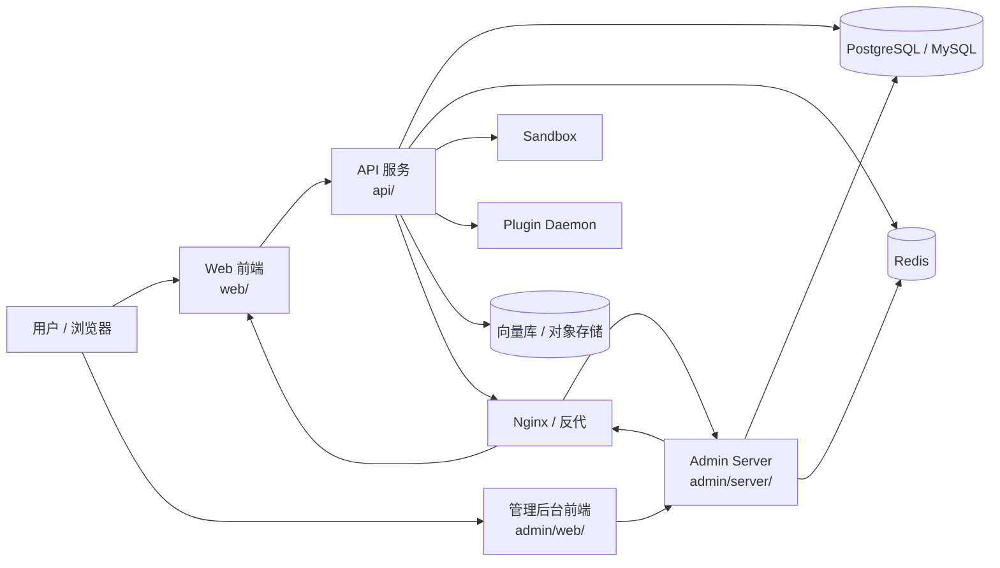

# Dify-Plus 1.12.1 二开部署配置与运维说明

本文面向部署、配置、运维与 fork 交付层，基于当前分支 `HEAD` 相对 `upstream-1.12.1` 的差异整理。

## 1. 部署基线

当前仓库已经切换到 `1.12.1` 版本基线，并保留 `upstream` 指向官方仓库：

- 当前基线：`1.12.1`
- 对照基线：`upstream-1.12.1`
- 上游仓库：`https://github.com/langgenius/dify`

本 fork 的交付层不是单一 Dify 自部署，而是由三部分组成：

- Dify 原有后端与前端：`api/`、`web/`
- 管理后台与其独立交付链：`admin/`
- fork 级部署、镜像、脚本与 CI/CD：`docker/`、`scripts/`、`.gitlab-ci.yml`、`.github/workflows/`

## 2. 部署拓扑



### 2.1 主要服务关系

- `docker/docker-compose.dify-plus.yaml` 定义 Dify 主链路的 API、Web、数据库、Redis、向量库、`sandbox`、`plugin_daemon`、`ssrf_proxy` 等服务。
- `docker/docker-compose.middleware.yaml` 提供底层依赖服务，供测试、迁移验证和本地中间件启动复用。
- `admin/deploy/docker-compose/docker-compose.yaml` 与 `admin/deploy/docker-compose/docker-compose-dev.yaml` 是管理后台独立的部署样例，包含 `web`、`server`、`mysql`、`redis`。
- `admin/deploy/docker/Dockerfile` 与 `admin/deploy/docker/entrypoint.sh` 决定管理后台镜像的打包与启动行为。

### 2.2 运行时网络与暴露端口

- API 默认绑定 `DIFY_PORT=5001`，Web 默认通过前端路由访问 API。
- 管理后台 `server` 默认暴露 `8888`，`web` 默认暴露 `8080`。
- `docker/docker-compose.dify-plus.yaml` 中通过 `CONSOLE_API_URL`、`CONSOLE_WEB_URL`、`APP_API_URL`、`APP_WEB_URL`、`FILES_URL`、`INTERNAL_FILES_URL` 组装前后端访问路径。
- `docker/.env.example` 是 Dify 主链路运行时最核心的配置入口。
- `web/.env.example` 负责浏览器侧的 `NEXT_PUBLIC_*` 配置。
- `api/.env.example` 负责后端运行环境、数据库、Redis、存储、向量库和 CORS 等配置。

## 3. 配置项来源

### 3.1 配置分层

| 层级 | 作用 | 主要文件 |
| --- | --- | --- |
| 容器编排层 | 定义服务、依赖、端口、镜像与默认环境变量 | `docker/docker-compose.dify-plus.yaml` |
| 运行环境层 | 覆盖实际部署值，决定 API / Web 行为 | `docker/.env.example`、`api/.env.example`、`web/.env.example` |
| 管理后台层 | 管理后台服务地址、数据库类型、JWT、Redis、日志等 | `docker/admin-server/config.docker.yaml` |
| 构建与交付层 | 镜像构建、推送、清单发布 | `.gitlab-ci.yml`、`.github/workflows/*.yml` |

### 3.2 Dify 主链路关键环境变量

以下变量是二开部署时最容易出问题的地方，建议优先检查：

- `CONSOLE_API_URL`、`CONSOLE_WEB_URL`、`APP_API_URL`、`APP_WEB_URL`：控制台与 WebApp 的拼接地址。
- `FILES_URL`、`INTERNAL_FILES_URL`：文件访问与插件通信地址。
- `SECRET_KEY`、`INIT_PASSWORD`、`COOKIE_DOMAIN`：认证、初始化账号和跨子域 Cookie。
- `DB_TYPE`、`DB_HOST`、`DB_PORT`、`DB_DATABASE`、`REDIS_HOST`、`REDIS_PORT`：基础依赖。
- `STORAGE_TYPE`、`VECTOR_STORE`：对象存储和向量库类型。
- `MIGRATION_ENABLED`：启动时是否自动执行迁移。
- `SERVER_WORKER_*`、`CELERY_*`、`GUNICORN_TIMEOUT`：服务并发与超时。

### 3.3 Web 侧二开配置

`web/.env.example` 中新增或重点改造的配置，主要用于 fork 级页面能力：

- `NEXT_PUBLIC_DEFAULT_DOMAIN`
- `NEXT_PUBLIC_AUTH0_LOGOUT_URL`
- `NEXT_PUBLIC_AMAZON_MARKETING_ALLOWED_EMAILS`
- `NEXT_PUBLIC_PRODUCT_COMPOSITE_SIZE`
- `NEXT_PUBLIC_DOMAIN_FORWARDING_GROUP`

这些值直接影响前端展示与跳转，建议在部署前与业务域名、站点映射关系一起确认。

### 3.4 管理后台配置

管理后台采用独立配置文件和独立镜像构建链：

- `docker/admin-server/config.docker.yaml`：数据库、Redis、JWT、GAIA 反代地址、日志、权限与系统参数。
- `admin/deploy/docker/entrypoint.sh`：初始化 MySQL、Redis 与前端/后端启动逻辑。
- `admin/deploy/kubernetes/server/gva-server-deployment.yaml`：后端 K8s 部署样例。
- `admin/deploy/kubernetes/web/gva-web-configmap.yaml`、`admin/deploy/kubernetes/web/gva-web-ingress.yaml`：前端 Nginx 与入口样例。

## 4. 运维脚本

`scripts/` 下的脚本主要解决知识库文档任务异常，属于 fork 的运维增强，不是 upstream 原生交付的一部分。

| 脚本 | 作用 | 风险点 |
| --- | --- | --- |
| `scripts/fail_pending_documents.py` | 将排队中和执行中的文档设置为暂停状态 | 会直接修改文档状态，执行前必须确认 |
| `scripts/fix_stuck_documents.py` | 修复状态卡在 `indexing` 的文档和段落 | 需要确认段落是否真的已完成，否则会误标记 |
| `scripts/rerun_document_indexing.py` | 重置文档状态并重新提交索引任务 | 会触发后续 Celery 任务，需要检查队列健康 |
| `scripts/run_and_stop_dataset_tasks.py` | 批量运行排队任务或停止执行中任务 | 同时涉及运行与停止两类动作，适合运维窗口操作 |

这些脚本都直接依赖 `api/` 目录下的 Flask 应用、数据库会话和 Redis，典型入口包括：

- `api/app_factory.py`
- `api/models/dataset.py`
- `api/extensions/ext_database.py`
- `api/extensions/ext_redis.py`
- `api/tasks/document_indexing_task.py`

### 4.1 这些脚本的共同执行模式

```mermaid
flowchart TD
  S[运维脚本] --> A[定位 api 目录]
  A --> B[create_app()]
  B --> C[进入 app_context()]
  C --> D[查询 Document / DocumentSegment]
  D --> E[更新数据库状态]
  E --> F[同步 Redis 标志位]
  F --> G[提交事务]
```

### 4.2 运维建议

- 只在确认队列堆积、索引异常或数据修复窗口内执行脚本。
- 先用只读 SQL 或管理后台确认状态分布，再执行暂停/重跑。
- 对于生产环境，优先在低峰期执行，并做好数据库备份。
- 如果 Redis、Celery 或对象存储异常，先修基础设施，再执行脚本修复。

## 5. CI/CD 与镜像交付

### 5.1 GitLab CI

`.gitlab-ci.yml` 负责 fork 的正式镜像交付，策略是“只在打 tag 时触发”：

- 构建 `api`、`web`、`admin/server`、`admin/web` 的 amd64 / arm64 镜像。
- 推送到腾讯云容器镜像仓库 `ccr.ccs.tencentyun.com`。
- 再通过 manifest 汇聚多架构镜像。

这说明 fork 的交付模型不是只发布 Dify 主链路，还同时发布管理后台全链路。

### 5.2 GitHub Actions

当前仓库还保留了 GitHub Actions 用于验证与局部发布：

- `.github/workflows/api-tests.yml`：后端单测、集成测试、数据库中间件启动。
- `.github/workflows/db-migration-test.yml`：迁移可回滚性验证，以及 PostgreSQL / MySQL 双栈迁移检查。
- `.github/workflows/deploy-rag-dev.yml`：`deploy/rag-dev` 分支在构建成功后通过 SSH 部署。

### 5.3 镜像和包版本的维护建议

- 交付时优先以 tag 为镜像版本，不要用 `latest` 作为唯一生产追踪方式。
- `docker/docker-compose.dify-plus.yaml`、`docker/.env.example`、`web/.env.example`、`api/.env.example` 必须保持版本同步。
- 管理后台镜像应与 `admin/deploy/docker/Dockerfile` 和 `docker/admin-server/config.docker.yaml` 配套更新，避免前后端版本错配。

### 5.4 本地 Web 镜像低内存构建

`web/` 在 Docker 内执行 `next build` 时，Apple Silicon 本地环境常见的问题是 Docker Desktop 内存不足，导致构建阶段直接被 OOM Kill。

当前仓库对本地构建的建议流程是：

1. 先在宿主机执行 `cd web && pnpm build:docker`，生成 `.next/standalone` 和 `.next/static`。
2. 再执行 `docker compose -f docker/docker-compose.dify-plus.yaml -f docker/docker-compose.local-build.yaml --env-file docker/.env.local-test build web`。
3. Web Dockerfile 会在检测到上述预构建产物存在时，直接复用它们打镜像；如果不存在，再回退到容器内执行 `pnpm build:docker`。

这样做的目的不是改变生产镜像内容，而是降低本地验证时的内存压力，保证 `dify-plus-web:1.13.2-local` 能稳定重建。

### 5.5 Service Worker 与 Workflow 运行排障

如果浏览器控制台持续出现 `bad-precaching-response`，且路径形如 `/serwist/logo/...`、`/serwist/screenshots/...`，优先检查两处：

1. `web/app/serwist/[path]/route.ts` 是否在空 `basePath` 场景下回退到 `/`，避免把 public 资源写成相对路径。
2. `web/app/sw.ts` 是否只对 `GET /api/*` 做缓存；`POST /api/workflows/run`、`POST /api/chat-messages` 这类 SSE 流式请求不能进入 SW 的 `NetworkFirst` 缓存。

修复后还需要在浏览器中手动清理旧 Service Worker：

1. DevTools -> Application -> Service Workers -> Unregister
2. DevTools -> Application -> Storage -> Clear site data
3. 强制刷新页面后再重试 Workflow 测试运行

### 5.6 nginx 502 与 Docker 服务重建排障

如果 Web 静态资源正常，但所有经 `localhost` 进入的 API 请求突然变成 `502 Bad Gateway`，同时在 nginx 日志里看到类似下面的报错：

- `connect() failed (111: Connection refused) while connecting to upstream`
- `upstream: "http://172.x.x.x:5001/..."`

通常不是 API 代码本身坏了，而是 nginx 在启动时把 Docker 服务名解析成了某个旧容器 IP。等 `api` 容器重建后，服务名 `api` 已经指向新 IP，但 nginx 还在连旧 IP，于是宿主机访问全部失败，而容器内直接 `curl http://api:5001/...` 却仍然成功。

当前仓库的修复方式是：

1. 在 `docker/nginx/conf.d/default.conf.template` 中为 Docker DNS 显式配置 `resolver 127.0.0.11`。
2. 将 `proxy_pass http://api:5001` 这类静态上游，改成基于变量的运行时解析形式，例如 `set $api_upstream http://api:5001` 再 `proxy_pass $api_upstream`。
3. 模板修改后执行 `docker compose ... up -d --no-deps nginx`，让容器重新生成并加载配置。

这样在后续重建 `api`、`web`、`plugin_daemon` 容器时，nginx 会按请求重新解析服务名，不再因为缓存旧 IP 导致整站 API 502。

## 6. 上游接入方式

当前 fork 的上游接入方式建议固定为：

- 本地保留 `upstream` remote，指向 `https://github.com/langgenius/dify`
- 以官方 tag 作为对照基线，例如 `1.12.1`
- 合并上游时先看 `git diff upstream-1.12.1..HEAD`，再分别检查 `docker/`、`api/`、`web/`、`admin/`

### 6.1 推荐的上游同步流程


### 6.2 合并上游时必须优先检查的文件

- `docker/docker-compose.dify-plus.yaml`
- `docker/docker-compose.middleware.yaml`
- `docker/.env.example`
- `api/.env.example`
- `web/.env.example`
- `api/migrations_extend/`
- `scripts/`
- `.gitlab-ci.yml`

这些文件决定了 fork 是否还能稳定启动、迁移和交付。

## 7. 运维检查清单

1. 确认版本基线是 `1.12.1`，且当前分支不是漂移到未对齐的提交。
2. 确认 `upstream` remote 可访问，并能拉到官方 tag。
3. 检查 `docker/.env.example`、`api/.env.example`、`web/.env.example` 中的域名、数据库、Redis、存储、向量库配置。
4. 检查管理后台配置 `docker/admin-server/config.docker.yaml` 与主站 API 地址是否一致。
5. 若要恢复卡住的文档任务，先确认 Celery、Redis、数据库连接正常，再执行 `scripts/` 下的修复脚本。
6. 若要发布生产镜像，优先走 `.gitlab-ci.yml` 的 tag 流程，并核对多架构 manifest。
