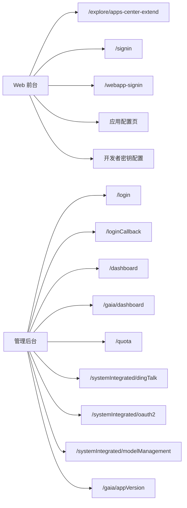

# Dify-Plus 二开页面与交互清单

本文把当前 fork 的前端页面、管理后台页面和主要交互整理成清单，便于快速定位入口、接口和 fork 差异。

## 1. 页面总图

## 2. Web 页面清单

| 页面/路由 | 入口文件 | 核心交互 | 调用接口/服务 | 与 upstream 的差异 |
| --- | --- | --- | --- | --- |
| `/explore/apps-center-extend` | `web/app/(commonLayout)/explore/apps-center-extend/page.tsx` | 清理遗留 token 参数、进入应用中心 | `web/app/components/explore/app-list-center-extend/index.tsx` | 新增应用中心，替代原始默认落点 |
| 应用中心列表 | `web/app/components/explore/app-list-center-extend/index.tsx` | 分类、标签、关键字筛选，点击进入会话 | `useInstalledAppList()` -> `fetchOpenInstalledAppList()` | 原先推荐页不支持这些交互 |
| 应用卡片 | `web/app/components/explore/app-card-extend/index.tsx` | 新建对话按钮、描述与状态展示 | `web/app/components/explore/app-card-extend/index.tsx` | 用已安装应用作为主入口 |
| 侧边栏 | `web/app/components/explore/sidebar/index.tsx` | “发现”与“应用中心”双入口、已安装应用列表 | `useGetInstalledApps()` | 新增应用中心按钮 |
| 顶部导航 | `web/app/components/header/index.tsx` | Logo 默认跳应用中心，展示账户额度 | `web/app/components/header/account-money-extend/index.tsx` | 默认首页改为应用中心 |
| `/signin` | `web/app/signin/page.tsx`、`web/app/signin/normal-form.tsx` | 邮箱密码、邮箱验证码、钉钉、OAuth2 登录 | `web/service/common.ts`、`web/service/client.ts` | 新增钉钉/OAuth2 登录分支 |
| `/webapp-signin` | `web/app/(shareLayout)/webapp-signin/page.tsx`、`normalForm.tsx` | 先检查 Console 登录态，再按访问模式切换 | `checkConsoleLoginStatus()`、`webAppLogout()` | 新增公开页鉴权逻辑 |
| 应用概览 Web App 卡片 | `web/app/components/app/overview/app-card.tsx`、`app-card-sections.tsx` | 「访问认证」开关 + 帮助 Tooltip，切换立即保存；未运行或无编辑权限时置灰 | `POST /console/api/apps/{id}/site`（`webapp_auth_enabled_extend`） | 新增 per-app WebApp 访问认证开关（默认开启） |
| 记忆上下文配置 | `web/app/components/app/configuration/config/index.tsx`、`retention-number-extend/index.tsx` | 开关与窗口大小调节 | 环境变量 `NEXT_CONTEXT_RETENTION_*` | upstream 无该配置 |
| API Key 限额设置 | `web/app/components/develop/secret-key/secret-key-quota-set-modal-extend.tsx` | 日限额、月限额、描述 | `createApikey` / `editApikey` | upstream 仅有基础密钥设置 |
| 模型参数扩展 | `web/app/components/header/account-setting/model-provider-page/model-parameter-modal/parameter-item-extend.tsx` | 支持 int/float/string/tag/boolean | 模型参数规则 | 扩展参数类型渲染 |

## 3. 管理后台页面清单

| 页面/路由 | 入口文件 | 核心交互 | 调用接口/服务 | 与 upstream 的差异 |
| --- | --- | --- | --- | --- |
| `/login` | `admin/web/src/view/login/index.vue` | 账号密码、钉钉、OAuth2 登录 | `admin/web/src/api/user_extend.js`、`admin/web/src/api/user.js` | 新增第三方登录入口 |
| `/loginCallback` | `admin/web/src/view/login/callback.vue` | 接收 code / access_token / state 并换 token | `gaiaOAuth2Login()`、`dingtalkLogin()` | 新增统一回调页 |
| `/dashboard` | `admin/web/src/view/dashboard/index.vue` | 原始管理后台首页 | `admin/web/src/view/dashboard/components/*` | 作为基础管理首页保留 |
| `/gaia/dashboard` | `admin/web/src/view/gaia/dashboard/index.vue` | 成员、应用、密钥、AI 作图额度分析 | `admin/web/src/api/gaia/dashboard.js` | 新增 fork 运营看板 |
| `/quota` | `admin/web/src/view/quota/index.vue` | 搜索用户、调整额度 | `getManagementList`、`setUserQuota` | upstream 无此独立额度页 |
| `/systemIntegrated/dingTalk` | `admin/web/src/view/systemIntegrated/dingTalk/index.vue` | 回调域名、CorpID、AppSecret、邮箱 API、测试连接 | `GET/POST /gaia/system/dingtalk` | 新增钉钉集成页 |
| `/systemIntegrated/oauth2` | `admin/web/src/view/systemIntegrated/oauth2/index.vue` | OAuth2/OIDC 配置、字段映射、测试连接 | `GET/POST /gaia/system/oauth2` | 新增 OAuth2 集成页 |
| `/systemIntegrated/modelManagement` | `admin/web/src/view/systemIntegrated/modelManagement/index.vue` | 启用提供商、选择模型、测试凭证 | `GET/POST /gaia/model-provider/*` | 新增模型运营页 |
| `/gaia/appVersion` | `admin/web/src/view/gaia/appVersion/index.vue` | 版本发布、Token 配置、安装包上传 | `GET/PUT/POST /gaia/app-version/*` | 新增版本管理页 |
| `/gaia/tenants` | `admin/web/src/view/gaia/tenants/tenants.vue` | 查看工作区列表与详情 | `GET /tenants/*` | 作为运营辅助页 |

## 4. 关键交互清单

### 4.1 应用中心

| 交互 | 页面 | 接口/服务 | 结果 |
| --- | --- | --- | --- |
| 打开应用中心 | 顶部 Logo / Explore 导航 / 侧边栏 | `/explore/apps-center-extend` | 进入 fork 的默认首页 |
| 搜索应用 | `web/app/components/explore/app-list-center-extend/index.tsx` | 本地筛选 `categories + tags + keywords` | 列表即时过滤 |
| 发起新对话 | `web/app/components/explore/app-card-extend/index.tsx` | 跳转 `/explore/installed/{installed_id}` | 进入已安装应用会话页 |
| 应用同步模板 | `web/app/components/explore/app-card.tsx` | `syncApp` / `syncCancelApp` | 应用和模板中心保持联动 |

### 4.2 登录与会话

| 交互 | 页面 | 接口/服务 | 结果 |
| --- | --- | --- | --- |
| 邮箱密码登录 | `web/app/signin/normal-form.tsx` | `POST /login` | 成功后优先回跳 `redirect_url`，否则进应用中心 |
| 邮箱验证码登录 | `web/app/signin/components/mail-and-code-auth.tsx` | `sendEMailLoginCode` | 进入验证码页 |
| 钉钉登录 | `web/app/signin/components/dingtalk-auth.tsx` | 钉钉授权地址 | 跳转钉钉 OAuth2 页面 |
| OAuth2 登录 | `web/app/signin/components/oauth2.tsx` | `/oauth/login/oauth2` | 跳转 SSO 授权页 |
| WebApp 外部成员登录 | `web/app/(shareLayout)/webapp-signin/page.tsx` | `checkConsoleLoginStatus()` | 先判断 Console 登录态，再决定表单 |
| WebApp 访问认证开关 | 应用概览页 Web App 卡片（`web/app/components/app/overview/app-card.tsx`） | `POST /apps/{id}/site`、`GET /api/login/status?app_code=` | 默认开启=访问需登录平台账号；关闭后任何人可匿名访问已发布 WebApp |
| 外部成员 OAuth2 | `web/app/(shareLayout)/webapp-signin/components/external-member-sso-auth.tsx` | `fetchWebOAuth2SSOUrl()` | 跳转第三方 SSO |

### 4.3 额度与模型

| 交互 | 页面 | 接口/服务 | 结果 |
| --- | --- | --- | --- |
| 查看账户额度 | `web/app/components/header/account-money-extend/index.tsx` | 账户数据 | 顶部实时展示余额 |
| 设置 API Key 日/月限额 | `web/app/components/develop/secret-key/secret-key-quota-set-modal-extend.tsx` | `createApikey` / `editApikey` | 创建或编辑密钥限额 |
| 修改记忆上下文 | `web/app/components/app/configuration/retention-number-extend/index.tsx` | 本地状态 + 环境变量 | 调整会话上下文窗口 |
| 管理提供商模型 | `admin/web/src/view/systemIntegrated/modelManagement/index.vue` | `GET/POST /gaia/model-provider/*` | 控制可用模型与启用状态 |

### 4.4 管理运营

| 交互 | 页面 | 接口/服务 | 结果 |
| --- | --- | --- | --- |
| 查看额度排名 | `admin/web/src/view/gaia/dashboard/index.vue` | `GET /gaia/dashboard/*` | 产出成员 / 应用 / 密钥看板 |
| 修改用户额度 | `admin/web/src/view/quota/index.vue` | `POST /gaia/quota/setUserQuota` | 调整单个成员总额度 |
| 配置钉钉 | `admin/web/src/view/systemIntegrated/dingTalk/index.vue` | `GET/POST /gaia/system/dingtalk` | 控制企业钉钉登录和邮箱补全 |
| 配置 OAuth2 | `admin/web/src/view/systemIntegrated/oauth2/index.vue` | `GET/POST /gaia/system/oauth2` | 控制统一身份认证 |
| 管理版本包 | `admin/web/src/view/gaia/appVersion/index.vue` | `GET/PUT/POST /gaia/app-version/*` | 发布安装包与 Token 校验 |

## 5. 页面差异矩阵

| 模块 | upstream 1.12.1 | 当前 fork |
| --- | --- | --- |
| 默认首页 | 原始探索页 | `/explore/apps-center-extend` |
| 应用中心 | 基础推荐展示 | 搜索、标签、排序、快速进入会话 |
| 登录 | 以基础登录为主 | 增加钉钉 / OAuth2 / 外部成员 SSO |
| 应用配置 | 基础模型参数配置 | 增加上下文记忆、API Key 限额 |
| 顶部状态 | 主要是导航 | 增加账户额度展示 |
| 管理后台 | 原始 gin-vue-admin | 增加额度看板、额度编辑、系统集成、模型管理、版本管理 |

## 6. 交互顺序建议

如果需要快速理解这个 fork，建议按下面顺序看：

1. `web/context/global-public-context.tsx`
2. `web/app/signin/normal-form.tsx`
3. `web/app/components/header/index.tsx`
4. `web/app/components/explore/app-list-center-extend/index.tsx`
5. `admin/web/src/view/systemIntegrated/index.vue`
6. `admin/web/src/view/gaia/dashboard/index.vue`
7. `admin/web/src/view/systemIntegrated/modelManagement/index.vue`

这样可以先建立“登录 -> 进入应用中心 -> 在管理后台看运营数据”的完整心智模型。

