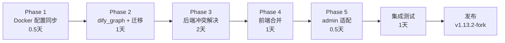

# Dify-Plus 合并规划：升级至 upstream v1.13.2

> 文档状态：草稿  
> 基线：fork `1.12.1`（tag）  
> 目标：upstream `1.13.2`（tag）  
> 上游提交数：570 次  
> 编写日期：2026-03-26

---

## 1. 总体评估

### 1.1 规模概览

| 维度 | 数据 |
|------|------|
| 上游 commit 数量（1.12.1 → 1.13.2） | 570 次 |
| 新增 feat 提交 | 34 次 |
| api/ 变更文件数 | 1,727 个 |
| web/ 变更文件数 | 2,582 个 |
| 新引入核心包 `dify_graph` | 273 个文件 |
| 新增上游数据库迁移 | 9 个 |
| 预计冲突高风险文件 | 16 个 |

### 1.2 最大风险点：`dify_graph` 架构重组

**这是本次合并最核心的架构变化。** upstream 1.13.2 引入了新的 `api/dify_graph/` 包，将原先分散在 `core.workflow` 和 `core.model_runtime` 下的工作流引擎和模型运行时代码提取为独立模块，同时保留 `core/` 中的原始位置（部分或全部）。

影响范围：
- 所有使用 `from core.model_runtime.*` 的文件 → 可能改为 `from dify_graph.model_runtime.*`
- 所有使用 `from core.workflow.graph_engine.*` 的文件 → 改为 `from dify_graph.graph_engine.*`
- Fork 中引用上述路径的 `*_extend.py` 文件也需要同步更新

具体变更示例（已在 diff 中确认）：
```python
# before (1.12.1)
from core.model_runtime.entities.model_entities import ModelType
from core.workflow.graph_engine.manager import GraphEngineManager

# after (1.13.2)
from dify_graph.model_runtime.entities.model_entities import ModelType
from dify_graph.graph_engine.manager import GraphEngineManager
```

### 1.3 合并难度评级

| 模块 | 难度 | 原因 |
|------|------|------|
| `api/controllers/service_api/wraps.py` | ★★★★★ | 上游完全重构 + fork 额度核心代码嵌入 |
| `api/controllers/web/completion.py` | ★★★★☆ | 上游重构 + fork 余额/登录校验 |
| `api/controllers/web/workflow.py` | ★★★★☆ | 上游重构（dify_graph） + fork 余额校验 |
| `api/services/app_service.py` | ★★★☆☆ | 上游改 import 路径 + fork 统计注入 |
| `api/controllers/console/auth/oauth.py` | ★★★☆☆ | 上游清理 + fork OAuth2/Casdoor 兼容 |
| `api/controllers/console/feature.py` | ★★★☆☆ | 上游删除 + fork CVE 保护代码 |
| `web/context/global-public-context.tsx` | ★★★☆☆ | 上游简化 + fork CVE 两阶段 bootstrap |
| `web/service/client.ts` | ★★☆☆☆ | 上游删除 + fork CVE header 注入 |
| `api/libs/token.py` | ★★☆☆☆ | 上游修改 + fork CSRF 白名单 |
| `web/app/components/header/index.tsx` | ★★☆☆☆ | 上游修改导航 + fork 应用中心跳转 |
| `web/app/signin/normal-form.tsx` | ★★☆☆☆ | 上游重构 + fork 钉钉/OAuth2 入口 |
| `api/configs/app_config.py` | ★★☆☆☆ | 上游新增配置 + fork ExtendConfig 注入 |
| `docker/docker-compose.yaml` | ★★☆☆☆ | 上游新增环境变量到 fork 自定义 compose |
| `api/controllers/console/workspace/model_providers.py` | ★★☆☆☆ | 上游改 import 路径 + fork 模型同步 |
| `api/migrations/versions/` | ★★☆☆☆ | 9 个新迁移 + fork 迁移链接续 |
| `web/app/signin/normal-form.tsx` | ★★☆☆☆ | 上游改造 + fork 钉钉登录入口 |

---

## 2. 合并前准备

### 2.1 创建合并分支

```bash
# 基于当前 fork main（或 1.12.1 tag）创建新合并分支
git checkout main
git pull origin main
git checkout -b merge/upstream-1.13.2
```

### 2.2 添加上游 remote（已存在则跳过）

```bash
git remote add upstream https://github.com/langgenius/dify.git
git fetch upstream --tags
```

### 2.3 备份与快照

```bash
# 记录当前 HEAD
git tag fork-1.12.1-pre-merge HEAD

# 确认 1.13.2 tag 存在
git show 1.13.2 --stat | head -5
```

### 2.4 准备冲突解决工具

建议使用 `git mergetool` 配合以下工具之一：
- VSCode `GitLens` + merge editor
- `git diff --base` / `git diff --ours` / `git diff --theirs` 三路对比
- `git checkout --ours <file>` / `git checkout --theirs <file>` 快速取舍策略

---

## 3. 合并执行策略

### 3.1 推荐策略：分步 Cherry-Pick / Merge（非直接 git merge）

由于变更规模巨大（570 commits，1727 + 2582 文件），**不推荐直接执行 `git merge 1.13.2`**，原因：
1. 会产生数百个冲突文件，难以逐一审查
2. fork 的 extend 代码散布在多个文件中，自动合并极易丢失

**推荐方案：子目录分批合并**

```
Phase 1: docker/ 和配置层（低风险，快速同步）
Phase 2: api/ 架构层（dify_graph 新包 + 迁移文件）
Phase 3: api/ 业务层冲突解决（extend 文件重新集成）
Phase 4: web/ 前端合并
Phase 5: 验证与测试
```

### 3.2 执行命令参考

```bash
# 方案 A：整体 merge + 逐文件冲突解决（推荐用于有CI的场景）
git merge 1.13.2 --no-commit --strategy-option=theirs

# 方案 B：分目录 merge（更安全，推荐）
# 先合并 docker/（几乎无 fork 修改）
git checkout 1.13.2 -- docker/docker-compose.yaml
git checkout 1.13.2 -- docker/docker-compose.middleware.yaml
git checkout 1.13.2 -- docker/nginx/

# 再处理 api/ 的 dify_graph 新包（直接复制）
git checkout 1.13.2 -- api/dify_graph/
```

---

## 4. 分阶段执行规划

### Phase 1：Docker 与部署层同步（预计 0.5 天）

**目标**：将上游 docker-compose.yaml 的新增环境变量合并到 fork 的 `docker-compose.dify-plus.yaml`

#### 4.1.1 上游新增的环境变量

需加入 `docker/docker-compose.dify-plus.yaml` 的 `x-shared-env` 区块：

```yaml
# 新增 UV 缓存目录
UV_CACHE_DIR: ${UV_CACHE_DIR:-/tmp/.uv-cache}

# 新增 Redis 最大连接数
REDIS_MAX_CONNECTIONS: ${REDIS_MAX_CONNECTIONS:-}

# 新增 Celery 任务注解
CELERY_TASK_ANNOTATIONS: ${CELERY_TASK_ANNOTATIONS:-null}

# 新增工作流日志清理白名单
WORKFLOW_LOG_CLEANUP_SPECIFIC_WORKFLOW_IDS: ${WORKFLOW_LOG_CLEANUP_SPECIFIC_WORKFLOW_IDS:-}

# 新增 Sandbox 批量清理间隔
SANDBOX_EXPIRED_RECORDS_CLEAN_BATCH_MAX_INTERVAL: ${SANDBOX_EXPIRED_RECORDS_CLEAN_BATCH_MAX_INTERVAL:-200}

# 新增 Hologres 向量库配置（如不使用可全部留空）
HOLOGRES_HOST: ${HOLOGRES_HOST:-}
HOLOGRES_PORT: ${HOLOGRES_PORT:-80}
HOLOGRES_DATABASE: ${HOLOGRES_DATABASE:-}
HOLOGRES_ACCESS_KEY_ID: ${HOLOGRES_ACCESS_KEY_ID:-}
HOLOGRES_ACCESS_KEY_SECRET: ${HOLOGRES_ACCESS_KEY_SECRET:-}
HOLOGRES_SCHEMA: ${HOLOGRES_SCHEMA:-public}
HOLOGRES_TOKENIZER: ${HOLOGRES_TOKENIZER:-jieba}
HOLOGRES_DISTANCE_METHOD: ${HOLOGRES_DISTANCE_METHOD:-Cosine}
HOLOGRES_BASE_QUANTIZATION_TYPE: ${HOLOGRES_BASE_QUANTIZATION_TYPE:-rabitq}
HOLOGRES_MAX_DEGREE: ${HOLOGRES_MAX_DEGREE:-64}
HOLOGRES_EF_CONSTRUCTION: ${HOLOGRES_EF_CONSTRUCTION:-400}
```

#### 4.1.2 nginx 配置更新

```bash
# 直接采用上游 nginx 配置（fork 无自定义）
git checkout 1.13.2 -- docker/nginx/conf.d/default.conf.template
```

#### 4.1.3 .env.example 同步

对比并更新 `docker/.env.example`、`api/.env.example`、`web/.env.example`，添加上游新增变量，保留 fork 专用变量。

#### 4.1.4 plugin daemon 版本更新

```bash
# 上游已将 plugin_daemon 更新到 0.5.4-local
# 更新 docker-compose.dify-plus.yaml 中的镜像版本
```

#### 验收标准

- `docker/docker-compose.dify-plus.yaml` 包含所有上游新增环境变量
- fork 专用变量（`COOKIE_DOMAIN`、`ADMIN_*`、`GAIA_*` 等）保持不变
- `.env.example` 文件更新同步

---

### Phase 2：后端架构层 —— dify_graph 新包 + 迁移文件（预计 1 天）

**目标**：引入 `api/dify_graph/` 新包，更新所有被影响的 import，合并上游 9 个迁移文件

#### 4.2.1 引入 dify_graph 包

```bash
# 直接从上游检出整个 dify_graph 目录（全量新增，无冲突）
git checkout 1.13.2 -- api/dify_graph/
```

**说明**：`dify_graph/` 是上游新增目录，fork 没有同名目录，直接复制无冲突。

#### 4.2.2 更新 core/ 目录中被重构的文件

```bash
# 批量更新 api/core/ 中已迁移到 dify_graph 的文件
# 逐一检出，注意不要覆盖 fork 在 core/ 中的扩展
git checkout 1.13.2 -- api/core/workflow/  # 有 dify_graph 重构
```

> **注意**：执行前先执行 `git diff HEAD -- api/core/` 确认 fork 在 `core/` 中是否有直接修改。  
> 根据当前分析，fork 对 `core/` 目录的改动主要在 `api/core/model_runtime/` 导入路径，通过 extend 文件中的引用体现，`core/` 本身的修改较少。

#### 4.2.3 更新 import 路径扫描

针对 fork 的 `*_extend.py` 和其他二开文件中的旧路径，执行批量扫描并更新：

```bash
# 扫描所有仍使用旧路径的 fork 文件
grep -r "from core.model_runtime" api/ --include="*_extend.py" -l
grep -r "from core.workflow.graph_engine" api/ --include="*_extend.py" -l
grep -r "from core.workflow.graph_engine" api/controllers/ -l
grep -r "from core.workflow.graph_engine" api/services/ -l
```

需要替换的路径规则：

| 旧路径（1.12.1） | 新路径（1.13.2） |
|----------------|----------------|
| `from core.model_runtime.entities.model_entities import ...` | `from dify_graph.model_runtime.entities.model_entities import ...` |
| `from core.model_runtime.errors.invoke import ...` | `from dify_graph.model_runtime.errors.invoke import ...` |
| `from core.model_runtime.utils.encoders import ...` | `from dify_graph.model_runtime.utils.encoders import ...` |
| `from core.workflow.graph_engine.manager import GraphEngineManager` | `from dify_graph.graph_engine.manager import GraphEngineManager` |

> **重要**：批量替换前，先确认 1.13.2 中 `dify_graph.model_runtime` 和 `core.model_runtime` 两者是否共存（可能存在兼容期，部分路径仍有效），再决定是否全量替换。

#### 4.2.4 合并上游 9 个新数据库迁移

上游新增迁移文件（需全部合入 `api/migrations/versions/`）：

| 文件 | 内容摘要 |
|------|---------|
| `2025_12_25_1039-7df29de0f6be_add_credit_pool.py` | 新增 credit_pool 表（企业计费） |
| `2026_01_17_1110-f9f6d18a37f9_add_table_explore_banner_and_trial.py` | 添加探索页横幅和试用表 |
| `2026_01_29_1415-e8c3b3c46151_add_human_input_related_db_models.py` | Human Input 功能模型（HITL）|
| `2026_02_09_0950-c3df22613c99_drop_server_default_for_app_trail_.py` | 修复 app trail 默认值 |
| `2026_02_10_1507-f55813ffe2c8_fix_tenant_default_model_unique.py` | 修复租户默认模型唯一约束 |
| `2026_02_11_1549-fce013ca180e_fix_index_to_optimize_message_clean_job_.py` | 优化消息清理任务索引 |
| `2026_02_26_1336-e288952f2994_add_partial_indexes_on_conversations_.py` | conversations 表部分索引 |
| `2026_03_02_1805-0ec65df55790_add_indexes_for_human_input_forms.py` | Human Input Forms 索引 |
| `2026_03_04_1600-6b5f9f8b1a2c_add_user_id_to_workflow_draft_variables.py` | workflow 草稿变量加 user_id |

```bash
# 直接检出这 9 个迁移文件
git checkout 1.13.2 -- api/migrations/versions/2025_12_25_1039-7df29de0f6be_add_credit_pool.py
git checkout 1.13.2 -- api/migrations/versions/2026_01_17_1110-f9f6d18a37f9_add_table_explore_banner_and_trial.py
git checkout 1.13.2 -- api/migrations/versions/2026_01_29_1415-e8c3b3c46151_add_human_input_related_db_models.py
git checkout 1.13.2 -- api/migrations/versions/2026_02_09_0950-c3df22613c99_drop_server_default_for_app_trail_.py
git checkout 1.13.2 -- api/migrations/versions/2026_02_10_1507-f55813ffe2c8_fix_tenant_default_model_unique.py
git checkout 1.13.2 -- api/migrations/versions/2026_02_11_1549-fce013ca180e_fix_index_to_optimize_message_clean_job_.py
git checkout 1.13.2 -- api/migrations/versions/2026_02_26_1336-e288952f2994_add_partial_indexes_on_conversations_.py
git checkout 1.13.2 -- api/migrations/versions/2026_03_02_1805-0ec65df55790_add_indexes_for_human_input_forms.py
git checkout 1.13.2 -- api/migrations/versions/2026_03_04_1600-6b5f9f8b1a2c_add_user_id_to_workflow_draft_variables.py
```

**迁移链验证**：确认上游最新迁移的 `down_revision` 与 fork 的 `api/migrations_extend/` 的 base 不冲突。

```bash
# 查看最新上游迁移的 revision
head -10 api/migrations/versions/2026_03_04_1600-6b5f9f8b1a2c_add_user_id_to_workflow_draft_variables.py
# 查看 fork extend 迁移链的起始 revision
head -10 api/migrations_extend/versions/*.py | head -30
```

#### 4.2.4-B `api/commands.py` → `api/commands/` 目录重构

**这是一个高冲突区域。** 上游 1.13.2 将 `api/commands.py`（2724 行）拆分为独立模块目录 `api/commands/`（account.py、plugin.py、retention.py、storage.py、system.py、vector.py 等）。

Fork 在 `api/commands.py` 末尾新增了：
- `extend_db` click 命令组（upgrade/downgrade/current/history/heads）
- `_run_alembic_command_extend()` 函数（使用 alembic 直接操作 `migrations_extend/`）

同时 `api/extensions/ext_commands.py` 中注册了 `extend_db`，但上游 1.13.2 将此位置的 `extend_db` 替换为 `export_app_messages`。

**合并策略**：

```
Step 1: 采用上游的 api/commands/ 目录
Step 2: 新建 api/commands/extend.py（或 api/commands/extend_db.py），
        将 fork 的 extend_db 命令组和 _run_alembic_command_extend 函数移入此文件
Step 3: 在 api/extensions/ext_commands.py 中：
        - 在 import 区域添加 from commands.extend import extend_db
        - 在 cmds_to_register 列表末尾追加 extend_db（不覆盖上游新增的 export_app_messages）
```

**新建文件结构示例**：

```python
# api/commands/extend.py
import os
import click
from alembic.config import Config
from alembic import command as alembic_cmd

@click.group("extend_db", help="管理二开扩展表的数据库迁移")
def extend_db():
    pass

@extend_db.command("upgrade", help="将数据库升级到最新版本")
@click.argument("revision", default="head", required=False)
def extend_db_upgrade(revision):
    _run_alembic_command_extend("upgrade", revision)

# ... 其余子命令 ...

def _run_alembic_command_extend(command, *args):
    api_dir = os.path.dirname(os.path.dirname(os.path.abspath(__file__)))
    migrations_extend_dir = os.path.join(api_dir, 'migrations_extend')
    alembic_cfg = Config(os.path.join(migrations_extend_dir, 'alembic.ini'))
    alembic_cfg.set_main_option('script_location', migrations_extend_dir)
    getattr(alembic_cmd, command)(alembic_cfg, *args)
```

#### 4.2.5 更新 pyproject.toml 依赖

```bash
# 直接采用上游 pyproject.toml（fork 没有在 pyproject.toml 中添加 extend 依赖）
git checkout 1.13.2 -- api/pyproject.toml
```

**关键依赖升级**（需关注兼容性）：

| 包 | 1.12.1 | 1.13.2 |
|----|--------|--------|
| `celery` | ~5.5.2 | ~5.6.2 |
| `flask-migrate` | ~4.0.7 | ~4.1.0 |
| `authlib` | 1.6.7 | 1.6.9 |
| `litellm` | 1.82.x | 1.82.2+ |

#### 验收标准

- `api/dify_graph/` 目录存在且可被 Python 正常 import
- `uv run --project api python -c "import dify_graph"` 无报错
- 9 个新迁移文件存在于 `api/migrations/versions/`
- `alembic upgrade head` 可以成功执行（在测试库上验证）

---

### Phase 3：后端业务层冲突解决（预计 2 天，最复杂阶段）

此阶段需要逐文件审查，**保留 fork 的二开功能，同时采纳上游的重构**。

#### 4.3.1 【最高优先级】`api/controllers/service_api/wraps.py`

**冲突性质**：上游完全重构了 API Token 鉴权逻辑，引入 `ApiTokenCache`/`fetch_token_with_single_flight`/`record_token_usage` 机制；fork 在此文件中注入了账号余额校验和 API Key 日/月额度限制。

**fork 二开功能必须保留**：
- 账号余额检查（`AccountMoneyExtend.used_quota >= total_quota`）
- API Key 日额度检查（`api_token_money.day_used_quota >= day_limit_quota`）
- API Key 月额度检查（`api_token_money.month_used_quota >= month_limit_quota`）
- 错误类型：`AccountNoMoneyErrorExtend`、`ApiTokenDayNoMoneyErrorExtend`、`ApiTokenMonthNoMoneyErrorExtend`
- `create_or_update_end_user_account_join_extend()` 函数

**合并策略**：

```
Step 1: 以上游 1.13.2 的 wraps.py 为基础（git checkout 1.13.2）
Step 2: 在上游新的 validate_app_token 装饰器函数体中，找到 token 校验成功后、
        返回 response 前的合适位置，插入 fork 的余额和额度校验代码块
Step 3: 将 fork 特有的 import 追加到文件头部（AccountMoneyExtend、ApiTokenMoneyExtend 等）
Step 4: 将 create_or_update_end_user_account_join_extend 函数追加到文件末尾
Step 5: 注意上游新 wraps 的 token 查找逻辑已通过 fetch_token_with_single_flight 异步化，
        fork 的同步 ORM 查询需适配
```

**风险**：上游新架构使用了 `overload` 和新的函数签名，插入位置需精确定位，建议单独分支实验后再合并。

#### 4.3.2 `api/controllers/web/completion.py`

**冲突性质**：上游重构了 completion 控制器，fork 注入了 WebApp 登录校验（`is_end_login`/`is_money_limit`）和余额扣减。

**fork 二开功能必须保留**：
- `is_end_login(end_user)` — 检查 WebApp End User 是否已绑定 Console 账号
- `is_money_limit(end_user)` — 检查账号是否超额
- 消息发送前的登录和余额双重门控

**合并策略**：

```
Step 1: git checkout 1.13.2 -- api/controllers/web/completion.py
Step 2: 将 is_end_login 和 is_money_limit 两个函数保留在文件中
Step 3: 在消息/补全接口的 post() 方法实现中，找到调用 AppGenerateService 前的位置
Step 4: 重新插入两个校验：
        - if is_end_login(end_user) is None → 返回 WebAuthRequiredErrorExtend
        - if is_money_limit(end_user) → 返回 AccountNoMoneyErrorExtend
Step 5: 保留 AppGenerateServiceExtend 的引用（用于应用统计次数更新）
```

#### 4.3.3 `api/controllers/web/workflow.py`

**冲突性质**：上游改用 `dify_graph.graph_engine.manager` + 新增 `redis_client`；fork 注入了登录/余额校验（通过 `is_end_login`/`is_money_limit`）。

**合并策略**：

```
Step 1: git checkout 1.13.2 -- api/controllers/web/workflow.py
Step 2: 追加 fork 的 import（is_end_login、is_money_limit、AppGenerateServiceExtend）
Step 3: 在工作流运行接口的 post() 方法中重新插入余额/登录校验
Step 4: 注意 AppGenerateServiceExtend 对应用使用次数的统计调用是否需要适配新参数
```

#### 4.3.4 `api/services/app_service.py`

**冲突性质**：上游以新 import 路径（dify_graph）重写了部分导入；fork 在 `get_app_list()` 中注入了 `AppStatisticsExtend` 初始化逻辑和推荐应用列表。

**合并策略**：

```
Step 1: git checkout 1.13.2 -- api/services/app_service.py
Step 2: 手动还原 fork 的 App Center 代码块：
        - AppStatisticsExtend 初始化（get_app_list 开头的 rows 查询和 for 循环）
        - RecommendedApp 列表查询
Step 3: 将 model.py 中 AppStatisticsExtend/RecommendedApp 的 import 追回
Step 4: AppExtend（记忆上下文）的 import 追回
Step 5: 注意上游改变了 IconType 的引入方式，需更新相应 import
```

**注意**：上游在 `models/model.py` 中可能也有变化，AppStatisticsExtend 和 RecommendedApp 如果仍在 `models/model.py` 中由 fork 添加，需确保它们在 1.13.2 版本的 model.py 中仍然可以共存。

#### 4.3.5 `api/controllers/console/auth/oauth.py`

**冲突性质**：上游从此文件中删除了 OAuth2/Casdoor 兼容代码；fork 需要保留这些代码。

**fork 二开功能必须保留**：
- `OaOAuth` 类（OAuth2 provider）的导入和注册
- `oauth2` provider 的初始化和 OAUTH_PROVIDERS 字典注入
- Casdoor 隐式/混合流的 access_token query 参数 fallback（`token_from_query`）
- `id_token` 处理
- 空 token 校验

**合并策略**：

```
Step 1: 以上游 1.13.2 的 oauth.py 为基础
Step 2: 将 fork 的 import（OaOAuth 等）追加到 import 区域
        注意使用注释 # extend: OAuto third-party login 标记
Step 3: 在 get_oauth_providers() 中恢复 oauth2 provider 初始化和注册
Step 4: 在 OAuthCallback.post() 中恢复 token_from_query fallback 逻辑
Step 5: 恢复空 token 校验代码
```

**安全注意**：`token_from_query` fallback 是非标准行为，仅用于 Casdoor 兼容，必须保留 warning 日志，不得静默处理。

#### 4.3.6 `api/controllers/console/feature.py`

**冲突性质**：上游从此文件删除了 fork 添加的 CVE-2025-63387 保护代码；fork 必须保留。

**fork 二开功能必须保留**：
- `_issue_login_config_jwt()` 函数
- `_verify_login_config_token()` 函数
- `LoginConfigBootstrapApi`（`/login_config_bootstrap` 路由）
- `system-features` endpoint（健康监测兼容）
- `LoginConfigApi`（`/login_config` 路由）的 JWT 校验门控

**合并策略**：

```
Step 1: 以上游 1.13.2 的 feature.py 为基础
Step 2: 还原所有 CVE-2025-63387 相关函数和路由
Step 3: 确认 constants 文件中 COOKIE_NAME_LOGIN_CONFIG_TOKEN / HEADER_NAME_LOGIN_CONFIG_TOKEN 仍存在
Step 4: 确认 libs.helper.extract_remote_ip 在 1.13.2 中仍可用
```

**注意**：上游 1.13.2 对 `/features` 路由可能有轻微调整，合并后需验证 `/login_config_bootstrap` → `/login_config` 双阶段链路仍然正常。

#### 4.3.7 `api/libs/token.py`

**冲突性质**：上游修改了 CSRF_WHITE_LIST，fork 在此列表中添加了 `/console/api/admin_register_user`。

**合并策略**：

```
Step 1: 以上游 1.13.2 的 token.py 为基础
Step 2: 在 CSRF_WHITE_LIST 中追加 fork 的规则：
        re.compile(r"/console/api/admin_register_user"),
Step 3: 保留注释：# 后台服务端调用（仅 Bearer 认证），无浏览器 Cookie，豁免 CSRF
```

#### 4.3.8 `api/controllers/console/workspace/model_providers.py`

**冲突性质**：上游将 import 路径从 `core.model_runtime.*` 改为 `dify_graph.model_runtime.*`；fork 在此文件中注入了模型同步能力（`ModelProviderExtendService`）。

**合并策略**：

```
Step 1: git checkout 1.13.2 -- api/controllers/console/workspace/model_providers.py
Step 2: 确认 fork 在此文件中的模型同步注入点（ModelProviderExtendService.create_tenant_model_sync_if_not_exist 等）
Step 3: 将 fork 的 extend import 和调用点重新插入到对应位置
Step 4: 确认 dify_graph.model_runtime.entities.model_entities 仍包含 ModelType 等类型
```

#### 4.3.9 `api/configs/app_config.py`

**冲突性质**：上游此文件可能有结构更新；fork 注入了 `ExtendConfig` 和 `ExtendInfo`。

**合并策略**：

```
Step 1: 以上游 1.13.2 的 app_config.py 为基础
Step 2: 恢复 fork 的 import：from .extend import ExtendConfig
Step 3: 在 DifyConfig 的基类列表中恢复 ExtendConfig 的注入
Step 4: 确认 api/configs/extend/__init__.py 中的 ExtendConfig/ExtendInfo 定义完整
```

#### 4.3.10 `api/configs/middleware/cache/redis_config.py`

上游 1.13.2 新增了 `REDIS_MAX_CONNECTIONS` 配置。直接采用上游版本，同时确认 fork 的扩展配置不受影响。

```bash
git checkout 1.13.2 -- api/configs/middleware/cache/redis_config.py
```

#### 验收标准

- `uv run --project api python -m pytest api/tests/ -x -q` 全部通过
- API 后端启动无 import 错误
- 关键接口可访问：
  - `GET /console/api/login_config_bootstrap` → 200 + cookie 设置
  - `GET /console/api/login_config` → 需携带 cookie/header
  - `POST /v1/chat-messages` → 带有效 API Key + 超额时返回正确错误码

---

### Phase 4：前端合并（预计 1 天）

#### 4.4.1 批量同步上游前端文件

前端主体文件变更量极大，`fork 未修改` 的文件直接采用上游版本：

```bash
# 采用上游的 package.json（版本号和工具链升级）
git checkout 1.13.2 -- web/package.json
git checkout 1.13.2 -- web/pnpm-lock.yaml

# 采用上游的核心配置文件
git checkout 1.13.2 -- web/next.config.ts
git checkout 1.13.2 -- web/tailwind.config.js
git checkout 1.13.2 -- web/tsconfig.json
git checkout 1.13.2 -- web/vite.config.ts
git checkout 1.13.2 -- web/vitest.config.ts

# 采用上游的 eslint 配置
git checkout 1.13.2 -- web/eslint.config.mjs
```

#### 4.4.2 `web/context/global-public-context.tsx`

**冲突性质**：上游简化为直接调用 `consoleClient.systemFeatures()`；fork 实现了 CVE-2025-63387 两阶段 bootstrap（先请求 bootstrap 获取 JWT，再用 JWT 请求 login_config）。

**fork 二开功能必须保留**：
- `fetchSystemFeatures()` 中的 bootstrap → login_config 两阶段调用
- `setLoginConfigToken()` 调用

**合并策略**：

```
Step 1: 以上游 1.13.2 的 global-public-context.tsx 为基础
Step 2: 恢复 fetchSystemFeatures() 中的两阶段逻辑：
        const bootstrapRes = await consoleClient.loginConfigBootstrap()
        if (bootstrapRes?.token) setLoginConfigToken(bootstrapRes.token)
        const data = await consoleClient.loginConfig()
Step 3: 注释说明 CVE-2025-63387 的背景
Step 4: 检查上游 1.13.2 中 globalPublicContext 的其他变化（新增的状态、方法等）并保留
```

#### 4.4.3 `web/service/client.ts`

**冲突性质**：上游移除了 fork 的 JWT header 注入；fork 需要保留。

**fork 二开功能必须保留**：
- `loginConfigToken` 变量和 `setLoginConfigToken()` 函数
- `getConsoleHeaders()` 函数（注入 `X-Login-Config-Token` header）
- consoleClient 配置中的 `headers: () => getConsoleHeaders()`

**合并策略**：

```
Step 1: 以上游 1.13.2 的 client.ts 为基础
Step 2: 在文件顶部恢复 fork 的 CVE-2025-63387 注释和变量/函数定义
Step 3: 恢复 consoleClient 配置中的 headers 回调
Step 4: 确认上游是否新增了其他 client 方法（如 systemFeatures），需要同时保留
```

#### 4.4.4 `web/app/components/header/index.tsx`

**冲突性质**：上游将 Logo 链接从 `/explore/apps-center-extend` 改回 `/apps`，并移除了 `AccountMoneyExtend` 组件；fork 需要恢复应用中心跳转和额度显示。

**fork 二开功能必须保留**：
- Logo 链接 `href="/explore/apps-center-extend"` （fork 的应用中心入口）
- `<AccountMoneyExtend />` 组件（额度显示）

**合并策略**：

```
Step 1: 以上游 1.13.2 的 header/index.tsx 为基础
        （上游将 WorkspaceProvider 路径改为 workspace-context-provider，需保留）
Step 2: 将 Logo link 的 href 改回 /explore/apps-center-extend
Step 3: 恢复 AccountMoneyExtend 的 import 和渲染
Step 4: 检查上游新增的任何导航项（如 LicenseNav、PlanBadge 更新），确保保留
```

#### 4.4.5 `web/app/signin/normal-form.tsx`

**冲突性质**：上游对登录表单做了结构调整（279 行 diff）；fork 在此文件中添加了钉钉/OAuth2 登录入口和默认跳转逻辑。

**fork 二开功能必须保留**：
- 钉钉登录按钮（`<DingTalkAuth>`）
- OAuth2 登录按钮（`<OAuth2Auth>`）
- 登录成功后跳转 `/explore/apps-center-extend`（而非 `/apps`）

**合并策略**：

```
Step 1: 使用三路 diff 工具对比三个版本：
        - upstream 1.12.1（无 fork 改动的基版本）
        - fork 1.12.1（含 fork 改动）
        - upstream 1.13.2（目标）
Step 2: 手动合并：保留上游的结构重构，同时在渲染区域插入钉钉/OAuth2 按钮
Step 3: 确认 login success 后的跳转路径（onSuccess callback 或 router.push）
Step 4: 验证 web/app/signin/components/dingtalk-auth.tsx 和 oauth2.tsx 是否也需要更新
```

#### 4.4.6 fork 独立前端文件（不受上游影响，直接保留）

以下文件在上游 1.13.2 中不存在（在 diff 中呈现为"上游删除"，实为 fork-only），**直接保留，无需修改**：

- `web/app/(commonLayout)/explore/apps-center-extend/page.tsx`
- `web/app/components/explore/app-list-center-extend/index.tsx`
- `web/app/components/explore/app-card-extend/index.tsx`
- `web/app/components/header/account-money-extend/index.tsx`
- `web/app/components/develop/secret-key/secret-key-quota-set-modal-extend.tsx`
- `web/app/components/app/configuration/retention-number-extend/index.tsx`
- `web/app/signin/components/dingtalk-auth.tsx`
- `web/app/signin/components/oauth2.tsx`
- `web/app/(shareLayout)/webapp-signin/components/external-member-sso-auth.tsx`
- `web/service/common-extend.ts`（额度 API）
- `web/service/use-explore.ts`（已安装应用列表）
- `web/models/common-extend.ts`（额度类型定义）

#### 4.4.9 `web/app/components/explore/app-card/index.tsx` 与 `web/app/components/apps/app-card.tsx`

**冲突性质**：
- `explore/app-card/index.tsx`：上游重构（引入 `TryAppSelection` 接口），fork 在此注入了"同步到应用模板"逻辑。
- `apps/app-card.tsx`：上游有 351 行变更，fork 在此添加了"同步到模板中心"和"取消同步"按钮。

**fork 二开功能必须保留**：
- 应用卡片的"同步"/"取消同步"按钮
- `syncApp()`、`cancelSyncApp()` 调用（来自 `web/service/apps.ts`）
- 同步状态 `onApp` 逻辑

**合并策略**：

```
Step 1: 以上游 1.13.2 的 app-card.tsx 为基础
Step 2: 在卡片操作区（DropdownMenu 或 context menu）恢复"同步"按钮和 API 调用
Step 3: 确认 web/service/apps.ts 中 syncApp/cancelSyncApp 接口定义在上游新版本中的兼容性
Step 4: 更新 TypeScript 接口：onApp/onRefresh props 可能需要适配上游新的 TryAppSelection
```


```bash
# 先检出上游 i18n 文件（大量新增）
git checkout 1.13.2 -- web/i18n/

# 然后确认 fork 自定义的 i18n key（如额度相关、钉钉登录提示）是否被覆盖
# 如有缺失，手动追加到对应语言文件
grep -r "quota\|dingtalk\|extend" web/i18n/ --include="*.ts" -l
```

#### 4.4.8 前端依赖安装

```bash
cd web
pnpm install
pnpm type-check
```

#### 验收标准

- `pnpm build` 无构建错误
- `pnpm type-check` 无类型错误
- 页面正常渲染，无控制台 JS 错误
- `/signin` 页面显示钉钉/OAuth2 快捷入口
- 顶部导航 Logo 跳转到 `/explore/apps-center-extend`
- 顶部账户额度显示正常

---

### Phase 5：管理后台适配（预计 0.5 天）

**背景**：`admin/` 目录是 fork-only，上游 1.13.2 不涉及，但主站 API 的变化可能影响管理后台的 API 协议。

#### 4.5.1 检查 admin-server 与主站 API 接口兼容性

主站 `api/controllers/console/` 中与管理后台交互的接口：

| 接口 | 文件 | 变化风险 |
|------|------|---------|
| 注册用户 | `api/controllers/console/auth/register_extend.py` | 低（fork-only） |
| 额度查询 | `api/controllers/console/money_extend.py` | 低（fork-only） |
| 模型提供商 | `api/controllers/console/workspace/model_providers.py` | 中（import 路径变更） |
| 系统集成 | `api/models/system_extend.py` | 低（fork-only） |

#### 4.5.2 更新管理后台配置

检查 `docker/admin-server/config.docker.yaml` 中的 API 地址和认证配置是否需要随 1.13.2 的变化更新。

#### 4.5.3 检查 admin 前端 API 调用

```bash
grep -r "gaia\|quota\|dashboard" admin/web/src/api/ -l
```

确认调用路径的稳定性，如有接口 path 变化则更新。

---

## 5. 关键二开功能完整性检查矩阵

合并后必须逐一验证以下功能点：

### 5.1 计费与额度体系

| 功能项 | 涉及文件 | 验证方式 |
|-------|---------|---------|
| 消息创建时账号余额扣减 | `events/event_handlers/update_account_money_when_messaeg_created_extend.py` | 发送消息后查询 account_money_extend |
| API Key 调用扣减 | 同上 + `api_token_money_extend` | API Key 调用后查询记录 |
| API Key 日/月额度超限拦截 | `controllers/service_api/wraps.py` | 设置低限额后调用 API |
| 账号余额超限拦截 | `controllers/service_api/wraps.py` + `controllers/web/completion.py` | 将余额调低后发消息 |
| WebApp 登录校验 | `controllers/web/completion.py` | 未绑定账号的 end_user 发消息 |
| 工作流运行余额检查 | `controllers/web/workflow.py` | 运行工作流 App 测试 |
| 定时快照任务 | `schedule/update_account_used_quota_extend.py` | 触发定时任务查看统计表 |
| API Key 统计任务 | `schedule/update_api_token_daily/monthly_used_quota_task_extend.py` | 同上 |

### 5.2 应用中心

| 功能项 | 涉及文件 | 验证方式 |
|-------|---------|---------|
| 默认落点应用中心 | `web/app/signin/normal-form.tsx` + `web/app/components/header/index.tsx` | 登录后检查跳转路径 |
| 已安装应用列表 | `controllers/console/explore/installed_app.py` | GET /explore/installed/apps |
| 应用使用次数排序 | `services/app_generate_service_extend.py` | 运行应用后检查排序 |
| 同步到应用模板 | `services/recommended_app_service_extend.py` | 点击"同步"检查接口 |
| 应用中心页面渲染 | `web/app/(commonLayout)/explore/apps-center-extend/` | 访问页面无 404/500 |

### 5.3 登录与认证

| 功能项 | 涉及文件 | 验证方式 |
|-------|---------|---------|
| 邮箱密码登录 | `controllers/console/auth/` | 登录功能正常 |
| 钉钉登录 | `controllers/console/app/ding_talk_extend.py` | 钉钉回调流程 |
| OAuth2 登录 | `controllers/console/auth/oauth.py` | OAuth2 回调流程 |
| CVE-2025-63387 保护 | `controllers/console/feature.py` + `web/service/client.ts` | `/login_config_bootstrap` 响应正常 |
| WebApp passport | `controllers/console/app/passport_extend.py` | WebApp 访问带 token |
| Cookie 跨域兼容 | `libs/token.py` | 多域名部署场景 |

### 5.4 记忆上下文

| 功能项 | 涉及文件 | 验证方式 |
|-------|---------|---------|
| 上下文保留轮数配置 | `models/model_extend.py` + `controllers/console/app/app_extend.py` | 在应用配置页设置保留轮数 |
| 消息上下文查询 | `services/recommended_app_service_extend.py` | 接口返回上下文列表 |
| 上下文删除 | `controllers/console/app/app_extend.py` | 删除后重新查询为空 |

### 5.5 模型同步

| 功能项 | 涉及文件 | 验证方式 |
|-------|---------|---------|
| 工作区模型同步 | `services/model_service_extend.py` | 从 workspace A 同步到 workspace B |
| 供应商凭证同步 | `services/model_provider_service_extend.py` | 同步后目标 ws 可使用模型 |
| 同步记录 | `models/tenant_model_sync_extend.py` | 查询 tenant_model_sync_extend |

### 5.6 管理后台

| 功能项 | 涉及文件 | 验证方式 |
|-------|---------|---------|
| 额度排行榜 | `admin/server/service/gaia/quota.go` | 管理后台额度页正常展示 |
| 修改用户额度 | `admin/server/api/v1/gaia/quota.go` | 修改后前端额度变化 |
| 钉钉集成配置 | `admin/server/service/gaia/system.go` | 配置页正常读写 |
| 批量工作流 | `admin/server/service/gaia/workflow.go` | 上传文件批量运行 |
| 用户管理 | `admin/server/service/gaia/user.go` | 用户列表、封禁、密码重置 |

---

## 6. 风险识别与应对方案

### 6.1 高风险：service_api/wraps.py 重构不兼容

**风险**：上游新的 `ApiTokenCache`/`fetch_token_with_single_flight` 采用了 Redis 缓存单飞模式，fork 的同步 ORM 查询与此存在架构差异。

**应对**：
1. 优先阅读上游 `services/api_token_service.py`，理解 `record_token_usage` 的设计意图
2. 判断 fork 的余额/额度检查是否应该在 `record_token_usage` 阶段集成（而非 token 校验阶段）
3. 如果上游记录用量的时机与 fork 的事件驱动时机不冲突，可以在 `validate_app_token` 中保留 fork 的前置拦截逻辑

### 6.2 高风险：dify_graph 包与 core/ 共存冲突

**风险**：upstream 1.13.2 可能存在 `core.model_runtime` 和 `dify_graph.model_runtime` 并存的过渡状态，部分路径可能仍指向旧位置。

**应对**：
1. 合并后执行全量 import 扫描，找出所有引用旧路径的 fork 文件
2. 优先运行后端测试 `uv run --project api python -m pytest api/tests/ -x` 定位 import error
3. 不要一次性批量替换所有 import，逐文件确认后替换

### 6.3 中风险：migrations_extend/ 的 revision 链

**风险**：上游 9 个新迁移中最新的 `down_revision` 与 fork 迁移的 `base` 对应关系需要重新确认。

**应对**：
1. 检查 `api/migrations_extend/env.py` 中 include_schemas 和 version_locations 配置
2. 确认 `alembic_version_extend` 表与主 `alembic_version` 表没有串表
3. 在测试库上按顺序执行 `flask db-migration upgrade head` 和 `flask db-extend-migration upgrade head`

### 6.4 中风险：CVE-2025-63387 保护代码与上游 1.13.2 的兼容性

**风险**：上游 1.13.2 已清理了 CVE-2025-63387 相关代码，表明上游选择了不同的修复策略，双方保护机制可能产生双重校验冗余。

**应对**：
1. 阅读上游 1.13.2 的安全修复 PR（参考 `fix/1.13.2-fix2-cve` 分支）
2. 确认上游是否通过其他方式（如 nginx、中间件）缓解了该 CVE
3. 如上游已有等效修复，评估是否仍需保留 fork 的 bootstrap 两阶段请求

### 6.5 低风险：npm 包升级（Node 版本要求变化）

**风险**：上游将 Node 要求从 `>=24` 改为 `^22.22.1`，且 pnpm 升级到 10.32.1。

**应对**：
1. 确认 CI/CD 环境的 Node 和 pnpm 版本
2. 更新 `.gitlab-ci.yml` 中的 Node 版本镜像

---

## 7. 测试与验证计划

### 7.1 后端测试

```bash
# 运行全量后端单元测试
uv run --project api python -m pytest api/tests/ -v --tb=short

# 运行迁移测试
cd api && uv run flask db upgrade head
cd api && uv run flask db-extend-migration upgrade head  # 如存在此命令

# 检查 import 完整性
uv run --project api python -c "from controllers.service_api.wraps import validate_app_token; print('OK')"
uv run --project api python -c "from controllers.console.feature import LoginConfigBootstrapApi; print('OK')"
uv run --project api python -c "from controllers.web.completion import is_end_login; print('OK')"
uv run --project api python -c "import dify_graph; print('OK')"
```

### 7.2 前端测试

```bash
cd web
pnpm install
pnpm type-check          # 类型检查
pnpm lint                # lint 检查
pnpm build               # 构建检查

# 运行关键组件测试
pnpm test --run web/app/components/header/
pnpm test --run web/app/signin/
```

### 7.3 集成测试（需本地启动服务）

1. **启动服务**：执行 `docker-compose -f docker/docker-compose.dify-plus.yaml up -d`（或本地 dev 模式）
2. **核心业务回归**（按上游检查清单文档）：

```
□ Console 登录 → 确认跳转到 /explore/apps-center-extend
□ 钉钉登录或 OAuth2 登录（如有环境）
□ 顶部账户额度显示
□ 创建 API Key → 设置日/月额度
□ 使用 API Key 调用 chat-messages → 确认余额被扣减
□ 将 API Key 额度调低 → 确认超限时返回 ApiTokenDayNoMoneyErrorExtend
□ 应用同步到模板中心 → 取消同步
□ 管理后台额度排行榜查看
□ 管理后台修改用户额度
□ 检查 /login_config_bootstrap 接口返回 200 + cookie
□ Human Input 节点功能（上游新功能验证）
```

---

## 8. 执行时间线与分工建议

| 阶段 | 内容 | 建议时长 | 优先级 |
|------|------|---------|-------|
| Phase 1 | Docker 与部署层同步 | 0.5 天 | P0 |
| Phase 2 | dify_graph + 迁移文件 | 1 天 | P0 |
| Phase 3 | 后端业务层冲突解决 | 2 天 | P0 |
| Phase 4 | 前端合并 | 1 天 | P1 |
| Phase 5 | 管理后台适配 | 0.5 天 | P1 |
| 测试 | 集成测试 + 回归 | 1 天 | P0 |
| **合计** | | **6 天** | |

### 执行顺序建议



---

## 9. 合并检查清单（执行完成后逐项打勾）

### 架构层

- [ ] `api/dify_graph/` 目录已引入并可正常 import
- [ ] Fork extend 文件中的 import 路径已更新（`core.model_runtime` → `dify_graph.model_runtime`）
- [ ] 9 个上游新迁移文件已合入 `api/migrations/versions/`
- [ ] `api/migrations_extend/` 的 revision 链与主迁移链接续正确
- [ ] `alembic upgrade head` 在测试库上成功执行
- [ ] `api/commands/extend.py` 已创建，`extend_db` 命令组功能完整
- [ ] `api/extensions/ext_commands.py` 中 `extend_db` 已重新注册
- [ ] `api/pyproject.toml` 版本号更新为 `1.13.2`
- [ ] `web/package.json` 版本号更新为 `1.13.2`

### 后端二开功能

- [ ] `api/controllers/service_api/wraps.py` — 额度限制拦截代码已恢复
- [ ] `api/controllers/web/completion.py` — 登录/余额校验已恢复
- [ ] `api/controllers/web/workflow.py` — 工作流余额校验已恢复
- [ ] `api/services/app_service.py` — AppStatisticsExtend 初始化已恢复
- [ ] `api/controllers/console/auth/oauth.py` — OAuth2/Casdoor 兼容已恢复
- [ ] `api/controllers/console/feature.py` — CVE-2025-63387 保护已恢复
- [ ] `api/libs/token.py` — CSRF 白名单已恢复
- [ ] `api/controllers/console/workspace/model_providers.py` — 模型同步逻辑已恢复
- [ ] `api/configs/app_config.py` — ExtendConfig 注入已恢复

### 前端二开功能

- [ ] `web/context/global-public-context.tsx` — 两阶段 bootstrap 已恢复
- [ ] `web/service/client.ts` — JWT header 注入已恢复
- [ ] `web/app/components/header/index.tsx` — 应用中心跳转 + 额度显示已恢复
- [ ] `web/app/signin/normal-form.tsx` — 钉钉/OAuth2 登录入口已恢复
- [ ] `web/app/components/explore/app-card/index.tsx` — 同步到模板功能已恢复
- [ ] `web/app/components/apps/app-card.tsx` — 同步/取消同步按钮已恢复
- [ ] 所有 `*-extend` 文件存在且未被覆盖

### 部署层

- [ ] `docker/docker-compose.dify-plus.yaml` — 上游新增环境变量已加入
- [ ] `docker/.env.example`、`api/.env.example`、`web/.env.example` 已同步
- [ ] 镜像版本标签更新为 `1.13.2`
- [ ] `.gitlab-ci.yml` 中的 Node/pnpm 版本已更新

### 测试通过

- [ ] `uv run --project api python -m pytest api/tests/` 全部通过
- [ ] `pnpm type-check` 无类型错误
- [ ] `pnpm build` 构建成功
- [ ] 集成测试业务回归全部通过

---

## 10. 参考资料

- 上游 1.13.2 Release Tag: `1.13.2`（已在本地 git 仓库）
- 上游 lts 分支: `upstream/lts/1.13.x`
- 上游 CVE 修复分支: `upstream/fix/1.13.2-fix2-cve`
- 与上游差异总表: `docs/dify-plus/与上游差异总表.md`
- 二开功能详解（后端）: `docs/dify-plus/二开功能详解-后端与数据层.md`
- 二开功能详解（前端）: `docs/dify-plus/二开功能详解-Web与管理后台.md`
- 回归检查清单: `docs/dify-plus/上游升级与回归检查清单.md`
- 迁移说明: `docs/dify-plus/二开数据库与迁移说明.md`
