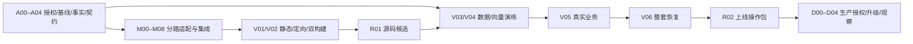

# Dify-Plus 合并 upstream 1.17.1 完整规划

日期：2026-09-28。状态：**原始规划快照，已进入实施与验证阶段**。本文中的“尚未实施”、旧工作区状态和节点进度均为编写时记录；当前源码合并状态、证据和阻塞项以[执行图](../../openspec/changes/merge-upstream-1-17-1/execution-graph.md)及[执行任务清单](../../openspec/changes/merge-upstream-1-17-1/tasks.md)为准。目标：[官方 Dify 1.17.1](https://github.com/langgenius/dify/releases/tag/1.17.1)。

## 1. 建议与交付边界

采用 **固定 tag 的正式 merge + 新宿主承接 fork 功能 + 隔离副本升级/恢复演练**。执行分为源码合并、环境验证、生产发布三个阶段。当前仅完成源码取证和规划材料，未创建分支/工作树，未改业务代码，未运行应用测试或数据库迁移。

主执行图有 **27 个节点**，每个节点规定前置、负责人、授权、写入范围、资源锁、执行步骤、验收证据与失败处理。任务清单提供更小的执行步骤，所有实施任务均待执行。

| 材料 | 用途 |
|---|---|
| [执行图与逐节点操作](../../openspec/changes/merge-upstream-1-17-1/execution-graph.md) | 从 A00 按依赖执行，含 Mermaid、负责人、命令和完成门槛 |
| [机器可读 DAG](../../openspec/changes/merge-upstream-1-17-1/execution-graph.json) | 唯一节点 ID/依赖/状态来源，可交给后续执行者继续工作 |
| [设计与决策](../../openspec/changes/merge-upstream-1-17-1/design.md) | 跨层契约、合并策略、已知债务与风险 |
| [OpenSpec 任务清单](../../openspec/changes/merge-upstream-1-17-1/tasks.md) | 逐项核验与进度记录；未勾选代表尚未执行 |
| [业务验收矩阵](../../openspec/changes/merge-upstream-1-17-1/verification-matrix.md) | 账号/登录、WebApp、计费、知识库、管理页、恢复等可观察标准 |
| [环境升级与回滚手册](../../openspec/changes/merge-upstream-1-17-1/runbook.md) | 环境参数表、单一双迁移入口、向量分支、停写与恢复顺序 |
| [完整 proposal](../../openspec/changes/merge-upstream-1-17-1/proposal.md) | 变更范围与四项 OpenSpec capability |
| [后端分析](../../openspec/changes/merge-upstream-1-17-1/research/backend-analysis.md) | 十项 fork 挂点、17 迁移、注册/OAuth/计费断链 |
| [前端分析](../../openspec/changes/merge-upstream-1-17-1/research/frontend-analysis.md) | 新 transport、卡片/导航迁移、API key、P6 过时项 |
| [部署分析](../../openspec/changes/merge-upstream-1-17-1/research/deployment-analysis.md) | Compose/镜像/env/Agent/SSRF/Weaviate 对照 |
| [冲突所有权表](../../openspec/changes/merge-upstream-1-17-1/research/conflict-ownership.tsv) | 91 个预测冲突逐路径分配解决节点与验收节点 |

## 2. 已确认的源码事实

| 项目 | 固定值 |
|---|---|
| 当前工作分支 | `1.16.0` |
| 当前 fork HEAD | `1c3368ed1584c4e9b6387a28334552d10c946ab4` |
| fork 已合并基线 tag | `fork-merged-1.16.0` → `b10f8f9f0b76e14faf2bd8be12e30f4e6b7fd0b6` |
| 上游共同基点 | `1.16.0` → `5c6372d2f76d240265b92fd27c16bc772ffcb107` |
| 本轮固定目标 | `1.17.1` → `8387590ace4a094de812b7847fc6a4c3a27cd52b` |
| 上游增量 | **1,501 commits / 8,120 变动路径**；+547,897 / −325,297 行 |
| fork 相对上游基点 | 500 变动路径 |
| merge-tree 预测冲突 | **91 路径：API 38、Web 45、Docker 3、其他 5** |
| DB 新增主链迁移 | **17 项**，目标主 head `c3f1a9b2e6d4` |
| fork 扩展链 | 目标 head `019_webapp_auth_switch` |

统计使用 Git 2.53.0、50% rename detection、renameLimit=10000。上游 fetch 与 merge-tree 在临时 bare 对象库中进行，没有改变工作区或主仓分支。完整清单见 [source-inventory.json](../../openspec/changes/merge-upstream-1-17-1/research/source-inventory.json)、[upstream-files.tsv](../../openspec/changes/merge-upstream-1-17-1/research/upstream-files.tsv)、[fork-files.tsv](../../openspec/changes/merge-upstream-1-17-1/research/fork-files.tsv)、[merge-tree 原始输出](../../openspec/changes/merge-upstream-1-17-1/research/merge-tree.txt)。HEAD 或目标变化后须重算，不能把本次预测当未来实际结果。

工作区已有多组未跟踪工具配置、skills 和 `.tmp`；当前分析没有发现其与目标新增路径的精确重名，但实施前必须复查。本次规划文件也需单独提交或备份处理，禁止 broad stage、clean、reset 或全量 stash。

## 3. 优先处理的真实断链

| 优先级 | 变化/风险 | 处理方式 |
|---|---|---|
| P0 | 新邮箱/OAuth 注册绕过旧 RegisterService 额度初始化 | 在所有实际账号创建入口共用事务中建一次额度，保留已有账号额度 |
| P0 | OAuth 迁入 application services/gateway，旧 provider map 不再使用 | 新 registry 注册 OAuth2/Casdoor gateway，保留 token/id_token、state/同源回跳与钉钉 |
| P0 | Console 旧 client/loader 删除，双阶段登录配置失去宿主 | 先迁 contract-loader/browser/server transport，兼容上游公开快照，敏感 license 保持登录保护 |
| P0 | WebApp site 写入 service 化，旧概览卡片删除 | 新事务边界保存 fork 字段，新 built-in access-point 卡片挂开关，并分清 environment passport |
| P0 | 17 迁移中有 Agent 表/JSON 删除、模型凭据去重 | 克隆真实数据审计影响，确认需要保留的旧 Agent 数据处置，整套快照恢复 |
| P0 | 自动迁移只执行主链，多个容器入口可能抢跑 | 停写后单执行者显式主链→extend；两head核验后业务容器禁自动迁移 |
| P0 | 仓库 Weaviate 1.19 声明与 v4 client 不匹配 | 先查真实引擎/版本；逐 minor 副本演练，禁止直接改镜像读旧卷 |
| P1 | workspace summary 替换旧 workspace 形状 | 前后端一起保留 admin_extend/tenant_extend，新卡片恢复同步菜单 |
| P1 | secret-key UI 迁到统一 app/dataset/environment modal | 按真实后端能力提供额度项，保留 dataset binding/RBAC/遮罩 |
| P1 | Node/pnpm 与 UI/i18n 结构升级 | 对齐工具链、24语言与 Next/Vinext 双构建，私有镜像供货单独核验 |

仅解决冲突不足以恢复业务：注册、OAuth、登录 transport、WebApp 和模板权限必须按调用链证明仍可达。

## 4. 执行阶段与完成门槛

此图是阶段摘要，精确依赖以 27 节点 DAG 为准。后端基础与身份契约先稳定，前端 transport 与计费再并行；前端业务 UI 等两侧契约汇合；部署配置可并行。重型测试与构建串行使用资源锁，避免机器内存争用。共享文件始终一个负责人，Git 索引/提交由集成负责人统一操作。

建议配置集成/架构、后端、前端、部署四个角色，可复用人员。Sol/high 负责规划与交叉审查，Astra/high 负责复杂实现，Luna/high 负责机械验证，复杂故障升级。预计约 **10.5–19 人日、三路并行约 6–10 工作日**，是当前源码规模的估算；旧 Weaviate 路径、数据量和维护窗口须 A03 后单独校准。

## 5. 保留边界与后续事项

- 本轮包含 `fork-merged-1.16.0` 之后四个提交，尤其每应用认证开关与匿名上下文修复。
- P4 计费幂等/并发与 P6 管理标准化保持独立；先保证本轮兼容，再根据新基线修订它们的计划。
- 公开匿名 WebApp 当前可能以匿名 end_user 建额度记录；先记录既有行为与缺口，本轮不擅自改为应用 owner 付费。若用户决定修复，另行明确付款人、限额和历史记录迁移规则。
- 现有 Agent 开关、保留时长和管理角色权限保持；新增业务行为需明确决定。
- 生产版本、数据量、DB/向量引擎、真实认证配置、RTO/RPO 等未读取；这些是上线操作包的必填输入，不能从仓库样例推定。

## 6. 后续执行入口

第一步是 A00：用户授权代码实施，并明确允许创建 `codex/merge-upstream-1.17.1` 执行分支后，执行 A01 基线保护。生产授权在完整环境操作包和演练完成后另行处理。当前规划已具备任务与验收结构，不代表这些授权已获得。

规划自身的校验结果见 [planning-validation.md](../../openspec/changes/merge-upstream-1-17-1/research/planning-validation.md)。业务通过状态只认未来绑定具体候选版本的执行证据。
