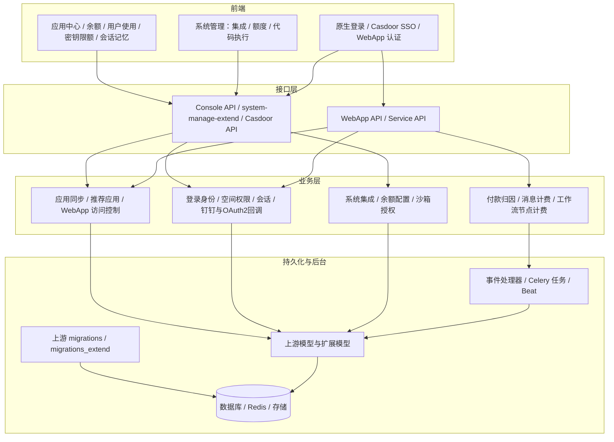
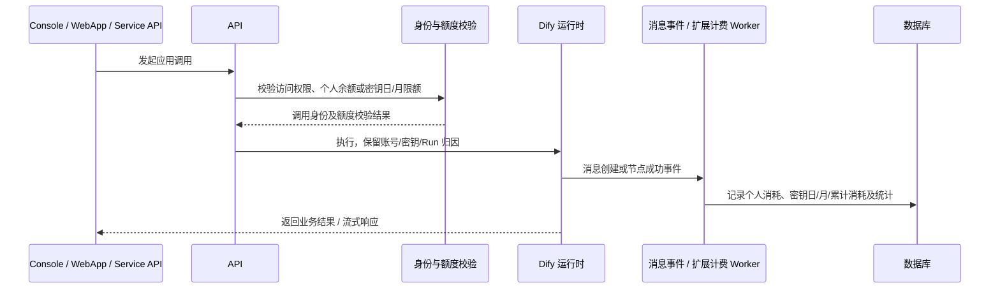

# Dify-Plus 整体架构

Dify-Plus 在 Dify 1.17.1 的应用、工作流、知识库、模型和插件运行时上提供企业身份、应用分发、余额及 API 密钥限额、会话记忆与原生系统管理。业务能力集中在 `api/` 和 `web/`；系统管理使用 Console 的登录态、权限、页面和 API。GVA 独立后台已去除。

## 系统部署

```mermaid
flowchart TB
    Users[Console 用户 / WebApp 用户 / 系统管理员] --> N[Nginx / 外部网关]
    Client[Service API 调用方] --> N
    N --> W[Web：Next.js Console / WebApp]
    N --> A[API：Flask / Dify Core / fork 扩展]
    N --> WS[api_websocket：Socket.IO]
    W --> A
    A --> DB[(业务数据库)]
    A --> R[(Redis / Celery Broker)]
    WS --> R
    A --> ST[(文件 / 对象存储)]
    A --> V[(向量数据库)]
    A --> PD[Plugin Daemon / 模型与工具提供商]
    A --> SB[Sandbox / 授权 Sandbox Full]
    A --> ID[Casdoor / 钉钉 / OAuth2]
    A --> AG[Agent Backend]
    AG --> LS[Agent Local Sandbox]
    AG --> PD
    AG --> R
    R --> WK[Worker：工作流 / 知识库 / 邮件 / 插件]
    R --> EX[Worker Gaia：扩展计费等任务]
    BEAT[Worker Beat：周期调度] --> R
    WK --> DB
    WK --> ST
    WK --> V
    EX --> DB
    MIG[单迁移服务：上游链 → 扩展链] --> DB
```

标准入口为 [`docker/docker-compose.dify-plus.yaml`](../../docker/docker-compose.dify-plus.yaml)。`collaboration` profile 提供专用 WebSocket 服务，`migration` profile 提供双迁移任务。API、WebSocket、初始化密钥、迁移和全部后台任务使用同一 fork API 发布镜像与共享配置。部署步骤见[部署与运维](./二开部署配置与运维说明.md)。

## 代码分层

| 能力 | 实现入口 |
| --- | --- |
| 应用中心与模板同步 | `api/controllers/console/app/app_extend.py`、`api/services/recommended_app_service_extend.py`、`web/app/components/explore/app-list-center-extend/` |
| 余额、API 密钥额度及使用归因 | `api/models/account_money_extend.py`、`api/models/api_token_money_extend.py`、`api/services/workflow_run_account_extend.py`、`api/controllers/service_api/wraps.py` |
| 消息与工作流计费 | `api/events/event_handlers/update_account_money_when_messaeg_created_extend.py`、`api/tasks/extend/update_account_money_when_workflow_node_execution_created_extend.py` |
| 记忆窗口和消息上下文 | `api/core/memory/token_buffer_memory.py`、`api/controllers/console/app/app_extend.py`、`web/app/components/app/configuration/retention-number-extend/` |
| 原生系统管理与授权 | `api/controllers/console/system_manage_extend.py`、`api/services/system_manage_extend.py`、`api/services/system_management_access_service_extend.py` |
| Casdoor SSO | `api/controllers/console/casdoor_config_extend.py`、`api/controllers/console/auth/casdoor_extend.py`、`api/services/casdoor_*_extend.py`、`api/core/casdoor/` |
| 钉钉和 OAuth2 | `api/services/ding_talk_extend.py`、`api/services/dingtalk_email_lookup_extend.py`、`api/libs/oauth.py` |
| WebApp 认证策略 | `api/services/webapp_auth_service_extend.py`、`api/services/webapp_console_identity_extend.py`、`web/service/webapp-auth.ts` |
| 数据结构和周期任务 | `api/models/*extend.py`、`api/migrations_extend/`、`api/schedule/*extend.py`、`api/extensions/ext_celery.py` |

## 系统管理权限

初始化创建的空间由数据库关联固定，新安装在 setup 事务中保存，已有安装通过扩展迁移回填。授权不依赖空间名字、固定 UUID、旧 Casdoor 管理 allowlist 或 RBAC 的宽松兼容角色。切换到其他空间、成员资格改变、账号或初始化空间失效后，请求重新校验权限；初始化空间失效时不会自动把管理范围转移到其他空间。

Casdoor SSO 的默认登录空间与实例管理范围独立。当前支持 Community / RBAC 关闭的 SSO 配置，静态校验和真实诊断绑定配置 revision，激活后用于登录；Enterprise / RBAC 开启模式当前不支持激活。Client Secret 加密保存，签名公钥自动发现并用于登录验签。

## 调用、归因与计费

个人 `total_quota` / `used_quota` 是 Dify-Plus 余额，额度单位按模型价格换算为美元。密钥有日限额和月限额，`accumulated_quota` 仅为累计使用量。工作流节点计费经 `extend_high` 异步消费，运行完成与账目更新具有时间差。需要按实际 usage、付款账号、密钥及 Run 记录核对；不把上游模型提供商 quota 当作 fork 余额。

## 应用中心与 WebApp

应用中心汇总当前空间已发布、可访问的安装应用，不要求先有使用统计。应用可同步到模板 / 推荐列表，用户可进入对应安装应用。

WebApp 每应用配置「访问认证」：默认开启，使用 Console 登录账号进行本地身份、空间权限及付款归因；关闭时允许匿名访问，仍通过标准 WebApp Passport 链路。访问开关不等于放开 Console 数据权限，匿名访问不调用需要 Console 身份的记忆上下文接口。Service API 使用独立 API 密钥和相应限额。

## 数据与交付边界

上游迁移目录 `api/migrations/` 与扩展目录 `api/migrations_extend/` 分别管理 schema，生产升级由唯一 executor 先执行 `flask db upgrade` 再执行 `flask extend_db upgrade`。初始化密钥任务先保证所有消费者使用同一 `SECRET_KEY`。

源码、镜像、部署配置、双链版本和真实业务读回分别记录。运行数据还依赖数据库、Redis 队列、向量库、文件 / 插件存储及 Agent 状态，恢复时需匹配一致恢复点。当前功能说明不代表某个生产环境已经安装、升级或通过验收。
