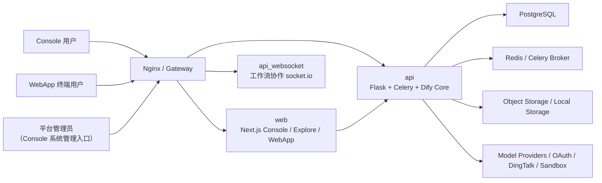
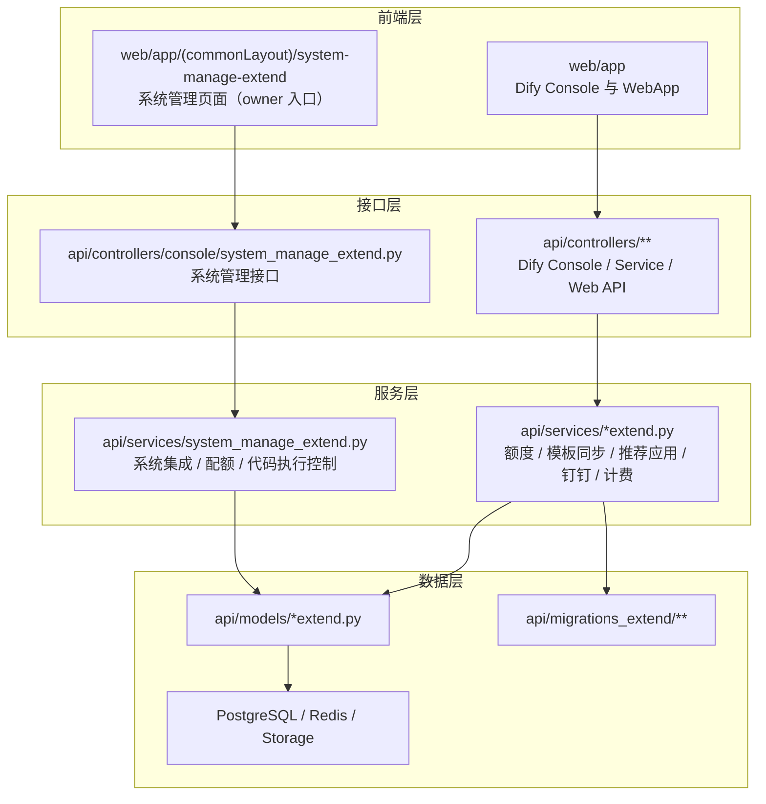
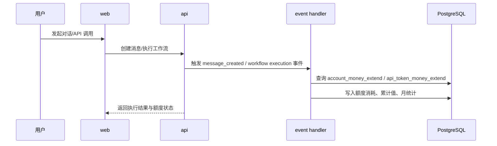
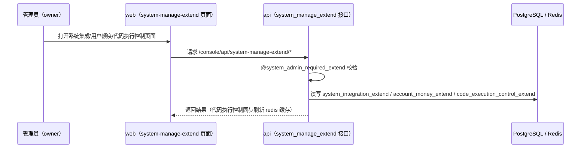

# Dify-Plus 整体架构图

## 1. 系统定位

Dify-Plus 由两部分组成（原独立管理后台 `admin/` 已于 2026-07-05 随 `p5-admin-decommission` 废弃删除，
管理能力并入 Console `/system-manage-extend/*`）：

- 官方 Dify 主体能力：`api/` + `web/`
- 企业二开能力：在 `api/` 和 `web/` 中通过 `extend` 系列模块叠加（含 Console 原生系统管理）

## 2. 总体部署视图

## 3. 代码分层图

## 4. 核心子系统

### 4.1 Dify 主运行时

- 后端入口仍为 Dify API：`api/app.py`、`api/controllers/**`
- 前端主体仍为 Dify Web：`web/app/**`
- 该部分承担应用创建、聊天、工作流、知识库、模型调用等上游能力

### 4.2 Fork 扩展层

- 配额与计费扩展：`api/models/account_money_extend.py`、`api/events/event_handlers/update_account_money_when_messaeg_created_extend.py`
- 模板同步与应用中心：`api/services/recommended_app_service_extend.py`、`api/controllers/console/app/app_extend.py`
- 登录与系统集成：`api/controllers/console/app/ding_talk_extend.py`、`api/controllers/console/auth/oauth.py`；WebApp Passport 使用 `api/controllers/web/passport.py` 标准链路
- 记忆上下文：`api/migrations_extend/versions/2025_02_27_0001-add_message_context_extend.py` 与 `web/app/components/base/chat/chat/index.tsx`

### 4.3 系统管理（Console 原生）

- 后端接口：`api/controllers/console/system_manage_extend.py`（`@system_admin_required_extend` 权限）
- 业务实现：`api/services/system_manage_extend.py`
- 页面入口：Console 顶部导航「系统管理」（仅 workspace owner 可见），路由
  `/system-manage-extend/system-integration`、`/system-manage-extend/quota-management`、
  `/system-manage-extend/code-execution-control`
- 迁移历史见[admin迁移状态总表](./admin迁移状态总表.md)

## 5. 关键业务流

### 5.1 用户额度扣减

### 5.2 Console 系统管理能力

## 6. 与上游的主要结构差异

- `api/` 中新增 `migrations_extend`、`models/*extend.py`、`services/*extend.py`、定时任务与事件处理器，形成一套 fork 业务能力层。
- `web/` 中新增应用中心、额度展示、公开页鉴权、记忆上下文、第三方登录、系统管理页面等交互（批量工作流入口已按 D2 决策于 2026-07-05 删除）。
- `docker/` 中新增 `docker-compose.dify-plus.yaml`，把 Dify 与二开依赖整合进同一部署拓扑。
- 原 `admin/` 管理后台子系统（曾是相对 upstream 最大的结构性差异）已于 2026-07-05 删除，代码留档于 tag `pre-admin-removal`。

## 7. 推荐阅读

- [与上游差异总表](./与上游差异总表.md)
- [二开功能详解-后端与数据层](./二开功能详解-后端与数据层.md)
- [二开功能详解-Web与管理后台](./二开功能详解-Web与管理后台.md)
- [二开部署配置与运维说明](./二开部署配置与运维说明.md)
