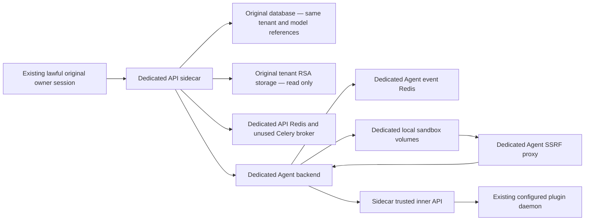

# O02 isolated Agent topology — reviewable plan only

This source plan itself starts no service, Agent fixture, model call, or cleanup. The reviewed five-service no-model package now runs and its API container-local health is 200. The actual published host bindings are empty and host/owner admission is unpassed. Automatic approval review rejected joining the sidecar API to the existing shared access network; that precise next action waits for explicit human approval. Do not use a different network, host, relay, or internal owner request to bypass this rejection. Agent creation and real generation remain separate gates. The existing destructive cleanup also remains blocked pending explicit approval.

## Verified starting point

The original API has `AGENT_SHELL_ENABLED=true`, `AGENT_BACKEND_USE_FAKE=false`, an Agent backend URL, and no configured Agent control-plane token. Its configured backend health probe failed before HTTP with `URLError` / `gaierror`. URL and token values were neither printed nor stored in this evidence.

Initial Agent App execution uses an API-owned Python thread and an in-process `queue.Queue`, not Celery/Gaia: `api/core/app/apps/agent_app/app_generator.py:185`, `api/core/app/apps/base_app_queue_manager.py:64`. The runner directly calls the Agent backend create-run API and consumes its SSE events. The Agent backend runs a process-local asyncio scheduler; its Redis stores run records and retained events, not a Celery job queue (`dify-agent/src/dify_agent/server/app.py:1`). Therefore the minimal initial-turn topology needs no worker or beat.

## Reversible service preparation

The current package contains exactly five services: API sidecar, Agent backend, dedicated Redis, local sandbox, and dedicated Agent SSRF proxy. Its inner metadata/storage link goes directly from the Agent backend to the sidecar under the existing trusted authentication contract. The LLM-only guard described below is not a sixth service in this package. Use the verified full API image for one loopback-only sidecar in API mode, `MIGRATION_ENABLED=false`. Run no migrations, worker, beat, scheduler consumer, or main-queue inspection/consumption. Add only isolated services, network aliases, Redis, and disposable sandbox volumes. Do not change or restart the original API/worker, proxy, provider settings, prices, credentials, or deployment files. Retain a private manifest of every newly owned service, network, volume, and effective image ID for rollback.

The sidecar connects to the original database using privately supplied deployment connection references. It needs the same original `SECRET_KEY` to verify existing lawful owner access/CSRF cookies; do not manufacture JWTs or log in as the owner. `PassportService.verify` uses this key, while `ext_login` loads the account and active workspace from the database. A separate API Redis is sufficient for ordinary authenticated requests. Refresh mappings reside in the original Redis, so only the sole auth writer may legally refresh through the original API; the sidecar must never log in, log out, or refresh the original session. Before any fixture mutation, obtain sidecar profile/workspace 200 with the real original owner/tenant and matching CSRF. Enable only the required original browser origin in the sidecar's CORS configuration.

Preserve credential ownership. `AgentLLMInnerService.prepare` reconstructs the app/tenant and calls the existing `ModelManager` / provider configuration; the harness must not read, export, reconstruct, or inject provider credential values. A fresh sidecar cache still needs normal read-only access to original tenant RSA storage: `libs/rsa.py:66` reads `privkeys/{tenant}/private.pem` when its own Redis cache is empty. Sharing only the database and mounting an empty storage volume is insufficient. The actual reviewed layout uses a new owned writable root at `/app/api/storage`, with only the original volume's existing `privkeys` directory mounted read-only at `/app/api/storage/privkeys`. The original effective signing scalar is resolved privately into a mode0600 environment file; the persisted key file is not copied. `FileService`'s `upload_files/{tenant}/{uuid}.{extension}` writes therefore land only in owned storage. The earlier whole-original-root read-only plus nested-upload proposal failed during mountpoint creation and is superseded. Actual health proof reports original RSA/signing hashes unchanged and no original `upload_files` directory created. These are mounting checks, not file-upload acceptance: uploads are still zero. Any required persistent write outside the owned fixture scope is a stop condition.

## Private internal transport references

| Link | Required reference mapping |
| --- | --- |
| Sidecar to dedicated Agent control plane | Sidecar `AGENT_BACKEND_API_TOKEN` equals dedicated backend `DIFY_AGENT_API_TOKEN`, using a fresh private fixture token |
| Agent backend to sidecar inner routes | Backend `DIFY_AGENT_INNER_API_KEY` equals sidecar `INNER_API_KEY_FOR_PLUGIN`; sidecar `PLUGIN_DAEMON_KEY` must be present |
| Agent backend inner URL | `DIFY_AGENT_INNER_API_URL` points only to the sidecar (or a separately reviewed transparent bounded-invoke proxy) |
| API model runtime to existing plugin daemon | Sidecar reuses normal internal `PLUGIN_DAEMON_URL` / `PLUGIN_DAEMON_KEY` references; no provider key copying |
| Sandbox to Agent Stub | Dedicated `DIFY_AGENT_STUB_API_BASE_URL`, genuine runtime-issued scoped JWE, matching private `DIFY_AGENT_SERVER_SECRET_KEY` |
| Local sandbox control plane | `DIFY_AGENT_LOCAL_SANDBOX_ENDPOINT` / `DIFY_AGENT_LOCAL_SANDBOX_AUTH_TOKEN` match the dedicated local sandbox |

`agent_inner_api_only` currently delegates to `plugin_inner_api_only` (`api/controllers/inner_api/wraps.py:96`), which checks the actual sidecar `INNER_API_KEY_FOR_PLUGIN`. A similarly named outer environment variable is not sufficient proof. Prior no-model Agent manifest validation already demonstrated the importance of this mapping. Values must stay private; verify equality as booleans only.

The standard dedicated proxy allows the actual `agent_backend` `/agent-stub/` and `api` `/files/` routes, denies other private-network targets, and otherwise allows public destinations (`docker/ssrf_proxy/squid-agent.conf.template:9`). Isolated service aliases must match this contract or receive an explicitly reviewed acceptance-only proxy configuration. The sandbox gets no original workspace mount or provider/daemon/API caller secrets; only runtime-minted scoped Agent Stub access. HTTP proxy variables alone are not claimed to disable all shell/network capabilities.

## Proposed lawful fixture and no-model checks

Only after the topology and exact fixture scope are approved: `POST /console/api/agent` creates one distinctly named synthetic Agent under the existing lawful owner. `GET /agent/{id}/composer` supplies its own draft; `PUT /agent/{id}/composer` uses `variant=agent_app`, `save_strategy=save_to_current_version`, and the same owned draft structure with model reference `plugin_id=langgenius/deepseek`, `model_provider=deepseek`, `model=deepseek-flash`, `model_settings.max_tokens=8`. Dify/CLI tool declarations, knowledge sets, human contacts/tools, environment variables/secret references, config assets, and files are empty. No original App graph or provider config is copied. Save and read back model references/cap, lawful Agent/backing-App/version IDs, owner/tenant, and empty declarations.

Before any model run: verify sidecar/Agent/sandbox health and legitimate bearer mappings; reconstruct the actual saved Agent request through the normal builder without `create_run` or model invocation; inspect layer IDs, dependency edges, declared and effective tool names, model settings, metadata actor IDs, and no-model manifest/files JWE routes. Persist only these allowed identifiers, booleans, and counts.

The config layer is intentionally always present for its CLI/help surface (`runtime_request_builder.py:906`). The API request builder intentionally includes shell when the flag is true **or** the config layer exists (`clients/agent_backend/request_builder.py:332`). Empty CLI declarations do not remove the four underlying `shell_run`, `shell_wait`, `shell_input`, `shell_interrupt` tools (`dify-agent/.../layers/shell/layer.py:259`). Thus neither an empty tools payload nor a false flag by itself proves a tool-free run; confirm the actual no-model compositor/toolset behavior. These source facts do not alone establish a new regression.

## Conditions that block execution

1. The five services are running and container-local API health is 200. Host `25452` has no active binding because the selected primary network is internal. The proposed shared access-network join/recreate was rejected by automatic approval review and remains blocked pending explicit human approval. No owner admission, Agent creation, file upload, or model request is performed until the actual transport and identity gates pass; no workaround is authorized.
2. Original configured Agent DNS is currently unresolved; a sidecar must demonstrate its own genuine reachable endpoints rather than reusing that failed URL.
3. Actual runtime proof verifies internal key/plugin key/control-token/sandbox-key equality booleans, signing-source equality, dependency TCP reachability and protected key hashes. Lawful sidecar profile/current-tenant summary and real metadata/file responses still need acceptance after the approved host transport exists.
4. The existing Agent runner uses `UsageLimits(request_limit=500)` and has no exposed two-call override. An 8-token model cap limits one response, not the number of Agent model invocations. No full Agent generation may be approved on a prompt-only promise of at most two calls. A separately reviewed hard forwarding budget at the unique sidecar Agent LLM gateway could be investigated without production source changes; until its real scope, counters, retry behavior, and failure semantics are reviewed, model calls remain prohibited.
5. Fixture cleanup authorization is still pending. New fixture creation must not be interleaved with the currently blocked three-App cleanup without a reviewed ownership/cleanup plan.

No provider invocation, secret export, fake claim, migration, Git/source edit, main-queue consumer, or runtime mutation is performed by this evidence.

## LLM-only guard v1 (instrument implemented; real forwarding not started)

The protocol permits a transparent guard. `dify-agent/adapters/llm/provider.py:83` emits JSON `{caller,target}`, authenticated with `X-Inner-Api-Key`, to exactly `POST /inner/api/agent/llm/invoke`. `caller` carries the genuine `tenant_id`, `user_id`, `user_from`, `app_id`, `agent_id`, config version ID/kind, runtime-generated `agent_run_id`, monotonic `call_index`, and deterministic UUID5 invocation ID. `target` carries the fully qualified provider, model, prompt messages, `model_parameters`, tool definitions, stop settings, and stream flag. There is no per-body JWT to rewrite; the trusted inner key is the transport authentication. Agent Stub JWE is a distinct protocol and is forwarded without alteration.

A dedicated acceptance-only single-process reverse proxy can sit between the new Agent backend and the sidecar API:

1. Authenticate the genuine fixture inner key in memory. Never log headers or body contents. Admit only the exact product-created owner, tenant, App, Agent, and saved config version; check `user_from=account` and the real builder-derived mode/invoke source. Refuse unrelated actor/resource scopes before forwarding.
2. Pin target provider/model to the existing configured selection and require integer `model_parameters.max_tokens=8` and `stream=true`. Enforce a reviewed input/body limit after counting the *actual rendered* system/user/tool prompt sizes; do not silently truncate or replace prompts. Automatic config/shell prompts may exceed a small user-query-only bound, so no-model rendering must supply the real input budget before a generation package is approved.
3. Bind the first admitted genuine Agent run ID and reject other runs. Under one atomic lock, reserve a durable forwarding slot **before opening the upstream request**. Maximum two slots for the entire immutable package, including upstream connection errors or unknown outcomes. Store allowed IDs, call indices, invocation IDs, hashes, numeric budgets, and timestamps in a mode0600 ledger. Reject duplicate invocation IDs and further requests; never replay or release uncertain slots. A third request receives a real non-success HTTP budget error and has zero upstream forwarding.
4. Forward the original bytes and genuine inner header to the sidecar unchanged. The implemented instrument uses standard-library HTTP response `read1` with immediate downstream flush; propagate upstream status, content type, encoding, and SSE cache headers, and remove hop-by-hop framing headers. Do not buffer the full response, invent SSE success/error events, modify caller claims, or manufacture usage. The API's real gateway yields `data: {code,message,data:LLMResultChunk}` (`controllers/inner_api/agent/llm.py:36`); the Agent adapter retains the latest genuine `delta.usage` (`adapters/llm/model.py:237`). Transparent forwarding preserves the actual provider usage and price contract.
5. Guard v1 admits only the LLM invoke POST. All metadata/config/file routes are denied by this instrument. The current five-service no-model package uses its separately reviewed direct trusted inner API link for those routes. There is no new dual-direction metadata proxy design or startup dependency. The LLM instrument receives no Console cookie and must not refresh, log in, or modify original account state.

### No-model preflight before any real forwarding

Use a clearly labelled local transport test sink, not the real LLM endpoint, to exercise the guard's HTTP admission and atomic budget reservation. The sink counts received requests and returns a generic non-model transport response; it must never emit fabricated LLM output or usage. With a separate preflight-only scope/ledger, two authorized-shaped transport requests must result in exactly two sink receives; the third must be denied with sink count still two. Concurrent submissions, duplicate invocation IDs, wrong resource scope, wrong key, unsupported provider, and cap above eight must have zero additional receives. An uncertain upstream failure must still consume its reserved slot. Separately test raw byte/status/header preservation using opaque transport bytes, clearly marked as proxy testing rather than generation acceptance. Do not claim this test validates account authorization or model execution.

After a real product Agent and lawful version exist, perform a no-forward admission preflight with its exact builder-produced identifiers and actual rendered parameters; it proves allowlist/cap construction without opening the provider path. The eventual genuine generation uses a new sealed ledger, and only that approved package may reach the real gateway. Every real forwarding response must be paired with provider usage, Agent events, and the exact Message/Agent ownership chain by independent readback. A budget error remains a real failure, not a fake successful Agent result. Source `request_limit=500` remains untouched, while the transparent forwarding boundary enforces the separately approved provider-call ceiling.

### Tool and filesystem effects

The default config/shell layers expose four shell tools even when declared tools are empty. The small fixture therefore cannot be described as inherently tool-free. Isolate local sandbox home/workspace/snapshots in new disposable volumes; mount no original workspace, RSA key, provider credential, Docker socket, or original data volume in the sandbox. Only the sidecar API receives read-only original credential storage.

Use dedicated internal Docker networks: local sandbox reaches only its Agent control endpoint and the dedicated proxy, never the original DB/Redis/plugin-daemon/API network directly. The acceptance proxy should allow only the exact genuine Agent Stub and owned file routes and deny other private and public destinations for this package. Keep backend control tokens/inner keys outside sandbox environment. Runtime-issued JWE retains the exact owned Agent/version/actor scope. Do not rely on `HTTP_PROXY` variables alone to constrain arbitrary code.

Count genuine Agent tool-call/tool-return events and independently compare sandbox job IDs and disposable-volume state before/after. Model forwarding slots are enforced by the guard regardless of tool outcomes. A prompt can request no tools, but a nonzero tool count must be reported honestly; any tool operation outside the reviewed owned scope is a stop condition. This plan does not claim a hard zero-tool-call switch that the current source does not expose. Shell bootstrap/config materialization jobs must be separated from genuine model-requested tool calls in the evidence.

The current reviewed mutation package is exactly the five health-only services, with zero new Agents and zero model calls. A later product-created Agent/backing App/draft fixture has its own scope and authorization gate; attaching the LLM-only instrument for real forwarding has a further model-budget gate. No Celery/Gaia/beat, original configuration edits, migrations, main queue consumers, fake claims, or provider credential export is included.

The instrument lives in `supporting/o02_gateway_guard.py`; `supporting/o02_gateway_guard_preflight.py` and `o02-guard-non-model-preflight.json` record 18 real HTTP transport checks against a clearly labelled non-model sink, with zero provider invocations. Independent review accepted hash `60c44a5bb2a4a007d2166137d877d21d6aefd7c339caabfe1d6025a58563a8a0`. Deployment constraints are one process/instance for the ledger (its lock is not cross-process), one fixed private upstream, and the complete immutable typed caller policy. The upstream service still validates the genuine owner chain. Two forwarded LLM HTTP requests do not imply two vendor attempts: provider SDK retries and tool execution counts remain separate verification boundaries. The SDK's short `deepseek` provider name normalizes to `langgenius/deepseek/deepseek` in the actual wire target; this is a valid contract, not a product bug.

Actual checkpoint references: `o02-sidecar-runtime-health.json` (five running services, image445d, internal health200, active host bindings empty, 0 models/Agents/uploads), `independent-o02-storage-subpath-review.json` (owned RW root/original RSA RO subpath), and `independent-o02-network-mode-review.json` (precise rejected action, reason, zero execution, explicit no-bypass boundary). The prepared private owner-admission/create/composer scripts have not run.
