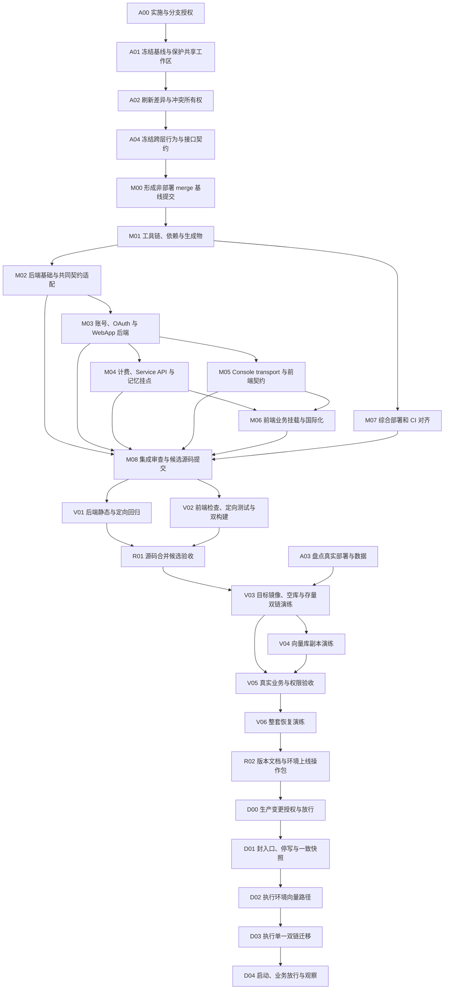

# 可执行合并 DAG

> A00 授权记录、A01 基线与共享工作区保护均已通过（passed）；指定分支 `codex/merge-upstream-1.17.1` 已创建，A02 差异与所有权刷新、A04 跨层契约冻结已通过（passed），M00 非部署双父基线已通过（passed）；M01 初始锁专项已通过（passed）；M02 原 8.1–8.5 已通过（146 项定向/Schema 测试及 29 项 HTTP 测试、独立 Luna 无 P1/P2）；曾因 message/context 安全交接重开 8.6–8.7；四个源码/测试路径已登记，36 项测试、Swagger schema 及独立 Luna 复核均通过，M02 已恢复 passed；M03 9.1–9.6 已通过（原 349 项定向测试、6 项 Schema 断言；9.6 追加 29 项定向测试，提交 `11fe1809f30c64d095d5a2a2ac81cc37eeb9e5c6`，生成契约不变）；M04 passed（370 项定向测试、独立 Luna 验收通过）；M05 11.1–11.6 源码与标准 message contract 生成均已通过（仍不可部署）；11.6 由根工作区标准生成复跑、schema 断言和 Astra worktree 字节比对验收；M06 12.1a、12.1b 已完成并提交；独立 Luna 在隔离 worktree 验证 12.1a 卡片 22 项通过、12.1b context 20 项通过，限定检查及代码审查均通过；主工作区缺 cn@0.2.4，未改依赖或 lockfile；12.2 应用中心只读分析已由 Sol 子代理 `/root/m06_12_2_analysis` 完成，证据 `evidence/M06/12.2-analysis.md`；12.2a 独立 gpt-6-astra worktree 任务 `client-new-thread:d21212b0-d4ba-41d6-9395-345a2a3602eb` 正在 provisioning；M03 9.6 已由独立 Astra 子任务 `/root/m03_9_6_sync_status` 完成并提交 `11fe1809f30c64d095d5a2a2ac81cc37eeb9e5c6`，12.2c 已解锁并创建独立 Astra worktree 任务 `client-new-thread:0ceed222-0cfe-483a-a7b1-b61587486cf7`（基于 `00728c296c`，provisioning）；独立对话请求仍不可读取；12.3 API key/汇率、12.4 系统管理路由分析任务仍在 provisioning；context caller 已由 M05 11.6 契约解锁；12.1b Chat 宿主与 fork service 的四路径实现已由 `9ee0119ca1ae501008db1913777ac4582af17205` 提交；Sol 路径交叉核对仍在 provisioning。M07 13.1–13.3、13.5 已通过，13.4 的 init_secret_key 门、失败闭合与 migration 说明已在 `1b1ddf4eb3` 实现，新建 gpt-6-luna 独立只读复核任务 `client-new-thread:a254696f-72b5-40b0-b23d-9a4aceda17a3` 正在 worktree provisioning，先前不可读请求已替换；13.6 暂缓；M08/V01/V02/R01 仍待各自前置；A03 因缺少真实环境只读访问授权而阻塞（blocked）。其余节点依赖执行图推进。节点顺序、写入范围及权限以 JSON 为事实源。

## 依赖图



## 调度与人员安排

- A00 授权门与 A01 共享工作区保护已通过；指定分支已创建，A02 已校验固定 tag 和重算差异，A04 已冻结共同契约，M00 已形成不可部署的双父 merge 基线；M01 已通过；M03 9.1–9.6 已通过（9.6 追加 29 项定向测试并保持 schema 不变）；M02 原 8.1–8.5 通过后重开 8.6–8.7；36 项测试、Swagger schema 和独立 Luna 复核均通过，已恢复 passed；M04 已通过；M05 11.1–11.6 已通过，11.6 标准生成、schema 断言及 Astra worktree 字节比对均通过；M07 13.1–13.3、13.5 已通过，13.4 实现完成待 Luna 复核，13.6 暂缓；M06 12.1a、12.1b 已完成；独立 Luna 验证 22 项卡片测试和 20 项 context 测试通过，两个 scoped check 及代码审查无阻断；12.2 Sol 分析已完成，12.2a 与 12.2c 的精确路径和前置已登记；12.2c 独立 Astra worktree 任务 `client-new-thread:0ceed222-0cfe-483a-a7b1-b61587486cf7` 正在 provisioning；12.3 与 12.4 的独立 Sol 分析任务也在 provisioning，context caller 已由 M05 11.6 generated contract 解锁，12.1b 已提交并通过 20 项聚焦测试、四文件 scoped check 及独立 Luna 审查；独立 Sol 路径交叉核对仍在进行，M08/V01/V02/R01 尚未通过。R01 是源码候选；R02 是上线准备完成；D04 才是生产升级完成。
- 建议集成/架构 1 人、后端 1 人、前端 1 人、部署 1 人；角色可复用。模型只是辅助建议：复杂实现 Astra/high，规划 Sol/high，机械检查 Luna/high，复杂故障升级 Sol/Astra。
- M02→M03→M04 串行；M05 在 M03 后可与 M04 并行；M07 与后端/前端适配并行；M06 等待后端计费与前端契约。
- V01/V02 共用 heavy_compute 锁，默认串行运行重型检查。A03 可独立完成获授权的环境只读盘点；V04 等待 V03 固定候选镜像后再做向量数据与客户端适配演练。
- 任一节点修复导致源代码改变，更新候选 commit/digest 并使相应后继检查失效；不得复用旧结果冒充新结果。
- 91 个预测冲突的唯一初始 owner 见 research/conflict-ownership.tsv；155 个 fork/upstream 重叠路径见 research/overlap-ownership.tsv，20 个新增或移动宿主落点见 research/host-ownership.tsv。实际 merge 出现新路径须先登记。
- Git 索引由集成负责人串行管理：M00 形成双父 upstream merge 基线；M01–M07 的代码、配套测试、证据及状态逐节点独立提交；M08 提交集成修复和候选源码。M00 基线不可部署，R01/V03 等后续门槛不提前通过。
- 时间估算：基线/共同契约 0.5–1 人日；源码适配 6–10 人日；验证/数据演练 3–6 人日；运维操作包 1–2 人日。合计约 10.5–19 人日，三路并行约 6–10 工作日；为当前规模下的估计，旧向量库逐站迁移另计，A03 后更新。

## A00 · 实施与分支授权

- 前置：无；负责人：集成负责人；建议模型：Sol/high。
- 授权：`explicit_user_implementation_and_branch`；资源锁：`集成负责人`。
- 写入范围：授权记录。

执行：

1. 已确认用户授权本地代码实施、校验及创建指定执行分支 `codex/merge-upstream-1.17.1`；原文和环境边界见 `evidence/A00/result.json`
2. 用户选择指定执行分支，当前分支实施的替代决定不适用；分支创建留待 A01

验收：

- 授权记录明确涵盖动作、分支名称及环境边界

证据：`evidence/A00/result.json` 与日志；附源 commit、环境/digest、退出码、断言和已知债务。失败：停止本节点及全部后继；记录失败输入与输出，修复后使受影响证据失效并重跑。生产节点按 runbook.md 恢复，迁移不盲目重试。

## A01 · 冻结基线与保护共享工作区

- 前置：A00；负责人：集成负责人；建议模型：Sol/high。
- 授权：`implementation`；资源锁：`git_index`。
- 写入范围：Git refs 与本次规划材料。

执行：

1. 检查当前 HEAD、工作区、upstream URL、tag；核对未跟踪路径与目标路径碰撞
2. 本次规划文件显式列出后独立提交或备份；其他未跟踪文件保留，禁止全量 stash/clean/reset
3. 确认授权分支名后创建 codex/merge-upstream-1.17.1，记录旧 HEAD 和恢复锚点；若名字已存在先检查，不覆盖

验收：

- 完整 SHA 与本分析一致，变化则 A02 重新评估
- 无未保存的受影响用户修改；未跟踪路径碰撞已逐项处置

命令（先满足本节点前置，路径以合并后实际结构复核）：

```sh
git status --short
git rev-parse HEAD
git remote get-url upstream
git tag --points-at HEAD
git switch -c codex/merge-upstream-1.17.1
```

证据：`evidence/A01/result.json` 与日志；附源 commit、环境/digest、退出码、断言和已知债务。失败：停止本节点及全部后继；记录失败输入与输出，修复后使受影响证据失效并重跑。生产节点按 runbook.md 恢复，迁移不盲目重试。

## A02 · 刷新差异与冲突所有权

- 前置：A01；负责人：集成负责人；建议模型：Sol/high。
- 授权：`implementation`；资源锁：`git_index`。
- 写入范围：research/ 与 ownership 台账。

执行：

1. 通过 upstream 取固定 tag 并核对 full SHA，不自动追 main
2. 刷新 merge-base、提交/文件差异和冲突预测；检查四个 fork 后续提交全部入账
3. 为新增/移动宿主分配独占 owner，91 路径初表仅是当前快照

验收：

- 目标确为 8387590ace4a094de812b7847fc6a4c3a27cd52b
- 所有冲突唯一归属；所有文件改写需求有 owner

命令（先满足本节点前置，路径以合并后实际结构复核）：

```sh
git fetch upstream refs/tags/1.17.1:refs/tags/1.17.1
git rev-parse refs/tags/1.17.1^{commit}
git merge-base HEAD refs/tags/1.17.1
```

证据：`evidence/A02/result.json` 与日志；附源 commit、环境/digest、退出码、断言和已知债务。失败：停止本节点及全部后继；记录失败输入与输出，修复后使受影响证据失效并重跑。生产节点按 runbook.md 恢复，迁移不盲目重试。

## A03 · 盘点真实部署与数据

- 前置：无；负责人：运维负责人；建议模型：Sol/high。
- 授权：`authorized_read_only_environment_access`；资源锁：`运维负责人`。
- 写入范围：脱敏环境清单。

执行：

1. 填 runbook 环境表，查询实际服务镜像/版本/两个 DB head/数据卷/备份/队列
2. 盘点真实 Agent、SSO、模型和向量库；记录历史 backfill 完成状态
3. 确认副本访问与业务验收负责人，准备环境操作草案与备份恢复命令；不得输出凭据或完整含密钥 Compose

验收：

- 环境清单必填项完成，缺失项标 blocked
- 具备可恢复副本与隔离环境方案

证据：`evidence/A03/result.json` 与日志；附源 commit、环境/digest、退出码、断言和已知债务。失败：停止本节点及全部后继；记录失败输入与输出，修复后使受影响证据失效并重跑。生产节点按 runbook.md 恢复，迁移不盲目重试。

## A04 · 冻结跨层行为与接口契约

- 前置：A02；负责人：架构负责人；建议模型：Sol/high。
- 授权：`implementation`；资源锁：`架构负责人`。
- 写入范围：`research/contract-matrix.md` 与 A04 状态证据。

执行：

1. 按 design D3 逐条写请求/响应/错误/权限/缓存契约
2. 确定 public snapshot 与 fork login_config 合成；workspace summary 权限源
3. 保留现有 app/dataset key 支持范围；environment 无计费契约则不显示无效输入
4. 记录匿名计费及 P4 已知债务，不因未答复改变付款人

验收：

- 身份/前端/额度负责人认可同一契约
- 不得以旧文件路径代替行为验收

状态：passed；共同契约见 `research/contract-matrix.md`（C01–C14）。这是已授权设计与源码支持的实施交接，不表示外部负责人签字或业务回归通过。证据：`evidence/A04/result.json` 与日志；附源 commit、环境/digest、退出码、断言和已知债务。失败：停止本节点及全部后继；记录失败输入与输出，修复后使受影响证据失效并重跑。生产节点按 runbook.md 恢复，迁移不盲目重试。

## M00 · 形成非部署 merge 基线提交

- 前置：A04；负责人：集成负责人；建议模型：Astra/high。
- 授权：`implementation`；资源锁：`git_index`。
- 写入范围：Git merge state。

执行：

1. 确认 A01 所有保护措施完成
2. 在授权分支执行正式 merge；冲突退出码不等于失败，核对 MERGE_HEAD 与固定 target
3. 将实际冲突逐项与 A02 的 91 路径及唯一 owner 核对；不一致则阻断并返回 A02 更新台账
4. 全部冲突选择 upstream 1.17.1 版本，上游删除则维持删除；逐项记录处置、保留 fork 第一父提交及后续适配 owner
5. 核验无未解决索引后提交双父 upstream merge 基线；记录父提交和树摘要，标记为不可部署基线

验收：

- 双父 merge commit 第一父为步骤 1 记录的执行前授权分支 HEAD、第二父为固定 target；无未解决索引
- 91 个预测冲突与实际冲突逐项核对并有唯一 owner；冲突树采用 upstream 版本或删除，fork 原始内容可从第一父与 A02 台账追溯
- 基线明确不可部署，后续适配、M08 候选和验证门槛未被提前判通过

命令（先满足本节点前置，路径以合并后实际结构复核）：

```sh
git merge --no-commit --no-ff refs/tags/1.17.1
git diff --name-only --diff-filter=U
git ls-files -u
git show --no-patch --format=%P HEAD
```

状态：passed；merge commit `948fefb69ae87abefa7e91a13968213696b3e310`，tree `56d356a4eb2cacbea577b5fd885bd19637b1203f`；第一父 `b17761ed0166e8ef49474da418b95a9462adbb9c`，第二父 `8387590ace4a094de812b7847fc6a4c3a27cd52b`。该基线不可部署，不代表升级完成；M01–M08/V01/V02/R01 尚未通过，A03 与生产门槛保持原状态。

证据：`evidence/M00/result.json` 与日志；附源 commit、环境/digest、退出码、断言和已知债务。失败：停止本节点及全部后继；记录失败输入与输出，修复后使受影响证据失效并重跑。生产节点按 runbook.md 恢复，迁移不盲目重试。

## M01 · 工具链、依赖与生成物

- 状态：passed（初始锁专项）；五个 fork 前端依赖及 Python 钉钉/pypinyin 保留。
- 工具实测：官方 pnpm 12.3.4 包和原生二进制 SRI 一致；初始解析使用获授权的 Node24.19.0；随后官方 Node24.20.0 归档 SHA256 校验及精确版本仓库锁检查通过。Python 3.12.9 的 locked/offline/no-sync 检查通过。
- 锁文件：仓库 pnpm-lock.yaml 已更新并通过 frozen/offline/lockfile-only；新增 50 个 package / 53 个 snapshot 全部属于五依赖的可达范围，既有条目无改动/删除；api/uv.lock SHA 不变。五项 peer 问题与原锁相同。
- 交接：M08 保有最终锁/契约生成物刷新权；非代码 ESLint、完整安装和构建待 M08/V02。M02 已通过；M03/M07 ready，M04–M06/M08/V01/V02/R01 等待前置；A03/环境/生产状态不变。本次不实施下游。
- 本地副作用：早期 `uv run --no-sync` 自动重建了指向失效解释器的 `api/.venv`，原 3.12.8 环境变为 3.12.9 空环境；后续检查已隔离到 `/private/tmp`。详情见证据。
- 前置：M00；负责人：构建负责人；建议模型：Astra/high。
- 授权：`implementation`；资源锁：`构建负责人`。
- 写入范围：package.json；pnpm-lock.yaml；pnpm-workspace.yaml；oxlint-suppressions.json；web/package.json；web/next.config.ts；api/pyproject.toml；api/uv.lock；api/providers/**/pyproject.toml；research/conflict-ownership.tsv 中本节点的全部冲突文件（含配套测试），除此以外新增文件先登记。

执行：

1. 对齐 Node24.20.0/pnpm12.3.4/Python3.12，保留 fork 专属依赖；本节点同步目标版本字段，避免演练后才改变镜像版本标识
2. 先处理声明/锁文件冲突；其余 owner 通过需求单申请新增依赖
3. fork 自有契约不直接写 generated；最终锁文件在 M08 再统一生成

验收：

- 依赖变化可解释；无抹除钉钉/pypinyin 等 fork 依赖
- 生成物来源明确，工具链版本可复现

证据：`evidence/M01/result.json` 与日志；附源 commit、环境/digest、退出码、断言和已知债务。失败：停止本节点及全部后继；记录失败输入与输出，修复后使受影响证据失效并重跑。生产节点按 runbook.md 恢复，迁移不盲目重试。

## M02 · 后端基础与共同契约适配

- 状态：passed；后端共同契约与定向验收通过，独立 Luna 复核未发现 P1/P2；146 项定向复测、Ruff/格式、OpenSpec strict 与 diff-check 通过。证据见 evidence/M02/result.json 与 evidence/M02/independent-review.json；仍非可部署版本。

- 前置：M01；负责人：后端基础负责人；建议模型：Astra/high。
- 授权：`implementation`；资源锁：`backend_core`。
- 写入范围：api/models/**；api/controllers/console/__init__.py；api/controllers/console/feature.py；api/services/feature_service.py；api/services/workspace_service.py；workspace summary 与 session 相关宿主；research/conflict-ownership.tsv 中本节点的全部冲突文件（含配套测试），除此以外新增文件先登记；本节点行为对应的配套测试源码，跨 owner 文件先登记移交。

执行：

1. 采用新 application service/admission/session 模型与 fork 导出
2. 实现 A04 的 public/login_config/license 与 workspace summary 共同契约
3. 逐一审计 extend 对重构 service 的调用和懒加载 ORM 属性，保持 session 生命周期
4. 路由注册、安全包装、模型独立文件保留；同步迁移或补充对应定向测试源码，随本节点独立提交冻结，M08 复核

验收：

- public/license 分级无泄露
- summary 权限字段真实可读；无旧签名/双重路由

证据：`evidence/M02/result.json` 与日志；附源 commit、环境/digest、退出码、断言和已知债务。失败：停止本节点及全部后继；记录失败输入与输出，修复后使受影响证据失效并重跑。生产节点按 runbook.md 恢复，迁移不盲目重试。

## M03 · 账号、OAuth 与 WebApp 后端

- 状态：passed；349 项定向测试及 6 项 Schema 断言通过；完整输入哈希、hunk边界和限制见 evidence/M03/result.json。

- 前置：M02；负责人：身份负责人；建议模型：Astra/high。
- 授权：`implementation`；资源锁：`身份负责人`。
- 写入范围：api/services/account_service.py；api/controllers/console/auth/**；api/controllers/console/app/site.py；api/controllers/web/login.py；account/OAuth/AppSite/WebPassport gateway 对应文件；research/conflict-ownership.tsv 中本节点的全部冲突文件（含配套测试），除此以外新增文件先登记；本节点行为对应的配套测试源码，跨 owner 文件先登记移交。

执行：

1. 所有实际账号创建入口同事务幂等建额度；不重置已有账号
2. 将 OaOAuth/Casdoor 注册到新 gateway，适配 token 类型、state 与同源回跳，保留钉钉
3. WebApp site 字段隔离转换，同事务写入扩展和正确缓存失效
4. built-in 与 environment passport 分流，保留公开/需登录逻辑；同步迁移或补充对应定向测试源码，随本节点独立提交冻结，M08 复核

验收：

- setup/邮箱/OAuth/邀请均有一条正确额度
- 公开矩阵与新环境认证契约清晰，禁止复活旧 controller

证据：`evidence/M03/result.json` 与日志；附源 commit、环境/digest、退出码、断言和已知债务。失败：停止本节点及全部后继；记录失败输入与输出，修复后使受影响证据失效并重跑。生产节点按 runbook.md 恢复，迁移不盲目重试。

M03 原子项 9.1–9.6 全部通过。9.6 修复 M06 12.2 发现的 AppPagination.recommended_apps 固定清空问题，仅填充当前页同步 app ID；29 项定向测试通过，未改变响应/生成 schema，提交 `11fe1809f30c64d095d5a2a2ac81cc37eeb9e5c6`。M06 12.2c 已解锁。M04/M05 的既有 schema 证据不受影响；环境与生产门槛未通过，当前源码不可部署。

## M04 · 计费、Service API 与记忆挂点

登记配套测试：`controllers/service_api/test_wraps.py`、`controllers/service_api/test_billing_extend.py`、`core/app/test_billing_hooks_extend.py`（均在 `api/tests/unit_tests/`）。既有 `controllers/console/test_apikey.py` 已在冲突清单。新增两条测试及既有 `test_wraps.py` 已同步到 `research/conflict-ownership.tsv` 与 M04 `owned_conflict_paths`，唯一 owner=M04，verifier=V01。另登记 `core/memory/test_token_buffer_memory.py` 适配 fork context 查询次数；既有 persistence 测试隔离 Celery broker。

- 状态：passed；M03 已通过。Sol 独立只读实施前审查与 Luna 独立验收均已完成（`evidence/M04/pre-analysis.md`、`evidence/M04/independent-review.json`）；OAuth 由 M03 交付，M04 实施/复核其余九项。

- 前置：M03；负责人：计费负责人；建议模型：Astra/high。
- 授权：`implementation`；资源锁：`计费负责人`。
- 写入范围：api/controllers/service_api/**；api/controllers/console/apikey.py；api/controllers/console/explore/**；api/controllers/console/app/statistic.py；api/controllers/console/app/workflow.py；api/controllers/console/tag/tags.py；api/core/** 的 fork 计费记忆挂点；api/events/**extend*；api/tasks/extend/**；api/extensions/ext_celery.py；research/conflict-ownership.tsv 中本节点的全部冲突文件（含配套测试），除此以外新增文件先登记；本节点行为对应的配套测试源码，跨 owner 文件先登记移交。

执行：

1. 建立十项挂点完整证据：M04 实施/复核九项计费与记忆挂点；OAuth 引用 M03 已通过证据，避免重复实现
2. 保留 token kwargs/请求线程 extras/初始执行 join；恢复路径不新增派发
3. 保留上游 dataset binding、RBAC、遮罩和 Cloud 限额；fork 配额语义独立
4. 保留 NULL retention、匿名 context 修复、三个 beat reset；记录非幂等既有债务；同步迁移或补充对应定向测试源码，随本节点独立提交冻结，M08 复核

验收：

- 九项由 M04 实施/复核并有新路径与调用证据；OAuth 引用 M03 证据闭合十项总览
- 所有被装饰入口签名兼容；不新增漏扣/重复派发

证据：`evidence/M04/result.json` 与日志；附源 commit、环境/digest、退出码、断言和已知债务。失败：停止本节点及全部后继；记录失败输入与输出，修复后使受影响证据失效并重跑。生产节点按 runbook.md 恢复，迁移不盲目重试。

M04 精确执行证据：`evidence/M04/{execution.log,scope-registration.json,focused-tests.log,lint.log,verify.sh,verify_static.py,plan-checks.log,static-checks.log}`；全部路径已核实存在。

M04 实现与验收：10.1–10.5 全部通过；定向测试 370 passed、2 warnings，独立 Luna 在冻结 HEAD `615efae14dcff1d02ea51d5c4b61e403df76ec5b` 验收通过。源码提交 `521eb98761`、`a65840a41a`、`08e130ed1d`；36 callers、16 项边界、51 个输入哈希与独立复核见 `evidence/M04/`。该状态仅表示源码节点通过，仍不可部署，环境/生产门槛未通过。

## M05 · Console transport 与前端契约

- 状态：源码节点 passed（11.1–11.6 全部通过），deployable 仍为 false。完整 Console 生成、双阶段登录、SSR snapshot/login_config 合成及 workspace 权限链已实现。11.3 以生成 schema 校验 summary，把 admin_extend/tenant_extend 送达 atoms，清理代码执行控制页与 hook 的失效 client 导入；11 项权限链、与 bootstrap 合计 24 项测试和 9 文件 scoped check 通过。11.4 将 schema 解析置于 queryFn，保证畸形 HTTP 200 不进入 TanStack 原始缓存，并保留 select 校验 hydration/同 key 预填数据；12 项聚焦、25 项受影响测试和两路径 check 通过，独立 Luna 无阻断项。11.5 Sol 只读验收确认旧服务未形成双源、SSR 不将 ping 当配置、匿名不能读取详细 license、手写 systemManage 为唯一 owner。页面 suite 仍因既有 `cn` 依赖缺失在收集阶段退出（0 用例），没有改依赖或 mock 绕过。45 条 11.1 路径和 11.3/11.4 新增路径已登记。M06 已解锁并需迁移额度徽章读取 login_config 汇率。真实浏览器 Cookie/CORS 与账号切换由 V02 验收。11.6 标准生成执行 64 个 openapi-ts jobs、格式化 191 个生成文件；GET/DELETE query 与响应 schema 断言通过，三文件和 Astra task worktree 字节一致，见 `evidence/M05/11.6-message-contract-generation.log`。根因、范围及交接见 `evidence/M05/codegen-analysis.md` 和 `evidence/M05/result.json`。
- 实施决策已冻结：登录配置端点以生成 Console contract 为唯一 runtime/DTO owner；手写 fork router 仅保留 systemManage。登录配置与公开 feature snapshot 分开建型；workspace 权限字段通过生成流程更新。A04 C03 的 `is_custom_auth2_button` 未见于 M02 实际 schema，按证据记录，不生成虚构字段。

- 前置：M03；负责人：前端契约负责人；建议模型：Astra/high。
- 授权：`implementation`；资源锁：`前端契约负责人`。
- 写入范围：web/service/console/**；web/service/client.ts；web/service/console-router-loader.ts；web/contract/**；packages/contracts/console.ts；web/features/system-features/**；web/context/app-context-normalizers.ts；web/models/common.ts；research/conflict-ownership.tsv 中本节点的全部冲突文件（含配套测试），除此以外新增文件先登记；本节点行为对应的配套测试源码，跨 owner 文件先登记移交。

执行：

1. 在目标 Console 架构注册 fork segment，迁移双阶段 Header/Cookie 协议
2. SSR optional/hard 调用守卫形状，public snapshot 与 fork 配置按 A04 合成
3. 迁移 workspace summary 字段与权限 atom；清理旧 client/loader 导入
4. 与 M02/M03 逐字段确认鉴权错误、缓存键及响应类型；同步迁移或补充对应定向测试源码，随本节点独立提交冻结，M08 复核

验收：

- 不恢复已删旧服务成为双源
- SSR 不把 ping 当配置，匿名不读敏感 license；权限位不丢失

证据：`evidence/M05/result.json` 与日志；附源 commit、环境/digest、退出码、断言和已知债务。失败：停止本节点及全部后继；记录失败输入与输出，修复后使受影响证据失效并重跑。生产节点按 runbook.md 恢复，迁移不盲目重试。

## M06 · 前端业务挂载与国际化

- 状态：preflight 已完成；12.1a 与 12.1b 均已完成。12.1a 的卡片套件 22 项、两文件 scoped check 通过，独立 Luna 审查无阻断；12.1b 的 context 套件 20 项、四文件 scoped check 通过，独立 Luna 审查无阻断。根工作区缺少锁定依赖 `cn@0.2.4`，未改依赖，两个子任务均在依赖齐全的隔离 worktree 验证；代码提交分别为 `ea853611dc` 与 `9ee0119ca1ae501008db1913777ac4582af17205`。12.1b 的 Sol 路径交叉核对仍在 provisioning。M04、M05 原源码验收及 M02 8.6 安全后端 follow-up 均已通过。12.2 Sol 分析已完成，12.2a 应用中心由独立 Astra worktree 任务实施中，M03 9.6 同步状态生产端已由独立 Astra 任务完成并提交，12.2a 与 12.2c 的独立 Astra worktree 已在各自登记路径开始实现，代码和测试仍未提交；之后推进 12.3/12.4 和其余 M06 实现。12.5 Sol只读分析完成：lo-LA缺135键、另21 locale缺85个systemManage键，已登记22个不重叠翻译路径；12.5a 九文件提交 `5673d013768afd0daae3cdbc92259c9096da4ff9`，语言组 i18n check 9/9通过，独立 Luna 复核 `client-new-thread:e4dae6de-cb0b-4dcf-8a4f-29f485fdcba5` 正在 provisioning；12.5b 七语言已补齐并通过结构/占位符/原值与 i18n parity 检查（0缺键），集成提交 `bb83bc818d5e`；12.5c 六语言已补齐并通过结构/占位符/原值与 i18n parity 检查（0缺键），集成提交 `44395f560311`；三组集成后完整 extend 检查 24/24 语言零缺键（代码快照 `fe35f6a54934`）；12.5b/c 独立 Luna 语言复核 `client-new-thread:41242006-885e-49aa-a19b-d69a497c162c` 正在 provisioning；孤儿quota modal删除等待12.3；category/template-card/app-card-utils仍有效并保留。12.2 应用中心需运行时校验响应；12.3 API key 额度按 scope 显示并读取 login_config 汇率、余额独立显示；12.4 保持系统管理路由权限且不实施 P6。24 语言 lo-LA 扩展、旧引用清理及 V02 真实浏览器身份边界仍待完成。详情见 `evidence/M06/result.json`。

- 前置：M04, M05；负责人：前端业务负责人；建议模型：Astra/high。
- 授权：`implementation`；资源锁：`前端业务负责人`。
- 写入范围：web/app/** fork UI 宿主；web/service/apps.ts；web/service/explore.ts；web/service/use-explore.ts；web/service/webapp-auth.ts；web/service/webapp-address.ts；web/models/app.ts；web/features/home/template-card.tsx；web/i18n/**；web/i18n-config/**；web/service/base.ts；web/service/fetch.ts；web/service/share.ts；web/service/use-share.ts；research/conflict-ownership.tsv 中本节点的全部冲突文件（含配套测试），除此以外新增文件先登记；本节点行为对应的配套测试源码，跨 owner 文件先登记移交。

执行：

1. 迁移 built-in access-point 认证 Switch、environment address/passport、匿名 context guard
2. 迁移应用中心分类/筛选/打开 installed app 和新 Studio 卡片同步菜单
3. API key modal/table 按 scope 显示已支持额度，余额保留独立显示
4. 系统管理三类路由及代码执行控制保活，保持当前权限；P6 不实施
5. 补 lo-LA extend，共24语言；移除旧 Overview/secret-key/category 生产引用；同步迁移或补充对应定向测试源码，随本节点独立提交冻结，M08 复核

验收：

- 现有 fork 路由都能被新宿主访问
- 两个 WebApp Switch 独立；24 语言资源齐全；旧测试迁移到真实新挂点

证据：`evidence/M06/result.json` 与日志；附源 commit、环境/digest、退出码、断言和已知债务。失败：停止本节点及全部后继；记录失败输入与输出，修复后使受影响证据失效并重跑。生产节点按 runbook.md 恢复，迁移不盲目重试。

## M07 · 综合部署和 CI 对齐

- 状态：13.1–13.3、13.5 passed；13.4 的逐变量 startup-scope 修正、906 行审计及首次密钥串行初始化实现已在 `1b1ddf4eb3` 完成；独立 Luna 复核任务 `client-new-thread:a254696f-72b5-40b0-b23d-9a4aceda17a3` 正在 worktree provisioning。`api_websocket` 与 `worker_beat` 已共用 app storage；fresh Luna 静态复验通过，但发现首次密钥初始化竞争和权限脚本掩盖失败。Sol 已确定方案：添加仅依赖 `init_permissions` 的一次性 `init_secret_key` 服务，使用私有 API 镜像初始化同一 storage 并调用现有密钥解析，然后让 API、WebSocket、所有 worker/beat 与 migration 等待成功；使 chown/touch 失败退出非零，并更新 `--no-deps` migration 操作说明。方案覆盖声明的 Compose DAG，不覆盖绕过依赖或跨 Compose 项目并发启动；13.6 暂缓。Compose/迁移/Agent/plugin/SSRF/Web 契约已移植，保留私有镜像、独立 worker、Agent 关闭默认与 259200 秒 retention。Sol 确认根 `.env.example` 有 244 项，严格启动样例仅保留 `COMPOSE_PROFILES`、`DIFY_AGENT_SERVER_SECRET_KEY`；修正保留 `CELERY_WORKER_AMOUNT=4`、`POSTGRES_MAX_CONNECTIONS=200`、匿名访问 `true`、WebSocket 上游 `api_websocket:5001`、`VECTOR_STORE=weaviate` 及嵌套 PostgreSQL 默认值，去掉 `SECRET_KEY` 硬编码开发 fallback。237 项可选变量已有服务样例，另 5 项补上文档落点。13.5 已分开记录 GitHub build validate 与 GitLab 私有镜像供货；GitLab manifest 风险是静态推断。真实凭据、镜像 digest/pull、容器、数据库、代理与 Agent 未验收。证据见 `evidence/M07/result.json`、`evidence/M07/env-variable-audit.tsv` 和 `evidence/M07/ci-analysis.md`。

- 前置：M01；负责人：部署负责人；建议模型：Astra/high。
- 授权：`implementation`；资源锁：`部署负责人`。
- 已登记写入路径：`api/docker/entrypoint.sh`、`docker/docker-compose.dify-plus.yaml`、`docker/.env.example`、`docker/envs/core-services/{api,dify-agent,local-sandbox,plugin-daemon,sandbox,shared,web,worker-beat,worker}.env.example`、`docker/nginx/conf.d/default.conf.template`、`docker/ssrf_proxy/{squid-agent,squid-common,squid}.conf.template`、`.github/workflows/{build-push,docker-build}.yml`；精确列表见 JSON 的 `registered_additional_paths` 与 `owned_conflict_paths`。若实施发现需改 Dockerfile 或 web entrypoint，须先登记再改。

执行前分析结论见 `evidence/M07/pre-analysis.md`：保留私有 API/Web 镜像、`worker-gaia`、`worker-dataset`、`sandbox-full`、fork 开关和 retention；将上游 Agent token/网络/SSRF/卷与 plugin 契约逐项移植；迁移由单个执行者顺序推进主链和扩展链，业务服务关闭自动迁移；CI build validate 不等于私有镜像供货。13.1 已将 API/Web 私有镜像 tag 统一到 1.17.1、移植 39 项上游环境键/默认值变化，并加入 API/worker/beat 健康检查。13.2 强制业务服务 `MIGRATION_ENABLED=false`，新增显式 migration profile 顺序执行 `flask db upgrade` 和 `flask extend_db upgrade`，并核对双 head。13.3 已更新 Agent token、Agent 专用 SSRF/隔离网络/卷、plugin 版本及 Web Vinext；与目标上游相同的 entrypoint、Dockerfile、ingress 和 Squid 模板保持不动。83 项静态/隔离启动断言与默认/全 profile Compose 解析通过；私有镜像拉取、容器运行、真实迁移/代理与分布式单执行者保护仍未验收。

执行：

1. 人工移植上游 Compose 契约到 fork 综合 Compose，保留独立 worker/sandbox-full/私有镜像
2. 单执行者双迁移；发布业务容器关闭自动迁移
3. 更新 Agent token/网络/SSRF/卷、plugin版本/队列、Web Next/Vinext 与 ingress
4. 保留现有业务开关和 retention；env 每项标新增/删除/保留/改值依据
5. CI build validate 和镜像推送分开记账

验收：

- 配置/镜像矩阵可审查；无误用官方 api/web 镜像替代 fork
- fork Compose 不因无文本冲突被漏审

证据：`evidence/M07/result.json` 与日志；附源 commit、环境/digest、退出码、断言和已知债务。失败：停止本节点及全部后继；记录失败输入与输出，修复后使受影响证据失效并重跑。生产节点按 runbook.md 恢复，迁移不盲目重试。

## M08 · 集成审查与候选源码提交

- 状态：blocked；前置节点 M04, M05, M06, M07 尚未通过；未执行本节点。

- 前置：M02, M03, M04, M05, M06, M07；负责人：集成负责人；建议模型：Astra/high。
- 授权：`implementation`；资源锁：`git_index, lockfiles`。
- 写入范围：AGENTS.md；README.md；所有权移交后的锁文件/冲突索引；本次合并元数据；research/conflict-ownership.tsv 中本节点的全部冲突文件（含配套测试），除此以外新增文件先登记。

执行：

1. 核对 M01–M07 各自已提交代码、配套测试、证据与状态；由各 owner 交付冲突处理与自动合并语义清单
2. M01 将锁文件写入权显式移交集成负责人，由 M08 统一刷新最终锁文件/契约生成物；扫描 orphan、旧 import、安全包装、四个后续提交
3. 只暂存逐项列出的本轮集成修复、证据和状态文件，不 stage 未跟踪用户目录；创建候选源码提交，不再创建 upstream merge commit
4. 更新冲突表每项处置/新宿主/验收映射

验收：

- 未解决索引为零、冲突标记和孤儿宿主为零
- M00 双父 merge 祖先仍可追溯，M01–M07 各有独立提交；候选源码提交覆盖最终集成修复，十挂点和全部91路径有审查记录

命令（先满足本节点前置，路径以合并后实际结构复核）：

```sh
git diff --name-only --diff-filter=U
git diff --check
git status --short
```

证据：`evidence/M08/result.json` 与日志；附源 commit、环境/digest、退出码、断言和已知债务。失败：停止本节点及全部后继；记录失败输入与输出，修复后使受影响证据失效并重跑。生产节点按 runbook.md 恢复，迁移不盲目重试。

## V01 · 后端静态与定向回归

- 状态：blocked；前置节点 M08 尚未通过；未执行本节点。

- 前置：M08；负责人：后端验证负责人；建议模型：Luna/high。
- 授权：`implementation`；资源锁：`heavy_compute`。
- 写入范围：受控测试/静态检查输出；不修改候选源码。

执行：

1. 读取 api/AGENTS.md；按合并后工具配置运行静态/导入和定向测试
2. 执行已随候选提交冻结的新注册/gateway/site/service_api/key/message/workflow/session/beat/retention 用例；需要修改源码或用例则退回对应 M 节点，更新候选后重验
3. 新增问题交还对应 M 节点修复，固定新 commit 后重验

验收：

- 单测报告明确用例、commit、结果
- 已有债务与新增回归分开；无运行权限或依赖不可用记 blocked

命令（先满足本节点前置，路径以合并后实际结构复核）：

```sh
uv run --project api python -m compileall -q api
uv run --project api python -c "import sys; sys.path.insert(0, 'api'); from app_factory import create_app"
uv run --project api pytest api/tests/unit_tests/controllers/console/test_apikey.py api/tests/unit_tests/services/test_account_service.py api/tests/unit_tests/core/app/workflow/test_persistence_layer.py
```

证据：`evidence/V01/result.json` 与日志；附源 commit、环境/digest、退出码、断言和已知债务。失败：停止本节点及全部后继；记录失败输入与输出，修复后使受影响证据失效并重跑。生产节点按 runbook.md 恢复，迁移不盲目重试。

## V02 · 前端检查、定向测试与双构建

- 状态：blocked；前置节点 M08 尚未通过；未执行本节点。

- 前置：M08；负责人：前端验证负责人；建议模型：Luna/high。
- 授权：`implementation`；资源锁：`heavy_compute`。
- 写入范围：受控构建/测试输出。

执行：

1. 在固定候选提交执行认证/新 access-point/api-key/应用中心用例；先核对实际收集到 browser 场景，零用例或路径失效不得记通过；若需改测试源码，退回 M05/M06 并经 M08 冻结新候选
2. 执行 frozen 安装、check/tss/i18n、unit/browser 和双构建
3. 新增场景必须实际进入新宿主，不能仅保留无人调用旧组件用例

验收：

- Node/pnpm 与锁文件一致，检查与双构建成功
- 定向认证与角色矩阵通过；24份extend可加载

命令（先满足本节点前置，路径以合并后实际结构复核）：

```sh
pnpm install --frozen-lockfile
pnpm check
pnpm --dir web lint:tss
pnpm --dir web i18n:check
pnpm exec vp test run --project unit web/features/system-features web/service/console web/app/components/app/access-point web/app/components/api-key
pnpm exec vp test run --project browser web/app/components/app/access-point web/app/components/api-key
pnpm --dir web build
pnpm --dir web build:vinext
```

证据：`evidence/V02/result.json` 与日志；附源 commit、环境/digest、退出码、断言和已知债务。失败：停止本节点及全部后继；记录失败输入与输出，修复后使受影响证据失效并重跑。生产节点按 runbook.md 恢复，迁移不盲目重试。

## R01 · 源码合并候选验收

- 状态：blocked；前置节点 V01, V02 尚未通过；未执行本节点。

- 前置：V01, V02；负责人：集成负责人；建议模型：Sol/high。
- 授权：`implementation`；资源锁：`集成负责人`。
- 写入范围：源码候选记录。

执行：

1. 汇总全部冲突/语义/静态测试记录
2. 记录候选 commit 与待环境验证项；不得此时声称已上线

验收：

- 源码候选可构建，阻断级新增回归清零
- 状态明确为 code-ready，仍须环境链

证据：`evidence/R01/result.json` 与日志；附源 commit、环境/digest、退出码、断言和已知债务。失败：停止本节点及全部后继；记录失败输入与输出，修复后使受影响证据失效并重跑。生产节点按 runbook.md 恢复，迁移不盲目重试。

## V03 · 目标镜像、空库与存量双链演练

- 前置：R01, A03；负责人：数据与容器验证负责人；建议模型：Luna/high。
- 授权：`implementation_isolated_runtime`；资源锁：`heavy_compute, test_database`。
- 写入范围：隔离镜像/副本/迁移记录。

执行：

1. 先准备环境专属 override/备份恢复命令草案；构建固定候选 fork 镜像并核对 digest、平台与供货，把实际 digest 固定到隔离 override，复核无生产存储/队列连接后才开始演练
2. 空库从零两链；实际旧库副本主链再extend，记录17迁移与两head
3. 审计Agent删表/JSON、normalized email、模型去重/凭据引用与可解密
4. 实际生产DB引擎必测；声称同时支持PG/MySQL则两者均测

验收：

- 双head为 c3f1a9b2e6d4 / 019_webapp_auth_switch
- 数据差异符合预审、破坏性数据有处置决定、耗时记录

证据：`evidence/V03/result.json` 与日志；附源 commit、环境/digest、退出码、断言和已知债务。失败：停止本节点及全部后继；记录失败输入与输出，修复后使受影响证据失效并重跑。生产节点按 runbook.md 恢复，迁移不盲目重试。

## V04 · 向量库副本演练

- 前置：V03；负责人：向量验证负责人；建议模型：Luna/high。
- 授权：`implementation_isolated_runtime`；资源锁：`vector_clone`。
- 写入范围：隔离向量数据副本。

执行：

1. Weaviate 按真实版本逐minor演练至目标；低于1.27先专项方案
2. 每站验证schema/对象/向量/检索/备份恢复；必要时逻辑导出重建
3. 非Weaviate不升级无关引擎，记录驱动读写检索验证
4. 禁止修改生产数据卷，记录gRPC/TLS及与Dify客户端适配

验收：

- 实际数据可写可检索，和基线查询集可比
- 恢复路径与耗时有证据；其他向量库分支也必须通过

证据：`evidence/V04/result.json` 与日志；附源 commit、环境/digest、退出码、断言和已知债务。失败：停止本节点及全部后继；记录失败输入与输出，修复后使受影响证据失效并重跑。生产节点按 runbook.md 恢复，迁移不盲目重试。

## V05 · 真实业务与权限验收

- 前置：V03, V04；负责人：业务验收负责人；建议模型：Luna/high。
- 授权：`implementation_isolated_runtime`；资源锁：`test_environment`。
- 写入范围：隔离部署及verification-matrix证据。

执行：

1. 使用目标 fork 镜像，按 verification-matrix 全部必测场景验收
2. 验证真实模型返回/计费、SSO、WebApp、知识库、系统管理、worker/beat/插件
3. Agent/协同/归档启用态真实验证；关闭态记录未启用和关闭有效
4. 禁止用HTTP200、fixture或build成功替代业务通过

验收：

- 矩阵每项有请求/结果/数据库对账证据
- 缺真实账号或凭据记blocked，不宣称生产就绪

证据：`evidence/V05/result.json` 与日志；附源 commit、环境/digest、退出码、断言和已知债务。失败：停止本节点及全部后继；记录失败输入与输出，修复后使受影响证据失效并重跑。生产节点按 runbook.md 恢复，迁移不盲目重试。

## V06 · 整套恢复演练

- 前置：V05；负责人：运维验证负责人；建议模型：Luna/high。
- 授权：`implementation_isolated_runtime`；资源锁：`test_environment`。
- 写入范围：隔离回滚快照与恢复日志。

执行：

1. 新版本先产生样本写入；停止所有写入者再恢复同一旧静止点数据与旧镜像
2. 验证旧双head、解密、文件/向量、登录/工作流/计费
3. 避免Redis恢复导致旧任务重放；记录清算/暂停/去重策略与RPO损失
4. 记录RTO与操作负责人；禁止image-only downgrade

验收：

- 旧版可真实运行，数据来自同一恢复点
- RTO/RPO可接受且无不受控任务重放

证据：`evidence/V06/result.json` 与日志；附源 commit、环境/digest、退出码、断言和已知债务。失败：停止本节点及全部后继；记录失败输入与输出，修复后使受影响证据失效并重跑。生产节点按 runbook.md 恢复，迁移不盲目重试。

## R02 · 版本文档与环境上线操作包

- 前置：V06；负责人：发布负责人；建议模型：Sol/high。
- 授权：`implementation`；资源锁：`git_index`。
- 写入范围：docs/dify-plus/** 本轮升级文档；受控发布清单。

执行：

1. 核验 M01 已对齐的版本字段，更新十挂点新坐标、运行手册、AGENTS baseline 与所有验证证据
2. 修订旧强制WebApp登录/旧migration018/旧前端路径；P4/P6仅标后续重定基线
3. 根据 V03–V06 实际结果定稿此前演练使用的环境操作草案，填 runbook 环境表、备份恢复命令、镜像 digest、维护窗口与阈值
4. 提交本轮明确路径；code候选通过后生成 fork-merged-1.17.1 留档tag，不覆盖已有tag
5. 源码或依赖若在文档收尾变化，返回对应验证节点

验收：

- 可执行环境包无占位符，演练证据完整
- tag对应已验证代码，明确不代表生产已上线

证据：`evidence/R02/result.json` 与日志；附源 commit、环境/digest、退出码、断言和已知债务。失败：停止本节点及全部后继；记录失败输入与输出，修复后使受影响证据失效并重跑。生产节点按 runbook.md 恢复，迁移不盲目重试。

## D00 · 生产变更授权与放行

- 前置：R02；负责人：发布负责人；建议模型：Sol/high。
- 授权：`explicit_user_production`；资源锁：`发布负责人`。
- 写入范围：生产审批记录。

执行：

1. 提交精确版本、停机窗口、数据删除影响、备份恢复点、RPO/RTO给用户确认
2. 确认所需镜像已可拉取、备份容量与责任人在线；超阈值则延期

验收：

- 取得明确生产执行授权且全部前置通过

证据：`evidence/D00/result.json` 与日志；附源 commit、环境/digest、退出码、断言和已知债务。失败：停止本节点及全部后继；记录失败输入与输出，修复后使受影响证据失效并重跑。生产节点按 runbook.md 恢复，迁移不盲目重试。

## D01 · 封入口、停写与一致快照

- 前置：D00；负责人：运维负责人；建议模型：Sol/high。
- 授权：`explicit_user_production`；资源锁：`production_window`。
- 写入范围：生产入口/调度/队列/全套备份。

执行：

1. 按runbook停新请求、触发器/beat，按截止时间排空或冻结在途任务，再停worker/API/Agent/plugin等写入者
2. 核实无外部写入者，记录DB/向量/文件/Redis同一静止点
3. 备份并验证可读取恢复，记录所有版本与密钥受控引用

验收：

- 写入静止，备份完整可恢复
- 在途任务和恢复后重投策略已记录

证据：`evidence/D01/result.json` 与日志；附源 commit、环境/digest、退出码、断言和已知债务。失败：停止本节点及全部后继；记录失败输入与输出，修复后使受影响证据失效并重跑。生产节点按 runbook.md 恢复，迁移不盲目重试。

## D02 · 执行环境向量路径

- 前置：D01；负责人：向量负责人；建议模型：Sol/high。
- 授权：`explicit_user_production`；资源锁：`production_window`。
- 写入范围：生产向量引擎。

执行：

1. 仅执行V04已演练同版本同拓扑路径，逐站验证后推进
2. 其他向量库分支执行健康/兼容确认，不更换无关镜像
3. 任一步异常停止；恢复当前站配对快照，后续不得启动

验收：

- 实际版本/schema/检索与演练一致

证据：`evidence/D02/result.json` 与日志；附源 commit、环境/digest、退出码、断言和已知债务。失败：停止本节点及全部后继；记录失败输入与输出，修复后使受影响证据失效并重跑。生产节点按 runbook.md 恢复，迁移不盲目重试。

## D03 · 执行单一双链迁移

- 前置：D02；负责人：数据库负责人；建议模型：Sol/high。
- 授权：`explicit_user_production`；资源锁：`production_window`。
- 写入范围：生产DB主链与extend链。

执行：

1. 仅启动必要中间件，用目标 fork API 单job先db upgrade再extend_db upgrade
2. 核对两head与破坏性迁移审计，不盲目stamp或重试
3. 失败保留现场，查已提交revision/残留索引再执行已批准恢复路线

验收：

- 双head、数据对账、模型凭据读回满足目标
- 所有业务容器自动迁移关闭后才允许启动

证据：`evidence/D03/result.json` 与日志；附源 commit、环境/digest、退出码、断言和已知债务。失败：停止本节点及全部后继；记录失败输入与输出，修复后使受影响证据失效并重跑。生产节点按 runbook.md 恢复，迁移不盲目重试。

## D04 · 启动、业务放行与观察

- 前置：D03；负责人：发布与业务负责人；建议模型：Sol/high。
- 授权：`explicit_user_production`；资源锁：`production_window`。
- 写入范围：生产服务/入口/观察记录。

执行：

1. 用配对 digest 启动 API/Web/必要中间件及受控 worker/必要队列，beat/trigger 继续暂停；在封闭入口完成登录/模型/异步工作流/真实扣费/知识库 smoke
2. 必测通过后逐步开放入口，按既定策略开放其余任务消费并恢复 beat/trigger 调度
3. 按窗口监控5xx/登录/扣费偏差/任务堆积/检索；超阈值封入口并整套恢复
4. 保存最终时间线、版本和结果；旧快照保留期结束另行处理

验收：

- 真实业务负责人签收与观察通过，才标 deployed
- 任何恢复后的新写入损失按RPO记录，绝不自动删除旧快照

证据：`evidence/D04/result.json` 与日志；附源 commit、环境/digest、退出码、断言和已知债务。失败：停止本节点及全部后继；记录失败输入与输出，修复后使受影响证据失效并重跑。生产节点按 runbook.md 恢复，迁移不盲目重试。
